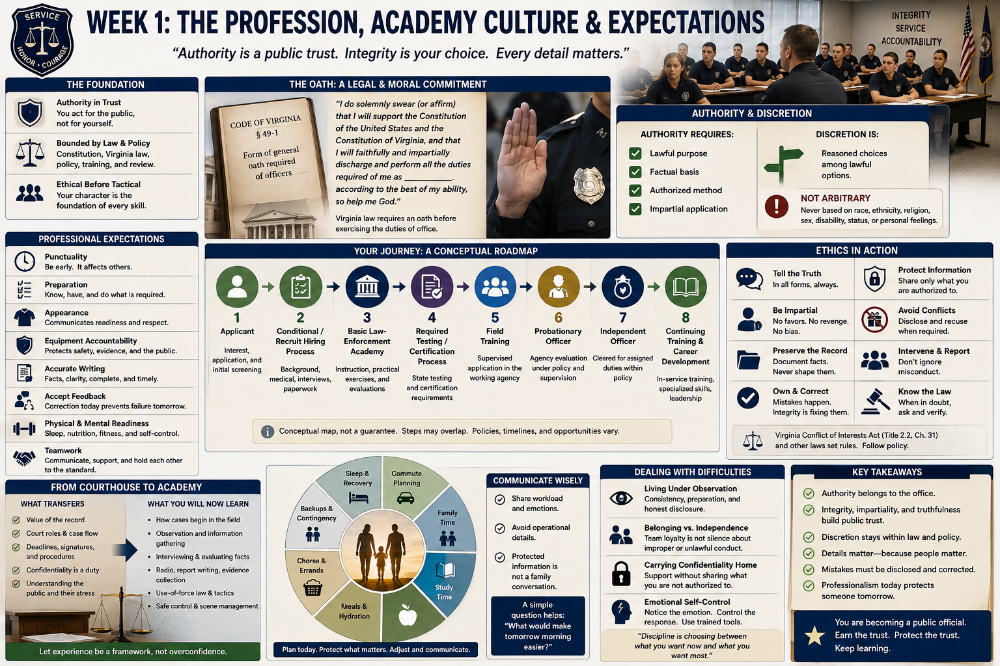

# Chapter 1 — Week 1: The Profession, Academy Culture & Expectations

> **RESEARCH DRAFT — FACTUAL REVIEW REQUESTED.** Sources were checked as of August 19, 2026. “Week 1” is this book’s editorial placement; no claim is made about HRCJTA’s actual sequence or internal rules.

## Opening

A clerk can end a difficult public interaction, return to the file, and still feel the weight of being a government employee. A sworn officer carries a different concentration of responsibility: the authority to detain, arrest, seek searches, issue process, and sometimes use force within law and policy. The badge does not create personal power. It identifies authority held in trust for public purposes and bounded by constitutional law, Virginia law, policy, training, and review.

The academy begins the transition from competent employee or student to **public official entrusted with significant legal authority**. That transition is ethical before it is tactical.

## What This Week Is About

This book places professional identity first because every later skill depends on it. Legal knowledge without integrity can be manipulated. Communication without impartiality can become coercive. Physical skill without self-control can cause unnecessary harm. Accurate reporting, timely arrival, careful equipment maintenance, and accepting correction are not academy theater; they are small rehearsals for reliability when another person’s liberty, safety, or case depends on the officer.

Virginia law sets baseline qualifications for police officers and requires an oath before exercising office. The statutory oath commits the officer to support the United States and Virginia constitutions and faithfully and impartially discharge the duties of office.[1][2] Those words connect legal authority to public trust.

## What You Need to Understand

### Authority belongs to the office

A sworn officer acts for a public agency, not for personal preference. The power must have a lawful purpose, a factual basis, and an authorized method. An officer remains accountable even when a supervisor, dispatcher, witness, colleague, or crowd adds pressure.

“Follow instructions” therefore always means **follow lawful instructions through the chain of command**. A recruit should learn orders promptly, seek clarification at an appropriate time, and report a genuine legal, ethical, or safety concern through established channels. Blind obedience and casual defiance are both poor substitutes for professional judgment.

### Ethics are choices made before anyone audits them

The DCJS compulsory minimum standards include professional orientation and legal subjects; Virginia law also disqualifies certain conduct and makes truthfulness central to the credibility of public officials.[3][4] The practical ethical duties include:

- tell the truth in applications, training records, reports, testimony, and mistakes;
- use authority impartially and never for revenge, favor, convenience, or private gain;
- protect confidential information and access records only for authorized work;
- disclose conflicts of interest and avoid gifts or relationships that compromise judgment;
- preserve evidence and documentation rather than shaping them toward a preferred result;
- intervene, report, or seek guidance as law and policy require when conduct is improper;
- own decisions and correct errors promptly.

Virginia’s State and Local Government Conflict of Interests Act supplies a statutory framework for covered public employees and officers. Agency policy and specific criminal statutes add other restrictions.[5] A recruit should not improvise a personal ethics code where law or policy gives a rule.

### Discretion is not permission to be arbitrary

Police work often permits choices: warn or charge when legally available; call another resource; slow an encounter; gather more information; or decline action when authority is absent. **Discretion** means reasoned choice within law and policy. **Arbitrariness** means treating similar situations differently for irrelevant, biased, retaliatory, or unexplained reasons.

Impartial policing does not demand identical outcomes when legally relevant facts differ. It demands that race, ethnicity, religion, sex, disability, political viewpoint, status, personal familiarity, or irritation not substitute for lawful reasons. Virginia’s Community Policing Act requires collection of specified data for investigatory motor-vehicle and pedestrian stops, illustrating that public accountability includes records capable of review.[6]

## What Training May Feel Like

Professional expectations may feel unusually exacting. A missing item, late arrival, incomplete instruction, untidy document, or casual phrase may prompt immediate correction. This draft does not assert HRCJTA inspection practices. It explains why academies commonly pay attention to details: police work transfers small omissions into large consequences.

- **Punctuality** supports shift relief, court appearances, coordinated operations, and public availability.
- **Preparation** prevents a colleague or citizen from bearing the cost of your missing knowledge or equipment.
- **Appearance** can communicate readiness and legitimacy, while never replacing respectful conduct.
- **Equipment accountability** protects safety, evidence integrity, public funds, and confidential information.
- **Accurate writing** allows supervisors, prosecutors, courts, and the public record to evaluate decisions.
- **Accepting feedback** makes correction possible before a weakness becomes misconduct or injury.

The hard part may be separating correction of performance from judgment of personal worth. Listen fully. Restate the standard if useful. Correct the behavior. Ask a focused question rather than offering an instant defense. Later, document or raise a concern through the proper process if the instruction remains unclear or appears improper.

## Key Concepts and Vocabulary

- **Sworn officer:** an officer who has taken the legally required oath and holds authority associated with the office, subject to qualification and certification rules.
- **Public trust:** the community’s justified expectation that authority will be used lawfully, competently, honestly, and impartially.
- **Oath:** a formal legal commitment to constitutional government and faithful, impartial duty.
- **Integrity:** consistency between lawful professional values and conduct, especially when concealment is possible.
- **Accountability:** the duty to explain conduct and accept review and consequences.
- **Chain of command:** the agency’s defined line for direction, supervision, information, and escalation.
- **Confidentiality:** protection of information that law or policy does not authorize an employee to disclose.
- **Conflict of interest:** a private interest that conflicts, or may appear to conflict, with impartial public duty.
- **Discretion:** authorized judgment among lawful options.
- **Procedural justice:** practices that emphasize voice, neutrality, respectful treatment, and trustworthy motives; these can strengthen perceptions of legitimacy even when an outcome disappoints someone.

## From the Classroom to the Street

Imagine an officer recognizes a driver as a neighbor. Professionalism does not require pretending not to know the person; it requires recognizing whether the relationship affects impartial action, disclosing it when policy requires, and requesting another officer if appropriate. The report should record legally relevant facts—not a narrative designed to favor or punish the neighbor.

Or imagine that the officer makes a mistaken entry in a report. Integrity is not the impossible promise of never making an error. It is preserving the original record as required, notifying the right person, and correcting the mistake through the authorized method rather than quietly overwriting it.

Emotional self-control works the same way. Feeling anger, embarrassment, fear, or frustration is human. Professional control means noticing the response, maintaining lawful behavior and communication, and using trained resources rather than making the public absorb the emotion.

## From the Courthouse to the Academy

Court experience is a genuine advantage in context. You may know:

- how judges and attorneys use records;
- the difference among a summons, warrant, charge, hearing, and disposition;
- that deadlines and signatures matter;
- that confidentiality is a daily duty, not a slogan;
- how frightened, angry, confused, or impatient members of the public behave;
- how one missing fact can delay an entire case.

But courthouse familiarity begins downstream. Seeing an officer’s return does not show every decision that produced it. Knowing the layout of a warrant does not establish probable cause. Recognizing criminal-case terminology does not teach how to interview a witness, evaluate conflicting information, preserve evidence, communicate by radio, or safely manage an evolving event. Let prior experience supply a framework—not confidence beyond your training.

The clerk’s strongest transferable habit may be respect for the record. In police work, however, you become one of the people who creates the record that others must trust.

## What May Be Difficult

### Living under closer observation

A recruit may feel that instructors notice everything. Police decisions are also observed: by partners, supervisors, cameras, witnesses, attorneys, courts, and the community. The answer is not perfectionism or concealment. It is consistent preparation, accurate disclosure, and recoverable habits.

### Balancing belonging and independence

Teamwork matters. A reliable officer communicates, shares workload, asks for help, and protects colleagues from avoidable mistakes. Yet loyalty never requires false reporting, silence about serious misconduct, or unlawful action. Healthy teams make correction possible.

### Carrying confidentiality home

Family support is easier when the recruit communicates about workload and emotion, but operational details, criminal-history information, victim information, academy testing content, and personnel matters may be protected. Say, “I had a demanding day and need twenty minutes to reset,” rather than disclosing information you are not authorized to share.

## Questions to Think About

1. What does the oath demand when a convenient choice conflicts with an impartial one?
2. How can you respond to correction without either becoming defensive or agreeing to something you do not understand?
3. Which courthouse habits transfer directly, and which could create overconfidence?
4. What is the difference between loyalty to a colleague and loyalty to the profession?
5. What personal relationship or outside interest might need disclosure under policy?
6. How would you explain a discretionary decision so that a supervisor and a stranger could understand it?

## Week in Review

Professional culture should make lawful service more dependable. Oath, integrity, impartiality, confidentiality, chain of command, documentation, equipment care, punctuality, teamwork, and emotional control all serve that purpose. Authority belongs to the office; discretion stays within law and policy; and mistakes must be disclosed and corrected. Court experience helps with institutions and records, but it does not replace learning how lawful cases begin in the field.

## Further Reading & References

### Official Sources

1. *Code of Virginia* § 15.2-1701, **Qualifications of officers**, official Virginia Law portal, accessed August 19, 2026: https://law.lis.virginia.gov/vacode/title15.2/chapter17/section15.2-1701/
2. *Code of Virginia* § 49-1, **Form of general oath required of officers**, official Virginia Law portal, accessed August 19, 2026: https://law.lis.virginia.gov/vacode/title49/chapter1/section49-1/
3. Virginia Administrative Code, **6VAC20-20, Rules Relating to Compulsory Minimum Training Standards for Law-Enforcement Officers**, official Virginia Law portal, accessed August 19, 2026: https://law.lis.virginia.gov/admincode/title6/agency20/chapter20/
4. Virginia Department of Criminal Justice Services, **Law Enforcement Training / Compulsory Minimum Training Standards and Performance Outcomes**, official DCJS website, accessed August 19, 2026: https://www.dcjs.virginia.gov/law-enforcement/training
5. *Code of Virginia*, Title 2.2, Chapter 31, **State and Local Government Conflict of Interests Act**, official Virginia Law portal, accessed August 19, 2026: https://law.lis.virginia.gov/vacode/title2.2/chapter31/
6. *Code of Virginia* § 52-30.1, **Community Policing Act; data collection and reporting requirement**, official Virginia Law portal, accessed August 19, 2026: https://law.lis.virginia.gov/vacode/title52/chapter6/section52-30.1/

### Further Reading

- Tom R. Tyler, *Why People Obey the Law*, revised edition, Princeton University Press, 2006.
- President’s Task Force on 21st Century Policing, *Final Report of the President’s Task Force on 21st Century Policing*, Office of Community Oriented Policing Services, 2015: https://cops.usdoj.gov/pdf/taskforce/taskforce_finalreport.pdf
- National Institute of Justice, **Procedural Justice**, research and practice overview, accessed August 19, 2026: https://nij.ojp.gov/topics/articles/procedural-justice

### For the Family

- International Association of Chiefs of Police, **Vicarious Trauma Toolkit**, resources for organizations, officers, and families, accessed August 19, 2026: https://www.theiacp.org/resources/document/vicarious-trauma-toolkit-vtt
- Office of Community Oriented Policing Services, Ellen Kirschman et al., *Breaking the Silence on Law Enforcement Suicides*, 2020. This is a serious wellness resource, not a prediction about any recruit: https://cops.usdoj.gov/RIC/Publications/cops-w0879-pub.pdf
