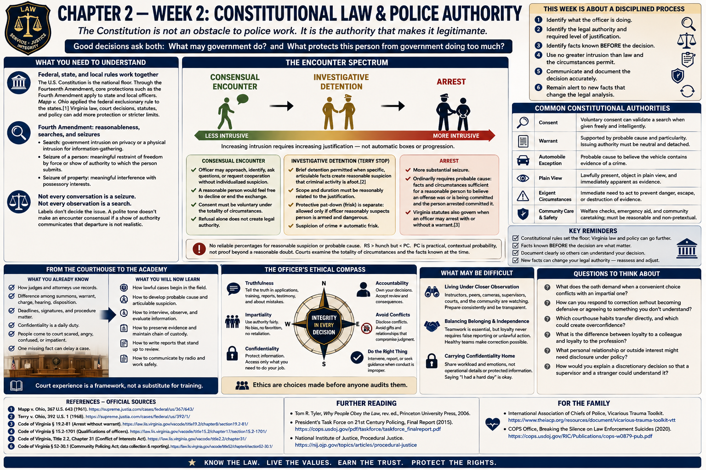

# Chapter 2 — Week 2: Constitutional Law & Police Authority



> **RESEARCH DRAFT — FACTUAL REVIEW REQUESTED.** Authorities were checked as of August 19, 2026. “Week 2” is an editorial learning sequence, not an HRCJTA schedule. This chapter is education, not legal advice; current instruction, binding precedent, Virginia law, agency policy, prosecutors, and courts govern practice.

## Opening

The Constitution is not an obstacle placed in front of “real” police work. It is part of the authority that makes police work legitimate. An officer’s legal power and the individual’s rights exist in the same encounter. A good decision asks both, **What may government do?** and **What protects this person from government doing too much?**

A court clerk often sees the answer after it has been reduced to paper: an affidavit, warrant, summons, motion to suppress, or judicial order. The officer experiences the earlier and harder moment, when facts are incomplete and the legal category is still being formed.

## What This Week Is About

This book devotes Week 2 to constitutional foundations because later topics—patrol, investigation, traffic, arrest, search, force, and reporting—depend on them. The purpose is not to memorize a catalog of cases. It is to learn a disciplined process:

1. identify what the officer is doing;
2. identify the legal authority and required level of justification;
3. identify facts known **before** the decision;
4. use no greater intrusion than law and the circumstances permit;
5. communicate and document the decision accurately;
6. remain alert to new facts that change the legal analysis.

## What You Need to Understand

### Federal, state, and local rules work together

The United States Constitution is the national floor. Through the Fourteenth Amendment, core protections such as the Fourth Amendment’s rule against unreasonable searches and seizures apply to state and local officers. *Mapp v. Ohio* applied the federal exclusionary rule to the states: evidence obtained through an unconstitutional search could not simply be used in a state prosecution.[1]

Virginia’s Constitution, statutes, and court decisions may supply additional rules. Statutes define offenses and procedures; agency policy can be more restrictive than what the Constitution minimally permits. A lawful act under the Fourth Amendment can still violate Virginia law or policy. Conversely, a policy cannot authorize what the Constitution forbids.

### Fourth Amendment: reasonableness, searches, and seizures

The Fourth Amendment protects people against unreasonable searches and seizures and sets requirements for warrants. Its application is highly fact-dependent.

- A **search** generally concerns government intrusion on a protected privacy interest or physical intrusion into a constitutionally protected area for information-gathering purposes.
- A **seizure of a person** occurs when government meaningfully restrains freedom through physical force or a show of authority to which the person submits; precise doctrine depends on the facts.
- A **seizure of property** meaningfully interferes with possessory interests.

Not every conversation is a seizure. Not every observation is a search. Labels do not decide the issue: a polite tone does not automatically make an encounter consensual if the surrounding show of authority communicates that departure is not realistically permitted.

### The encounter spectrum

```text
Consensual Encounter
        ↓
Investigative Detention
        ↓
Arrest
```

This diagram shows increasing intrusion and justification, not three airtight boxes or an automatic progression.

**Consensual encounter.** An officer may generally approach, identify themself, ask questions, or request cooperation without individualized suspicion if a reasonable person would feel free to decline or end the exchange. Consent must actually be voluntary under the totality of circumstances. A person’s refusal, standing alone, does not transform the request into legal authority.

**Investigative detention.** Under *Terry v. Ohio*, an officer may briefly detain a person when specific, articulable facts and rational inferences create reasonable suspicion that criminal activity is afoot.[2] The detention’s scope and duration must remain reasonably related to its justification. A protective pat-down is a separate intrusion: *Terry* permits a limited weapons frisk when the officer reasonably suspects the person is armed and dangerous. Suspicion of crime does not automatically establish that additional safety justification.

**Arrest.** An arrest is a more substantial seizure and ordinarily requires probable cause: facts and circumstances sufficient for a reasonable person to believe that an offense has been or is being committed and that the person arrested committed it. Virginia statutes also govern when an officer may arrest with or without a warrant.[3]

There is no reliable numerical percentage for either reasonable suspicion or probable cause. Reasonable suspicion is more than a hunch and less demanding than probable cause; probable cause is practical, contextual probability, not proof beyond a reasonable doubt. Courts examine the totality of circumstances and the facts known at the time—not facts discovered afterward.

### Warrants and judicial authorization

A warrant normally requires probable cause supported by oath or affirmation, particularity about the place to be searched and persons or things to be seized, and issuance by a neutral and detached judicial officer. The officer’s affidavit must supply facts, not merely a conclusion that probable cause exists. Virginia statutes prescribe warrant procedures and execution rules.[4]

A warrant is a constitutional preference, not a magic document. Officers must stay within its authorized scope, observe current execution rules, preserve the basis for issuance, and report material developments. Deliberate or reckless material falsehoods or omissions can undermine judicial review.

### Exceptions are categories, not shortcuts

Courts recognize circumstances in which a warrant is not required. At an introductory level these may include:

- voluntary consent by someone with actual or reasonably apparent authority;
- search incident to a lawful arrest, within the doctrine’s defined scope;
- exigent circumstances, such as an objectively reasonable need to prevent imminent harm, escape, or destruction of evidence;
- the automobile exception when current legal requirements are met;
- items in plain view when the officer is lawfully present, has lawful access, and their incriminating character is immediately apparent;
- certain inventory and administrative actions conducted under lawful, standardized purposes rather than as investigative pretexts.

Each has elements and limits. “Officer safety,” “consent,” or “exigent” is a conclusion until the officer can state the facts supporting it. Some subjects—homes, digital devices, vehicles, probation conditions, schools, emergencies, and special-needs searches—have rules too nuanced for this overview. Ask the legal instructor which current Virginia and federal authorities control.

### Fifth Amendment and Miranda

The Fifth Amendment protects against compelled self-incrimination. *Miranda v. Arizona* created procedural safeguards before **custodial interrogation**.[5] Both conditions matter:

- **Custody** asks whether the person’s freedom was restrained to the degree associated with formal arrest, assessed objectively in context.
- **Interrogation** includes express questioning and its functional equivalent—police words or actions they should know are reasonably likely to elicit an incriminating response, subject to doctrinal limits.

An arrest does not mean every statement is the product of interrogation. A question does not mean every interview is custodial. Volunteered statements, routine booking questions, waivers, invocation of rights, reinitiation, and public-safety issues carry additional rules. A recruit must learn the exact warning, waiver documentation, and response to invocation from current instruction and policy.

Miranda generally concerns admissibility of statements; it is not a generic phrase meaning “the arrest was invalid.” Probable cause to arrest and safeguards for custodial interrogation are separate analyses.

### Sixth Amendment

The Sixth Amendment guarantees rights in criminal prosecutions, including counsel, confrontation, a speedy and public trial, an impartial jury, and notice of accusation. The offense-specific right to counsel attaches after formal judicial proceedings begin; it is analytically different from Fifth Amendment/Miranda protections during custodial interrogation. Once attached, deliberate government elicitation of statements about the charged offense can raise Sixth Amendment issues. Do not collapse “the person has a lawyer,” “the person asked for a lawyer during custodial interrogation,” and “formal proceedings have begun” into one rule.

### Fourteenth Amendment: due process and equal protection

The Fourteenth Amendment applies constitutional restraints to state and local government. **Due process** protects against government deprivation of life, liberty, or property without constitutionally adequate law and procedures and, in some settings, against arbitrary executive action. **Equal protection** rejects unjustified discriminatory government treatment. Police decisions must rest on lawful facts, not protected identity, hostility, favoritism, or stereotypes.

Force used during an arrest, investigatory stop, or other seizure is generally assessed under the Fourth Amendment’s objective-reasonableness standard identified in *Graham v. Connor*.[6] The question is not the officer’s private motive or perfect hindsight; it is what an objectively reasonable officer would do in the circumstances known at the time, considering factors such as severity, immediate threat, and active resistance or flight. That constitutional floor does not replace Virginia law, de-escalation duties, agency policy, or later reporting and review.

## Landmark Cases: Four Working Foundations

### *Terry v. Ohio* (1968)

**What happened:** A Cleveland detective observed men repeatedly looking into a store window, suspected preparation for a robbery, approached them, and conducted a weapons pat-down that found firearms.

**Question:** Could the officer briefly detain and pat down a person without probable cause to arrest?

**Principle:** Specific, articulable facts can justify a limited investigative detention; a separate reasonable belief that the person is armed and dangerous can justify a limited protective frisk.[2]

**Why it matters:** A recruit must articulate observations and rational inferences, and must distinguish the reason for the stop from the reason for any frisk.

### *Mapp v. Ohio* (1961)

**What happened:** Officers forcibly entered Dollree Mapp’s home without producing a valid warrant and found material used to prosecute her under Ohio law.

**Question:** Does the Fourth Amendment exclusionary rule apply in state court?

**Principle:** Evidence obtained by searches and seizures violating the Constitution is subject to exclusion in state as well as federal prosecutions.[1]

**Why it matters:** A Virginia officer’s constitutional choices affect whether evidence can be used, not merely whether an internal rule was followed.

### *Miranda v. Arizona* (1966)

**What happened:** Ernesto Miranda was questioned in custody and signed a confession without the now-familiar safeguards.

**Question:** What procedures protect the Fifth Amendment privilege during custodial interrogation?

**Principle:** Before custodial interrogation, police must provide specified warnings; a valid waiver must be knowing, intelligent, and voluntary.[5]

**Why it matters:** Custody, interrogation, warning, waiver, and invocation must be recognized and documented separately.

### *Graham v. Connor* (1989)

**What happened:** Officers detained Graham, who was experiencing a diabetic reaction, and used force while investigating conduct they misunderstood.

**Question:** Which constitutional standard governs force during a seizure?

**Principle:** The Fourth Amendment’s objective-reasonableness standard governs, judged from the perspective of a reasonable officer on scene rather than with hindsight.[6]

**Why it matters:** Officers must continually assess facts, use force only under current law and policy, render required aid, and articulate decisions. “I felt threatened” is not a substitute for observable circumstances.

## What Training May Feel Like

Legal training often feels unstable because one changed fact can change the answer. A parked-car conversation may begin consensually and become a detention when the officer retains identification or commands the person to stay. Probable cause may develop during a lawful investigation—or information may dispel suspicion and require release.

Expect to work through facts in sequence. Write a timeline. Mark what the officer knew before each decision. Ask whether the source was reliable and whether innocent explanations eliminate suspicion (often they do not, but they remain relevant). State the authority for each new intrusion. Then ask what would end or reduce that authority.

The uncomfortable phrase “it depends” is not evasion when followed by disciplined identification of the facts on which it depends.

## Key Concepts and Vocabulary

- **Reasonable suspicion:** objective, particularized suspicion supported by specific facts and rational inferences; more than an unparticularized hunch.
- **Probable cause:** practical probability, based on the totality of circumstances, sufficient for the relevant arrest or search decision.
- **Totality of circumstances:** evaluation of all relevant facts together rather than isolating each one.
- **Particularity:** the warrant requirement that limits what place may be searched and what persons or things may be seized.
- **Consent:** voluntary permission; scope and authority matter, and consent may be limited or withdrawn.
- **Exclusionary rule:** a judicial remedy that may bar unlawfully obtained evidence, subject to developed exceptions and doctrines.
- **Custody / interrogation:** the two predicates for Miranda safeguards.
- **Articulation:** explaining objective facts, reasonable inferences, authority, and decisions clearly; not adding detail after the fact.
- **Objective reasonableness:** a legal standard based on the circumstances, not merely an officer’s sincere subjective belief.

## From the Classroom to the Street

Consider a fictional learning problem: an officer sees a person standing beside a closed store late at night. Time and place are facts, but “suspicious” is a conclusion. Is the person looking at a phone, trying the locked door, carrying store property, waiting for a ride, or responding to an alarm? Has dispatch reported a crime? Does the person match a description, and how specific and reliable is it? The officer may be permitted to approach consensually before possessing grounds to detain. The words used, position of officers, display of authority, retention of identification, and response to an attempted departure may determine whether the encounter stays consensual.

Do not work backward from what is eventually found. If contraband appears only after a seizure, it cannot retroactively justify the seizure.

## From the Courthouse to the Academy

```text
Officer observes facts
        ↓
Officer makes legal decisions
        ↓
Officer documents facts
        ↓
Charges / warrant / summons
        ↓
Court receives the case
        ↓
Judge evaluates legal sufficiency and evidence
```

As a clerk, you may receive the final documents. As an officer, you must create the legally relevant record. The judge cannot evaluate an unrecorded observation, and a polished conclusion cannot replace missing facts. Defense counsel may test when the seizure began, what the officer knew, whether consent was voluntary, and whether the search exceeded its scope. A prosecutor needs both favorable and unfavorable facts. Your report and testimony should allow the legal system to evaluate what actually occurred—not guarantee a conviction.

## What May Be Difficult

- **Separating moral certainty from legal justification.** Strong suspicion still needs articulable facts and the correct authority.
- **Keeping doctrines separate.** Stop versus frisk; arrest versus Miranda; lawful arrest versus search scope; constitutional permission versus policy authorization.
- **Updating old rules.** Search-and-seizure law changes. A remembered case name is not a substitute for current instruction.
- **Accepting release as a lawful outcome.** If suspicion is dispelled or authority ends, professional policing may require letting the person go.
- **Writing before concluding.** Record what was seen, heard, checked, and communicated, then state the inference and action.

## Questions to Think About

1. At what point in a hypothetical conversation would a reasonable person no longer feel free to leave, and which facts drive your answer?
2. What facts support a detention but not necessarily an arrest?
3. Why does reasonable suspicion of crime not automatically justify a frisk?
4. How are probable cause to arrest and Miranda safeguards different?
5. What facts support each claimed warrant exception?
6. What new information would require an officer to narrow or end an intrusion?
7. Could an action be constitutional but forbidden by Virginia law or agency policy?

## Week in Review

Police authority is defined by limits. A consensual encounter, investigative detention, and arrest involve different degrees of restraint and justification, but facts—not labels—control. Warrants are preferred for many searches; exceptions have elements and boundaries. The Fifth, Sixth, and Fourteenth Amendments add distinct protections. *Terry*, *Mapp*, *Miranda*, and *Graham* give recruits working foundations, not all-purpose slogans. Sound practice requires current law, policy, instruction, fact-by-fact reassessment, and honest articulation.

## Further Reading & References

### Official Sources

1. *Mapp v. Ohio*, 367 U.S. 643 (1961), U.S. Supreme Court opinion, Library of Congress: https://tile.loc.gov/storage-services/service/ll/usrep/usrep367/usrep367643/usrep367643.pdf
2. *Terry v. Ohio*, 392 U.S. 1 (1968), U.S. Supreme Court opinion, Library of Congress: https://tile.loc.gov/storage-services/service/ll/usrep/usrep392/usrep392001/usrep392001.pdf
3. *Code of Virginia* § 19.2-81, **Arrest without warrant authorized in certain cases**, official Virginia Law portal, accessed August 19, 2026: https://law.lis.virginia.gov/vacode/title19.2/chapter7/section19.2-81/
4. *Code of Virginia*, Title 19.2, Chapter 5, **Search Warrants**, official Virginia Law portal, accessed August 19, 2026: https://law.lis.virginia.gov/vacode/title19.2/chapter5/
5. *Miranda v. Arizona*, 384 U.S. 436 (1966), U.S. Supreme Court opinion, Library of Congress: https://tile.loc.gov/storage-services/service/ll/usrep/usrep384/usrep384436/usrep384436.pdf
6. *Graham v. Connor*, 490 U.S. 386 (1989), U.S. Supreme Court opinion, Library of Congress: https://tile.loc.gov/storage-services/service/ll/usrep/usrep490/usrep490386/usrep490386.pdf
7. Constitution Annotated, Congress.gov, **Fourth Amendment—Search and Seizure**, current official congressional analysis, accessed August 19, 2026: https://constitution.congress.gov/constitution/amendment-4/
8. Constitution Annotated, Congress.gov, **Fifth Amendment**, accessed August 19, 2026: https://constitution.congress.gov/constitution/amendment-5/
9. Constitution Annotated, Congress.gov, **Sixth Amendment**, accessed August 19, 2026: https://constitution.congress.gov/constitution/amendment-6/
10. Constitution Annotated, Congress.gov, **Fourteenth Amendment**, accessed August 19, 2026: https://constitution.congress.gov/constitution/amendment-14/
11. *Code of Virginia* § 19.2-74, **Issuance and service of summons in place of warrant in misdemeanor case; exceptions**, official Virginia Law portal, accessed August 19, 2026: https://law.lis.virginia.gov/vacode/title19.2/chapter7/section19.2-74/

### Further Reading

- Wayne R. LaFave, *Search and Seizure: A Treatise on the Fourth Amendment*, 6th edition, Thomson Reuters, 2020 (professional reference; consult current supplements).
- Orin S. Kerr, **An Equilibrium-Adjustment Theory of the Fourth Amendment**, *Harvard Law Review* 125 (2011), pp. 476–543: https://harvardlawreview.org/print/vol-125/an-equilibrium-adjustment-theory-of-the-fourth-amendment/

### For the Family

Constitutional law changes through cases and legislation. Family members can help by asking a recruit to explain a rule and its limits in ordinary language, but unofficial quizzes and internet summaries should never replace current academy materials. A useful public resource is Congress’s nonpartisan Constitution Annotated: https://constitution.congress.gov/
