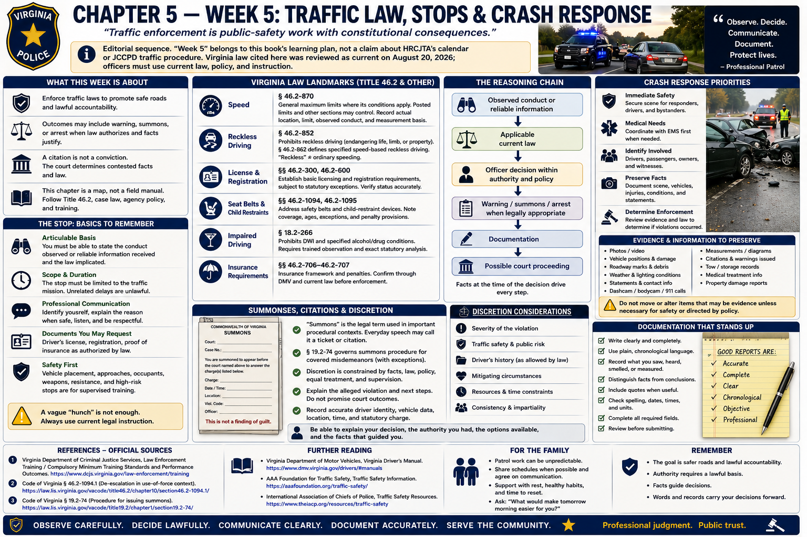

# Chapter 5 — Week 5: Traffic Law, Stops & Crash Response



> **Editorial sequence.** “Week 5” belongs to this book's learning plan, not a claim about HRCJTA's calendar or JCCPD traffic procedure. Virginia law cited here was reviewed as current on August 20, 2026; officers must use current law, policy, and instruction.

## Opening

A brake light, speed reading, lane movement, or crash statement becomes legally useful only when the officer can describe what was observed, connect it to current law, communicate professionally, and preserve an accurate record. Traffic work is public-safety work with constitutional consequences—not a hunt for technicalities.

## What This Week Is About

Virginia's motor-vehicle title is extensive. This chapter offers a map: lawful observation, the basis and scope of a stop, identification and vehicle documents, proportionate enforcement choices, crash duties, and court-ready documentation. It does not replace Title 46.2, judicial decisions, or agency instruction.

Traffic enforcement seeks safer road use and lawful accountability. Outcomes may include a warning, a summons, or—where law authorizes and facts justify—arrest. A citation is not a conviction. The court determines contested facts and law.

## What You Need to Understand

### The stop needs a lawful, articulable basis

A traffic stop is a Fourth Amendment seizure. Its justification and duration are fact-dependent. An officer must be able to state the conduct observed or reliable information received and the law reasonably implicated; a vague “hunch” is not enough. Tasks and inquiries unrelated to the traffic mission cannot unlawfully prolong the stop. Current law and agency legal instruction govern each case.

Professional communication begins with identity and a clear explanation of the reason when circumstances permit. Listen to relevant information, identify the driver, request documents authorized by law, explain the decision, and avoid sarcasm, argument, or unnecessary escalation. This is not tactical guidance: vehicle placement, approaches, occupant removal, weapons, resistance, and high-risk stops belong in supervised training.

### A few Virginia-law landmarks

- **Speed:** § 46.2-870 supplies general maximum limits where its conditions apply; posted limits and other sections may control. Record the actual location, applicable limit, observed conduct, and reliable measurement basis.
- **Reckless driving:** § 46.2-852 prohibits driving recklessly or at a speed or manner endangering life, limb, or property. Section 46.2-862 separately defines specified speed-based reckless driving. “Reckless” is not interchangeable with every speeding violation.
- **License and registration:** §§ 46.2-300 and 46.2-600 establish foundational licensing and vehicle-registration requirements, subject to statutory exceptions. Status must be accurately verified; do not assume the legal consequence from a card's appearance alone.
- **Seat belts and children:** §§ 46.2-1094 and 46.2-1095 address safety belts and child-restraint devices. Their coverage, enforcement limitations, ages, exceptions, and penalty provisions matter; use the current text rather than a slogan.
- **Impaired driving:** § 18.2-266 defines prohibited driving while intoxicated or under specified alcohol/drug conditions. Impairment decisions require trained observation, lawful investigation, and exact statutory analysis; this book gives no testing protocol.
- **Insurance-related requirements:** Virginia's current vehicle-insurance framework and penalties should be checked through DMV and current §§ 46.2-706–46.2-707. A database result or document issue must be understood under current law before enforcement.

The useful reasoning chain is:

```text
Observed conduct or reliable information
      ↓
Applicable current law
      ↓
Officer decision within authority and policy
      ↓
Warning / summons / arrest when legally appropriate
      ↓
Documentation
      ↓
Possible court proceeding
```

### Summonses, citations, and discretion

Virginia statutes use “summons” in important procedural contexts. Everyday speech may call the issued charging document a ticket or citation; the terms are not always interchangeable. A summons generally directs the person to answer the charge in court and is not a finding of guilt. Section 19.2-74 governs summons procedure for covered misdemeanors and contains qualifications and exceptions.

Where warning or charge is a lawful choice, discretion remains constrained by facts, law, agency policy, equal treatment, and supervision. The officer should explain the alleged violation and next steps without promising the court outcome. Accurate driver identity, vehicle data, location, time, statutory charge, and observations matter.

### Crash response is care, fact preservation, and coordination

At a crash, immediate hazards and medical needs take priority conceptually. Officers coordinate as appropriate with fire, EMS, transportation personnel, and towing providers; identify drivers, passengers, owners, and witnesses; record road, weather, vehicle, and injury information; preserve statements and available records; and determine whether evidence supports enforcement. Diagrams, photographs, measurements, electronic information, and formal reports may be appropriate under training and policy.

Virginia §§ 46.2-894 and 46.2-895 address driver duties after crashes involving injury/death or attended property, and § 46.2-896 addresses certain unattended-property crashes. Section 46.2-373 addresses law-enforcement crash reports for crashes meeting statutory conditions and specifies forwarding and timing requirements. Exact reporting categories and agency workflow must be learned from current text and policy; this chapter does not invent a JCCPD form or threshold.

Do not infer fault merely because a crash occurred. Separate physical observations, participant statements, witness statements, records, and conclusions. Civil liability, a traffic charge, and reportability are different questions.

## What Training May Feel Like

Traffic material combines many similar statutes with communication and precise paperwork. Practical days may be long or outdoors in generic academy training, but no HRCJTA schedule is asserted here. Fatigue makes transposed digits and assumed facts more likely; deliberate verification is a professional habit.

## Key Concepts and Vocabulary

- **Traffic stop:** temporary seizure requiring constitutional justification.
- **Citation:** common term for written notice of an alleged violation; use the document's exact Virginia name.
- **Summons:** process directing a person to appear or answer in court; not a conviction.
- **Reasonable suspicion:** objective, articulable basis under the totality of circumstances for a brief detention.
- **Reckless driving:** Virginia criminal traffic offense defined by statute, not merely a synonym for carelessness.
- **Crash report:** official record required in circumstances defined by law and procedure.
- **Registration:** legal recording of a vehicle; distinct from title, ownership, inspection, and insurance.
- **Corroboration:** independent information supporting or testing an account.

## From the Classroom to the Street

**Fictional example—not JCCPD procedure.** An officer sees a sedan travel through a steady red signal. The officer records the location, direction, signal condition, sight line, traffic, and the vehicle identified—not simply “ran red.” After a lawful stop, the driver says glare obscured the signal. That statement is documented and evaluated; it neither automatically defeats nor proves the charge. The officer verifies identity and relevant records, chooses an authorized outcome under law and policy, explains it, and completes accurate documentation.

At a two-car crash, “Vehicle 1 caused it” is a conclusion. Useful components include final positions, visible damage, roadway controls, accounts attributed by name, independent witnesses, injuries reported or observed, records reviewed, and limitations. Enforcement requires evidence of a violation, not pressure to select a winner for insurance.

## From the Courthouse to the Academy

A traffic summons, reckless-driving charge, DUI-related proceeding, crash-related charge, or license matter may reach Virginia General District Court. The paperwork familiar to a court employee began earlier: an observation, legal classification, identification, communication, and documentation at roadside. Notes and recordings may be reviewed; the officer may testify and be cross-examined. Clear limits—what was measured, seen, said, or learned from a record—are stronger than certainty added later.

## What May Be Difficult

**Statutory density:** nearby sections can create different offenses and exceptions. Read the whole current provision. **Constitutional scope:** lawful initiation does not make every extension lawful. **Precision:** confirm person, plate, vehicle, location, direction, time, code section, and court information. **Crash emotion:** people may be injured or frightened; care and neutral fact gathering can coexist. **Court preparation:** review permitted records and testify from honest memory, never fill a gap.

## Questions to Think About

1. Which objective facts establish the basis for the stop?
2. What information is relevant to the traffic mission, and what would extend it?
3. Why are speeding and reckless driving not automatically the same?
4. Which facts came from observation, a person, or a database?
5. What does a summons require, and what does it not decide?
6. How do reportability, enforcement, and civil fault differ after a crash?
7. What detail would a judge need months later?

## Week in Review

Traffic enforcement links observation to current law, a constitutionally limited stop, professional explanation, authorized discretion, and exact documentation. Crash response adds medical need, multi-agency coordination, preservation, and statutory duties. Learn the framework, then learn procedures through supervised training; never substitute this reading guide for current Title 46.2 or agency policy.

## Further Reading & References

### Official Sources

1. *Code of Virginia*, Title 46.2, **Motor Vehicles**: https://law.lis.virginia.gov/vacode/title46.2/
2. *Code of Virginia* §§ 46.2-852 and 46.2-862, **Reckless driving**: https://law.lis.virginia.gov/vacode/title46.2/chapter8/section46.2-852/ and https://law.lis.virginia.gov/vacode/title46.2/chapter8/section46.2-862/
3. *Code of Virginia* §§ 46.2-894–46.2-896 and 46.2-373, **Crash duties and law-enforcement reports**: https://law.lis.virginia.gov/vacode/title46.2/chapter8/section46.2-894/ and https://law.lis.virginia.gov/vacode/title46.2/chapter3/section46.2-373/
4. *Code of Virginia* § 18.2-266, **Driving motor vehicle, engine, etc., while intoxicated**: https://law.lis.virginia.gov/vacode/title18.2/chapter7/section18.2-266/
5. Virginia Department of Motor Vehicles, **Virginia Driver's Manual**: https://www.dmv.virginia.gov/licenses-ids/exams/manual
6. Virginia State Police, **Safety Division**: https://vsp.virginia.gov/safety-and-enforcement/safety-division/

### Further Reading

- National Highway Traffic Safety Administration, **Traffic Safety Facts and research**: https://www.nhtsa.gov/data
- U.S. Supreme Court, *Rodriguez v. United States*, 575 U.S. 348 (2015): https://supreme.justia.com/cases/federal/us/575/348/ (secondary-access copy; consult official reporter for legal work).

### For the Family

- Practical training and dense code study can be tiring. Support hydration, sleep, and a predictable study block; do not ask the learner to demonstrate roadside procedures.
