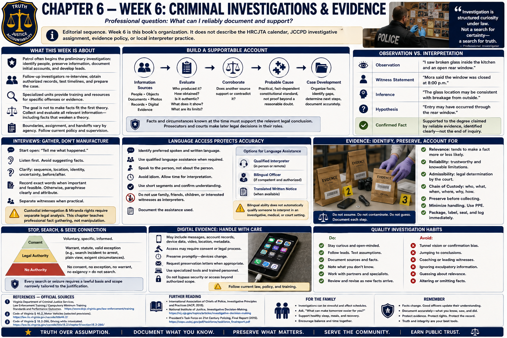

# Chapter 6 — Week 6: Criminal Investigations & Evidence



> **Editorial sequence.** Week 6 is this book's organization. It does not describe the HRCJTA calendar, JCCPD investigative assignment, evidence policy, or local interpreter practice.

## Opening

“I know what happened” is not the investigator's finish line. The professional question is: **What can I reliably document and support?** A plausible account may change when a time stamp, independent witness, photograph, or contrary fact appears. Investigation is structured curiosity under law.

## What This Week Is About

Patrol commonly begins the preliminary investigation: recognize what may have occurred, address urgent needs, identify people, preserve information, document initial accounts, and develop leads. Follow-up investigators may re-interview people, obtain authorized records, coordinate examinations, test timelines, and prepare a case. Specialized units contribute training and resources for particular offenses or evidence. Boundaries and handoffs vary by agency.

The purpose is not to make facts fit the first theory. It is to collect and evaluate relevant information—including facts that weaken a suspected explanation—while respecting constitutional and statutory limits.

## What You Need to Understand

### Build a supportable account

An investigation may use victim and witness accounts, suspect information, timelines, physical objects, documents, photographs, authorized records, and digital evidence. Each item raises questions: Who produced it? How was it obtained? Is it authentic? What does it actually show? What are its limits? Does another source corroborate or contradict it?

Probable cause is a practical, fact-dependent constitutional standard, not proof beyond a reasonable doubt. It must rest on facts and circumstances supporting the relevant legal conclusion at the time. Investigators should state facts, sources, reliability considerations, and material gaps; prosecutors and courts make later legal decisions in their roles.

Digital evidence can include messages, account records, device data, video, location information, and metadata. Access may require consent, legal process, specialized expertise, and preservation requests. This chapter does not teach device access, surveillance, or methods for bypassing security.

### Observation is not interpretation

- **Observation:** “I saw broken glass inside the kitchen and an open rear window.”
- **Witness statement:** “Mora said the window was closed at 8:00 p.m.”
- **Inference:** “The glass location may be consistent with breakage from outside.”
- **Hypothesis:** “Entry may have occurred through the rear window.”
- **Confirmed fact:** a proposition supported to the degree claimed by reliable evidence; “confirmed” should identify the support, not end inquiry.

A photograph may confirm glass location when taken, but not necessarily who broke it. A time-stamped access record may corroborate entry by a credential, but not necessarily identify the person holding it. Careful labels prevent interpretation from masquerading as perception.

### Interviews gather information; they do not manufacture it

Begin, when appropriate, with an open invitation: “Tell me what happened.” Listen without supplying details. Follow with clarifying questions about sequence, location, sensory basis, identity, uncertainty, and what occurred before and after. Record exact words when legally important and when accuracy permits; otherwise attribute a clear paraphrase. Separate witnesses when lawful and practical to preserve independent recollection, not to signal guilt.

Trauma, age, disability, injury, language, fear, and intoxication may affect communication. Emotional presentation alone is not a reliable truth test. Treat confidence cautiously, avoid assumptions, document conditions, and seek corroboration. Custodial interrogation and Miranda questions require separate legal analysis; this chapter teaches professional fact gathering, not manipulation.

### Language access protects accuracy

Conversational bilingual ability is not automatically the same as qualification to interpret accurately in an investigative, medical, or court setting. Interpretation requires faithful transfer of meaning, confidentiality, role boundaries, and competence with the subject. An officer should not assume comprehension from accent, a brief exchange, or a family member's presence.

Identify the person's preferred spoken and written language; use qualified language assistance when law or policy requires; speak to the person rather than about the person; avoid idiom; allow interpretation in manageable segments; and document what assistance was used. Children, companions, victims, or interested witnesses may be unsuitable interpreters. Courts and agencies control their own qualification requirements. A bilingual officer may communicate directly when competent and authorized, but does not automatically replace an official interpreter or translated legal notice.

### Evidence must remain identifiable and accountable

**Relevance** concerns whether information tends to make a consequential fact more or less likely. **Reliability** concerns trustworthiness and limitations. **Admissibility** is a legal determination governed by evidence rules, constitutional law, statutes, and judicial rulings—not merely by an officer's belief that an item matters.

Preservation seeks to prevent loss, alteration, contamination, or unexplained access. Trained personnel document location and condition, photograph when appropriate, collect and label under policy, record transfers, use appropriate storage, and preserve original records. Hazardous substances, firearms, biological material, explosives, and unknown materials demand specialized instruction and equipment; this guide provides no handling directions.

```text
Evidence located
      ↓
Documented
      ↓
Collected by trained personnel
      ↓
Labeled
      ↓
Transferred with a record
      ↓
Stored under policy
      ↓
Retrieved for authorized analysis or court
```

**Chain of custody** is the documented history of possession and handling. Suppose a store provides a small storage device containing video. A label connects it to the case; the transfer record identifies who received it and when; secure storage and later checkout explain where it went. An unexplained gap does not magically change content, but it can create a serious authenticity or integrity question. The officer must document honestly, never reconstruct a missing entry as though it happened.

## What Training May Feel Like

Investigations combine legal thresholds, detailed procedure, names, time, exhibits, interviews, and report writing. The cognitively difficult task is holding multiple possible explanations without becoming vague. Checklists and authorized systems support memory; they do not replace thinking. Complex documentation can follow the learner home as study load, but protected rest improves accuracy.

## Key Concepts and Vocabulary

- **Preliminary investigation:** initial identification, preservation, interviews, leads, and documentation.
- **Follow-up investigation:** later work that evaluates leads and develops a supportable case.
- **Evidence:** information or material offered to prove or disprove a fact.
- **Chain of custody:** documented possession and handling history.
- **Contamination:** unwanted alteration, transfer, or introduction that may affect integrity.
- **Corroboration:** independent support or testing of information.
- **Lead:** information suggesting a productive next inquiry; not proof.
- **Hypothesis:** testable explanation, not established fact.
- **Interpreter:** person who conveys spoken or signed meaning between languages; qualification depends on context.

## From the Classroom to the Street

**Fictional example—not an agency procedure.** A complainant says a former employee stole a laptop at noon. The officer attributes that allegation. Video shows a person in similar clothing at 12:08 but does not show a face. An inventory record lists the device; an access log shows the former employee's credential used at 12:05; a supervisor says credentials were sometimes shared. Each item is documented with its source and limitation. The combined evidence creates leads, but “the video proves the former employee stole it” overstates what was observed.

An investigation can be organized as: define possible offense and elements; create a revisable timeline; list people and basis of knowledge; inventory evidence and custody; identify agreements and contradictions; pursue lawful corroboration; record unsuccessful steps and limitations; reassess probable cause; submit complete documentation for review.

## From the Courthouse to the Academy

Evidence, statements, officer reports, and probable-cause materials affect charging, discovery, motions, testimony, and admissibility. The defense may test collection, attribution, omissions, preservation, suggestiveness, and chain of custody. The prosecution must disclose material under governing law. A judge sees a record built by many hands. Good investigation makes each link visible; it does not guarantee a charge or conviction.

Your court experience may make warrants and exhibits familiar. Academy learning adds the front end: lawful acquisition, neutral documentation, preservation, and the humility to state what a record cannot establish.

## What May Be Difficult

**Confirmation bias:** actively seek facts inconsistent with the working theory. **Memory:** use contemporaneous notes and distinguish refreshed recollection from what a record states. **Contradictions:** clarify without bullying; inconsistency can arise from perspective, memory, language, or deception and must be evaluated, not automatically diagnosed. **Volume:** use timelines and evidence logs while preserving original context. **Handoffs:** record who received what, when, why, and in what condition.

## Questions to Think About

1. Is each sentence an observation, attributed statement, inference, hypothesis, or confirmed fact?
2. What independent source might corroborate or challenge the account?
3. What authority is needed for the next investigative step?
4. What does each photograph or record show—and not show?
5. Could language assistance be necessary even when conversation seems possible?
6. Can every evidence transfer be reconstructed?
7. What fact would you disclose even though it weakens the initial theory?

## Week in Review

Investigation moves from uncertainty toward a documented, testable account. Listen openly, attribute sources, distinguish observation from meaning, preserve favorable and unfavorable information, use lawful process, respect language needs, and maintain evidence integrity. The governing question is not whether the investigator feels certain, but what reliable evidence can support in court.

## Further Reading & References

### Official Sources

1. Virginia Department of Criminal Justice Services, **Law Enforcement Training / Compulsory Minimum Training Standards and Performance Outcomes**: https://www.dcjs.virginia.gov/law-enforcement/training
2. *Code of Virginia*, Title 19.2, Chapter 5, **Search Warrants**: https://law.lis.virginia.gov/vacode/title19.2/chapter5/
3. Supreme Court of Virginia, **Rules of Evidence**: https://www.vacourts.gov/courts/scv/rulesofcourt.pdf
4. National Institute of Justice, **Crime Scene Investigation: A Guide for Law Enforcement**, 2013: https://nij.ojp.gov/library/publications/crime-scene-investigation-guide-law-enforcement
5. U.S. Department of Justice, Civil Rights Division, **Language Access**: https://www.justice.gov/crt/language-access

### Further Reading

- National Institute of Justice, **Eyewitness Evidence: A Guide for Law Enforcement**, 1999: https://nij.ojp.gov/library/publications/eyewitness-evidence-guide-law-enforcement
- National Institute of Standards and Technology, **Digital Evidence**: https://www.nist.gov/programs-projects/digital-evidence
- Charles R. Swanson et al., *Criminal Investigation*, 12th ed., McGraw Hill, 2019.

### For the Family

- Investigation study may mean quiet evenings with procedures and writing. Help protect a regular study period and sleep.
- Do not ask for case details. Practice accuracy with neutral activities—such as reconstructing a recipe or trip timeline—and welcome “I do not know.”
