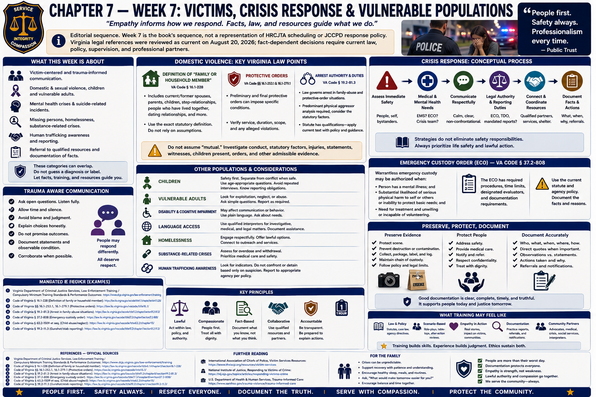

# Chapter 7 — Week 7: Victims, Crisis Response & Vulnerable Populations

> **Editorial sequence.** Week 7 is the book's sequence, not a representation of HRCJTA scheduling or JCCPD response policy. Virginia legal references were reviewed as current on August 20, 2026; fact-dependent decisions require current law, policy, supervision, and professional partners.

## Opening

At the courthouse, a crisis may appear as a clean caption: petitioner, respondent, charge, hearing date. The first responding officer encounters something different—a frightened person, incomplete chronology, children who heard more than they can explain, urgent safety questions, and no final legal finding. Professional response combines care with careful evidence work. Empathy does not decide credibility; it creates conditions in which people can communicate and receive help.

## What This Week Is About

This chapter introduces victim-centered and trauma-informed communication, domestic and sexual violence, children and vulnerable adults, disability and cognitive impairment, mental-health and suicide-related crises, missing people, homelessness, substance-related crises, human trafficking awareness, reporting duties, and referral. These categories can overlap, but a diagnosis or label should never be guessed from appearance.

The officer's tasks are high-level: address immediate safety and medical needs, communicate respectfully, identify legal authority and reporting duties, preserve information, coordinate qualified resources, document facts, and avoid increasing harm. Physical control, tactical entry, and restraint are outside this guide.

## What You Need to Understand

### Trauma affects communication in varied ways

Trauma can affect attention, encoding and retrieval of memory, chronology, speech, and emotional presentation. A person may recall central and peripheral details differently, disclose in stages, appear flat, become highly emotional, or need pauses. None of those responses by itself proves truth or deception. Ask open questions, allow time when circumstances permit, clarify without blame, document the person's words and observable condition, and corroborate.

Victim-centered practice respects autonomy and dignity while explaining choices honestly. Do not promise arrest, protection, confidentiality, prosecution, or a particular court outcome. Avoid “Why didn't you leave?” or other questions that sound like blame; ask what happened, what danger exists now, what the person needs to communicate, and what evidence or services may be available.

Sexual-assault response requires privacy, medical and forensic coordination, informed explanation, careful evidence preservation, and trauma-aware interviewing under current protocol. Child interviews and forensic interviews require specialized training. Do not repeatedly question a child merely to obtain a more orderly story.

### Domestic violence: definitions and duties matter

Virginia § 16.1-228 defines **family or household member** for juvenile and domestic relations law; the definition extends beyond current spouses and people living together, and its exact categories control. Sections 16.1-253.1 and 16.1-279.1 govern preliminary and final protective orders in family-abuse matters. Protective orders can impose specific conditions, and service, duration, scope, and alleged violations must be verified rather than assumed.

Virginia § 19.2-81.3 provides arrest authority and duties for specified family-abuse and protective-order circumstances. Its predominant-physical-aggressor analysis directs consideration of factors listed in the statute and discourages automatic dual arrest. The statute contains qualifications; officers must apply its current language with policy and legal guidance. Safety assessment, injuries, statements, excited utterances where relevant, photographs, damaged property, witnesses, children present, prior orders, and other admissible evidence may matter even when a victim is uncertain about participation.

An officer should explain available processes and connect victims with advocacy without making the victim responsible for the officer's legal duties. Children at an incident have their own safety and reporting considerations. Never characterize every relationship dispute as “mutual” without investigating conduct and statutory factors.

### Crisis behavior may have many causes

Unusual speech or behavior may arise from mental illness, developmental or cognitive disability, dementia, medication, substance use, brain injury, fear, medical emergency, sensory disability, or several causes together. When circumstances allow: reduce avoidable stimulation, use calm concrete language, listen, allow processing time, avoid needless confrontation, ask about communication or medical needs, and request crisis, medical, supervisory, or other specialized assistance. Communication strategy does not erase an immediate safety responsibility.

Virginia § 37.2-808 governs an **emergency custody order (ECO)** and certain warrantless emergency custody. It uses statutory criteria involving mental illness and a substantial likelihood of serious physical harm or inability to protect basic needs, need for treatment, and unwillingness or incapacity to volunteer; the exact text, evidence, time limits, designated evaluation, and transportation rules control. Section 37.2-809 governs **temporary detention orders (TDOs)** and is a distinct judicial/clinical process. Neither is a convenient substitute for a criminal arrest or a diagnosis by an officer.

For suicide-related calls, prioritize immediate safety, calm communication, emergency medical or behavioral-health assistance, applicable legal authority, coordination, and accurate documentation. Do not debate a person into compliance, minimize what they say, promise secrecy, or include unnecessary method details in routine communication. Follow trained crisis procedures and request appropriate help.

### Reporting duties protect children and vulnerable adults

Virginia § 63.2-1509 lists mandated reporters of suspected child abuse or neglect, expressly including law-enforcement officers, and establishes prompt reporting requirements and a general 24-hour outside limit unless a statutory exception applies. Current statutory definitions and reporting channels control; a report is not a finding that abuse occurred.

Virginia § 63.2-1606 lists mandated reporters for suspected abuse, neglect, or exploitation of an adult and includes law-enforcement officers. It requires an immediate report when the reporter has reason to suspect, with limited statutory rules for certain institutional reporting. “Adult” and covered abuse, neglect, and exploitation are defined in Virginia law; age or disability should not be guessed. Officers must follow current reporting and criminal-investigation responsibilities without substituting one for the other.

Missing-person response also demands careful fact gathering and prompt risk assessment. Age, disability, cognitive condition, medication, environmental exposure, possible violence or exploitation, and unusual absence may affect urgency. This guide does not assert JCCPD classification or search procedure.

### Vulnerability does not erase individuality

People with disabilities may need communication accommodation rather than lowered expectations. A person experiencing homelessness may be a victim, witness, complainant, or suspect and retains the same dignity and rights. Substance-related crisis may require medical attention and does not justify assuming every fact. Language access may require a qualified interpreter; family members can have conflicts or safety implications.

Human trafficking awareness begins with indicators and careful questions, not a single profile. Victims may not use the label or may fear authorities. Consult Virginia law, DCJS/Department of Criminal Justice Services resources, trained investigators, and service partners; do not conduct amateur “rescues” or promise immigration outcomes.

Referrals can include victim/witness assistance, domestic-violence and sexual-assault advocacy, child advocacy centers, adult or child protective services, community services boards, medical care, disability services, shelter/housing services, and legal aid. Use maintained agency resource lists rather than relying on a printed phone number that may change.

## What Training May Feel Like

Material involving abuse, sexual violence, suicide, children, and exploitation can carry emotional weight. A learner may feel anger, sadness, protectiveness, numbness, or uncertainty. Those reactions require healthy management, not shame or performance. Use academy wellness resources, supervision, peer support, confidential professional care, rest, and boundaries as available. Do not share identifying scenario or case details at home.

## Key Concepts and Vocabulary

- **Victim-centered:** prioritizing safety, dignity, information, and informed choice within legal duties.
- **Trauma-informed:** recognizing possible trauma effects and avoiding practices likely to compound harm.
- **Family abuse:** Virginia statutory term whose definition and relationship scope must be read in current law.
- **Protective order:** judicial order imposing specified protections; exact terms and status control.
- **Predominant physical aggressor:** statutory domestic-violence analysis; not simply the person who appears angrier.
- **Crisis intervention:** coordinated communication, safety assessment, legal judgment, and connection to appropriate care.
- **Emergency custody order (ECO):** Virginia emergency evaluation process governed by § 37.2-808.
- **Temporary detention order (TDO):** separate temporary-detention process governed by § 37.2-809.
- **Mandatory report:** report required from listed persons when the statutory threshold is met; not proof of abuse.
- **Vulnerable adult:** use controlling Virginia definitions rather than a casual label.

## From the Classroom to the Street

**Fictional example—not JCCPD procedure.** A neighbor reports a confused older adult outside at night. Instead of assuming intoxication, the officer identifies an immediate medical and environmental concern, communicates slowly, seeks identifying and caregiver information lawfully, and requests appropriate medical/support resources. A bracelet suggests a memory condition; it is relevant information, not an officer's diagnosis. The report distinguishes the neighbor's account, the bracelet text, the person's statements, and the officer's observations.

**Fictional domestic-violence example.** Two partners accuse each other after an argument. The officer does not “arrest both to be safe” or accept the loudest account. Immediate needs come first; accounts and observable injuries or damage are documented; witnesses and children are identified; order status and statutory relationships are verified; § 19.2-81.3 and current policy guide the decision; and each person receives accurate process/resource information.

## From the Courthouse to the Academy

Protective-order petitions, criminal complaints, warrants, domestic-assault cases, emergency hearings, victim/witness contacts, and some mental-health proceedings show the formal record after a crisis. At first contact, the officer must communicate amid uncertainty without knowing what a judge, prosecutor, clinician, or witness will later decide. Sensitive records may have access and confidentiality restrictions; familiarity with a clerk's counter does not authorize disclosure.

The court file may compress lived experience into boxes and allegations. Strong initial work preserves exact order terms, sources, observations, safety and medical actions, language assistance, notifications, evidence, referrals, and uncertainty. Respectful treatment and neutral documentation serve both the person and a fair process.

## What May Be Difficult

**Emotional presentation:** never use demeanor alone as a credibility shortcut. **Role boundaries:** officers are not clinicians, advocates, or judges, but coordinate with each. **Choice and duty:** honor autonomy while clearly performing mandatory legal obligations. **Repeated accounts:** minimize unnecessary retelling and use specialized interviews when indicated. **Resources:** know how to find the agency's maintained list. **Self-care:** cumulative exposure can affect sleep, attention, and relationships; seeking support is professional maintenance.

## Questions to Think About

1. How can trauma affect chronology without proving or disproving an allegation?
2. Which questions gather safety information without blaming the victim?
3. What must be verified about a protective order?
4. How do an ECO and TDO differ from arrest?
5. When does a mandated report coexist with a criminal investigation?
6. What accommodation or interpreter would improve accurate communication?
7. How would you document a referral without promising its outcome?
8. What signs tell you to use wellness support after difficult material?

## Week in Review

Victim and crisis response calls for empathy disciplined by law and evidence. Address urgent needs, listen without prejudging, recognize varied trauma responses, verify relationships and orders, apply current statutory duties, coordinate specialists, document objectively, and connect people with maintained resources. Vulnerability is context, not identity; unusual behavior is information, not a diagnosis.

## Further Reading & References

### Official Sources

1. *Code of Virginia* §§ 16.1-228, 16.1-253.1, and 16.1-279.1, **Family abuse definitions and protective orders**: https://law.lis.virginia.gov/vacode/title16.1/chapter11/section16.1-228/
2. *Code of Virginia* § 19.2-81.3, **Arrest without a warrant for family abuse and protective-order violations**: https://law.lis.virginia.gov/vacode/title19.2/chapter7/section19.2-81.3/
3. *Code of Virginia* §§ 37.2-808 and 37.2-809, **Emergency custody and temporary detention**: https://law.lis.virginia.gov/vacode/title37.2/chapter8/section37.2-808/ and https://law.lis.virginia.gov/vacode/title37.2/chapter8/section37.2-809/
4. *Code of Virginia* §§ 63.2-1509 and 63.2-1606, **Mandatory reports concerning children and adults**: https://law.lis.virginia.gov/vacode/title63.2/chapter15/section63.2-1509/ and https://law.lis.virginia.gov/vacode/title63.2/chapter16/section63.2-1606/
5. Virginia Department of Criminal Justice Services, **Victims Services**: https://www.dcjs.virginia.gov/victims-services
6. Virginia Department of Behavioral Health and Developmental Services, **Crisis Services**: https://dbhds.virginia.gov/crisis-services/
7. Virginia Department of Social Services, **Child Protective Services** and **Adult Protective Services**: https://www.dss.virginia.gov/family/cps/ and https://www.dss.virginia.gov/family/as/aps.cgi

### Further Reading

- U.S. Department of Justice, Office for Victims of Crime, **The Vicarious Trauma Toolkit**: https://ovc.ojp.gov/program/vtt/introduction
- Substance Abuse and Mental Health Services Administration, **Practical Guide for Implementing a Trauma-Informed Approach**, 2023: https://store.samhsa.gov/product/practical-guide-implementing-trauma-informed-approach/pep23-06-05-005
- International Association of Chiefs of Police, **Trauma-Informed Sexual Assault Investigation Training**: https://www.theiacp.org/projects/trauma-informed-sexual-assault-investigation-training

### For the Family

- Difficult topics may produce tiredness or quietness without inviting case details. Offer routine, food, rest, and nonjudgmental listening.
- Encourage early use of confidential professional or peer support when distress persists. Family support matters, but relatives should not become the recruit's therapist.
