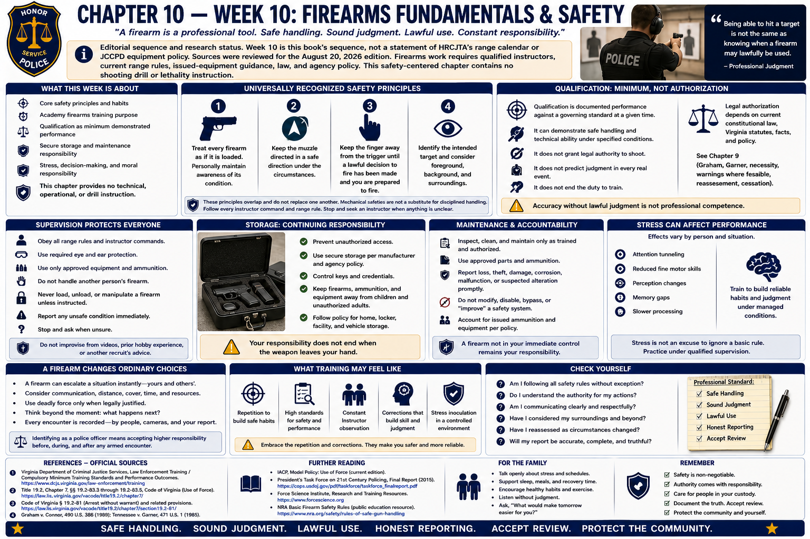

# Chapter 10 — Week 10: Firearms Fundamentals & Safety



> **Editorial sequence and research status.** Week 10 is this book's sequence, not a statement of HRCJTA's range calendar or JCCPD equipment policy. Sources were reviewed for the August 20, 2026 edition. Firearms work requires qualified instructors, current range rules, issued-equipment guidance, law, and agency policy. This safety-centered chapter contains no shooting drill or lethality instruction.

## Opening

A police firearm is not a symbol of status. It is a dangerous professional tool whose misuse can produce irreversible harm. Carrying one means constant responsibility: safe handling, secure storage, sound condition, lawful judgment, honest reporting, and willingness to be reviewed.

Technical competence matters, but it answers only one question. **Being able to hit a target is not the same as knowing when a firearm may lawfully be used.** Professional firearms education must join safe handling and supervised performance with restraint, constitutional and Virginia law, decision-making, and accountability.

## What This Week Is About

This chapter introduces universally recognized safety principles, supervised academy learning, qualification as a minimum demonstrated performance, secure storage, maintenance responsibility, stress, and the moral weight of armed authority. It gives no stance, draw, reload, rapid-fire, target-area, weapon-retention, modification, or other operational instruction.

DCJS publishes compulsory minimum training standards and performance outcomes; approved academies and agencies implement current requirements. Public standards do not establish this book's editorial week, a specific HRCJTA course of fire, or JCCPD's issued equipment. Scores, stages, and equipment rules can change and are intentionally not guessed here.

## What You Need to Understand

### Safety rules are habits, not range slogans

The National Rifle Association, National Shooting Sports Foundation, military services, and law-enforcement programs phrase core rules somewhat differently. Their common safety principles include:

1. Treat every firearm as if it is loaded; personally maintain awareness of its condition.
2. Keep the muzzle directed in a safe direction under the circumstances.
3. Keep the finger away from the trigger until a lawful decision to fire has been made and the shooter is prepared to fire.
4. Identify the intended target and consider foreground, background, and surroundings.

These principles overlap rather than substitute for one another. Mechanical safeties are not a replacement for disciplined handling. Follow every instructor command and range rule; stop and seek an instructor when condition, equipment, or instruction is unclear. This book cannot define a “safe direction” for every environment and provides no gun-handling procedure.

### Qualification is not authorization

**Qualification** is documented performance against a governing standard at a given time. It can demonstrate elements of safe handling and technical ability under specified conditions. It does not grant independent legal authority to shoot, predict judgment in every real event, or end the duty to train.

Legal authorization depends on current constitutional law, Virginia statutes, facts, and policy. Chapter 9's discussion of *Graham*, *Garner*, necessity, warnings where feasible, reassessment, and cessation remains central. Every discharge also carries accountability for the projectile and foreseeable surroundings. Accuracy without lawful judgment is not professional competence.

### Supervision protects the whole training environment

Range rules govern commands, protective equipment, permitted actions, loading status, movement, malfunction response, ammunition, medical planning, and instructor authority. Exact procedures belong to the range staff. Never improvise from a video, commercial course, prior hobby experience, or another recruit's advice. Report an unsafe condition immediately and leave unfamiliar equipment untouched until directed.

Stress can affect attention, fine motor performance, perception, and memory, but effects vary. Training seeks reliable safety habits and judgment within managed conditions. Stress is never an excuse to ignore a basic rule; it is a reason to practice under qualified supervision and to use deliberate checks.

### Storage continues the chain of responsibility

Prevent unauthorized access. Use secure storage consistent with manufacturer guidance and agency policy; account for keys or credentials; keep professional equipment away from children and unauthorized adults; and follow policy for homes, lockers, facilities, and vehicles. Vehicle storage, take-home equipment, ammunition, and off-duty access are agency-governed. This book offers neither home-defense advice nor lock details.

Know the rules for assigned equipment. Inspect, clean, and maintain it only as trained and authorized; use approved parts and ammunition; and report loss, theft, damage, corrosion, malfunction, or suspected alteration promptly. Do not modify, disable, bypass, or “improve” a safety system. A firearm not in the officer's immediate control still remains the officer's responsibility under applicable policy.

### A firearm changes ordinary choices

Armed status calls for emotional discipline. Anger, fatigue, alcohol or impairing substances, medication effects, family conflict, and acute distress can create safety issues that require policy compliance, separation from equipment, supervisory or medical guidance, or help. The exact response depends on circumstances and policy. Asking for support protects the officer, household, coworkers, and public.

Carrying a firearm professionally also means accepting the possibility of grave consequences. Avoid joking that celebrates shootings or treats restraint as weakness. Mature confidence is quiet: respect the tool, follow rules, know the law, practice honestly, and remember every person who may be affected.

## What Training May Feel Like

The range may involve unfamiliar noise, protective equipment, close supervision, repeated correction, and performance pressure. A recruit with prior firearms experience must still learn the academy's commands and standards; familiarity can create unsafe assumptions. A new shooter should not hide confusion. Instructors need truthful information about hearing, vision, injury, medication effects, equipment, or misunderstanding.

Fatigue can erode attention. Recovery, hydration, hearing and eye protection, hygiene related to range contaminants, and compliance with instructor health guidance matter. Current range and occupational-safety rules control.

## Key Concepts and Vocabulary

- **Firearm:** a weapon capable of discharging a projectile; in police work, a controlled professional responsibility rather than a status object.
- **Muzzle:** the end from which a projectile exits; disciplined direction is a core safety principle.
- **Trigger discipline:** keeping the finger away from the trigger until a lawful firing decision and readiness to fire.
- **Target and surroundings:** the intended object/person and the foreground, background, and uninvolved people or property that may be affected.
- **Qualification:** documented performance under a specified governing standard; not blanket authorization or complete judgment.
- **Range rules:** site- and program-specific safety commands and procedures established by qualified personnel.
- **Secure storage:** prevention of unauthorized access under manufacturer guidance, law, and agency policy.
- **Issued equipment:** agency-owned or authorized equipment whose use, care, alteration, and reporting are policy-controlled.

## From the Classroom to the Street

**Conceptual example—not a firing scenario or JCCPD procedure.** A recruit meets the technical qualification standard but repeatedly treats decision exercises as opportunities to fire. Feedback should focus on observation, authority, surroundings, communication, and restraint. A correct “no fire” decision can demonstrate more professional judgment than an accurate shot.

At home, a child visits unexpectedly. The officer does not rely on a verbal warning or presumed secrecy. Professional equipment remains secured against unauthorized access according to current agency requirements. Family routines must adapt to the equipment, never the reverse.

## From the Courthouse to the Academy

```text
Seconds to decide
       ↓
Hours to document
       ↓
Days or months of investigation
       ↓
Potential years of legal review
```

A firearm discharge may be examined through scene evidence, recordings where applicable, witness accounts, medical evidence, equipment records, qualification and training records, reports, statutes, constitutional standards, policy, and expert analysis. Prosecutors, agency investigators, outside investigators where applicable, judges, civil litigants, and the public may ask different questions.

The contrast between a short decision and long review should reinforce preparation and truthfulness. It should not produce a defensive narrative or discourage necessary lawful action.

## What May Be Difficult

**Prior experience:** replace hobby habits with current professional rules. **Performance anxiety:** safety outranks speed or pride. **Correction:** accept it immediately. **Legal integration:** separate mechanical ability from authority. **Home boundaries:** professional equipment must not become ordinary household property. **Emotional seriousness:** neither glorify nor catastrophize; use support and continuing training.

## Questions to Think About

1. Can I state the core safety principles without treating them as substitutes for range commands?
2. What is the difference between qualification and lawful authorization?
3. Who may access professional equipment, and what policy controls storage?
4. What condition requires an immediate stop and instructor help?
5. How do surroundings affect accountability?
6. What loss, damage, or malfunction must be reported?
7. How will my household maintain a clear, secure boundary around equipment?

## Week in Review

Firearms education exists to develop safe, supervised competence joined to lawful restraint. Maintain muzzle and trigger discipline, identify target and surroundings, follow range commands, secure equipment, use only authorized maintenance, report problems, and keep qualification distinct from judgment. The firearm's seriousness is a reason for humility and continuing accountability, not glorification.

## Further Reading & References

### Official Sources

1. Virginia Department of Criminal Justice Services, **Law Enforcement Training / Compulsory Minimum Training Standards and Performance Outcomes**: https://www.dcjs.virginia.gov/law-enforcement/training
2. *Code of Virginia* § 19.2-83.5, **Use of force; data collection and reporting requirement**: https://law.lis.virginia.gov/vacode/title19.2/chapter7/section19.2-83.5/
3. Occupational Safety and Health Administration, **Occupational Noise Exposure**: https://www.osha.gov/noise
4. National Institute for Occupational Safety and Health, **Reducing Exposure to Lead and Noise at Outdoor Firing Ranges**: https://www.cdc.gov/niosh/docs/2011-104/
5. Bureau of Alcohol, Tobacco, Firearms and Explosives, **Safety and Security for Firearm Owners**: https://www.atf.gov/firearms/safety-and-security-firearm-owners

### Further Reading

- National Shooting Sports Foundation, **Firearm Safety** (general safety source, not Virginia police policy): https://www.nssf.org/safety/
- National Institute of Justice, **Overview of Police Use of Force**: https://nij.ojp.gov/topics/articles/overview-police-use-force

### For the Family

- Ask the recruit to explain the agency's storage boundaries, not firearm mechanics. Children and visitors should never have unauthorized access; professional equipment should remain separate from ordinary household life.
- Range weeks can bring fatigue and serious reflection. Support rest and open conversation about responsibility without requesting techniques, scenarios, or confidential details.
