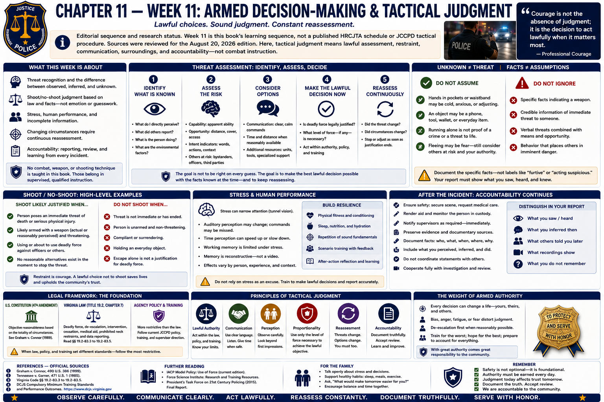

# Chapter 11 — Week 11: Armed Decision-Making & Tactical Judgment



> **Editorial sequence and research status.** Week 11 is this book's learning sequence, not a published HRCJTA schedule or JCCPD tactical procedure. Sources were reviewed for the August 20, 2026 edition. Here, **tactical judgment** means lawful assessment, restraint, communication, surroundings, and accountability—not combat instruction.

## Opening

An unknown object is not automatically a weapon. A sudden movement is not automatically an attack. Yet officers sometimes must decide before every uncertainty can be resolved. Professional armed judgment lives in that tension: observe without pretending certainty, respond to reasonably perceived danger, use communication and time when circumstances permit, account for uninvolved people and surroundings, and keep reassessing.

The defining skill is not merely firing accurately. It is making a lawful, objectively reasonable decision about whether firing is justified at all—and recognizing when it is not or is no longer justified.

## What This Week Is About

This chapter addresses threat recognition conceptually, incomplete information, shoot/no-shoot judgment, stress and human performance, changing circumstances, moral responsibility, and post-incident obligations. It provides no approach, entry, clearing, ambush, retention, disarming, targeting, or shooting technique. Scenario methods and equipment procedures belong only in supervised instruction.

Chapters 9 and 10 remain controlling foundations: constitutional reasonableness, Virginia's force statutes, de-escalation where reasonably possible, firearm safety, qualification versus judgment, cessation, care, intervention, reporting, and review.

## What You Need to Understand

### Unknown, possible, and confirmed are different

Threat assessment should distinguish what is observed, what another person reported, what is inferred, and what remains unknown. Context can include behavior, words, reliable information, apparent capability and opportunity, proximity to others, environmental constraints, and changes over time. No single cue should become a universal shortcut.

Officers must not assume every hand movement, silhouette, tool, phone, or unknown object is a firearm. Nor must they ignore specific facts indicating immediate danger. When reasonably possible, observation, clear communication, time, appropriate distance, lighting, additional information, and specialized resources can reduce ambiguity. When immediate danger is reasonably perceived, constitutional and statutory standards govern. The account must state the particular facts—not merely “furtive movement” or “I feared for my safety.”

### Shoot/no-shoot learning rewards restraint

Judgment scenarios may evaluate whether a recruit recognizes that a firearm **should not** be used. A person may be distressed but unarmed, hold an ordinary object, comply after delay, move near an uninvolved person, or cease threatening behavior. These are high-level illustrations, not reusable scenario scripts.

A decision not to fire is not hesitation when the legal threshold is absent. A decision to stop firing when justification ends is not failure to finish a technique. Professional restraint protects life and makes authority legitimate.

### Surroundings are part of every decision

Identify uninvolved people, foreground, background, structures, traffic, and other consequences that can reasonably be perceived. Information about one apparent danger must not erase awareness of everyone else. Communication and coordination can also affect what other officers and bystanders understand. Exact positioning or response methods are outside this guide.

### Acute stress affects people differently

Research on police and other high-stress performance reports possible narrowed attention, changes in auditory perception, altered time estimates, reduced working-memory capacity, and uneven later recall. These effects are **possible, variable, and context-dependent**, not universal facts. Studies often use different populations, simulations, measures, and stress levels; individual reports should not be assumed or coached.

Memory is reconstructive rather than a video recording. Confidence and accuracy are not identical. Contemporaneous recordings and physical evidence can clarify or challenge a recollection, but a camera also has a limited position and sensory field. Good training builds lawful decision habits and accurate reporting without turning human limitations into an excuse for misconduct or a reason to fill gaps.

After an incident, distinguish: what you directly perceived; what you inferred then; what others later told you; what a recording later showed; and what you do not remember. Follow lawful investigative and reporting processes. Do not coordinate accounts, watch recordings contrary to policy, or adopt another person's observations as your own.

### Judgment remains dynamic

```text
Observe facts and identify uncertainty
               ↓
Assess authority, danger, and surroundings
               ↓
Use reasonable communication or resources when possible
               ↓
Make the lawful decision required now
               ↓
Reassess and stop or change when circumstances change
```

The framework is conceptual. It cannot dictate tempo or physical response. Its purpose is to prevent tunnel thinking: the lawful answer at one moment may not remain lawful seconds later.

### A critical incident begins new responsibilities

After a serious force or firearm event, priorities generally may include addressing continuing threats, requesting medical aid, notifying supervisors, preserving the scene and evidence, identifying witnesses, protecting public safety, and following investigative instructions. Administrative and criminal review may be separate; outside investigation, prosecutorial review, civil litigation, or judicial proceedings may occur. Exact notification, public-safety statement, interview, representation, testing, equipment handling, and report procedures are agency- and fact-specific and are not stated here.

Truthfulness remains absolute. Preserve rather than curate evidence. Provide required information through proper processes. Do not speculate publicly or share images, recordings, identities, or confidential details with family or social media.

Wellness support can coexist with accountability. A critical incident can affect sleep, concentration, mood, physical arousal, relationships, or meaning; reactions vary, can be delayed, and do not automatically indicate a disorder. Peer support, chaplaincy, employee assistance, a culturally competent licensed clinician, medical care, family support, legal support, and time away under policy can serve different needs. Immediate risk of self-harm, harm to another, inability to function safely, or severe symptoms requires urgent professional help.

## What Training May Feel Like

Judgment scenarios can generate adrenaline, uncertainty, embarrassment, and strong self-criticism. The learning goal is not to look fearless. It is to notice relevant facts, apply law, communicate when appropriate, protect uninvolved people, change decisions as facts change, and explain honestly.

After-action discussion should separate outcome from decision quality. A good outcome does not prove a careless decision was sound; an adverse outcome does not alone prove a reasonable decision was unlawful. Review the information reasonably available at each point, then identify skills and systems that can improve.

## Key Concepts and Vocabulary

- **Threat:** a danger assessed from articulable facts and context; uncertainty alone is not confirmation.
- **Threat recognition:** conceptual observation and assessment of possible danger, not a mechanical cue list.
- **Shoot/no-shoot judgment:** legal and professional determination whether firing is justified; “no shoot” is a substantive decision.
- **Uninvolved person:** anyone not presenting the danger or subject to the force decision whose safety must be considered.
- **Backdrop / surroundings:** people, structures, traffic, and environment beyond or around the apparent threat.
- **Acute stress:** short-term physiological and psychological response that may affect performance or perception in variable ways.
- **Critical incident:** serious event with potential legal, investigative, operational, and wellness consequences; agency definitions may differ.
- **Post-incident responsibilities:** safety, care, notification, evidence preservation, truthful process participation, and wellness under governing procedure.

## From the Classroom to the Street

**Fictional, high-level example—not JCCPD procedure.** Dispatch reports that a person may have a weapon. At the scene, an officer observes an object but cannot yet identify it. No single assumption resolves the problem. The officer considers the reliability and specificity of the report, actual behavior, communication, uninvolved people, surroundings, lawful authority, reasonable options, and every change. The example intentionally supplies no “correct tactic”; its lesson is to keep possibility, observation, and confirmation distinct.

In another conceptual exercise, circumstances initially support a serious force response, but the apparent threat drops away and the person complies. The decision must change. Earlier justification does not create continuing permission.

## From the Courthouse to the Academy

```text
Seconds to decide
       ↓
Hours to document
       ↓
Days or months of investigation
       ↓
Potential years of legal review
```

Later reviewers can compare reports, dispatch information, body-camera or other recordings where applicable, witness accounts, physical and medical evidence, scene measurements, policy, training records, Virginia statutes, and *Graham*/*Garner*. A prosecutor may consider criminal law; an agency may assess policy; a civil court may examine constitutional claims; each inquiry has its own standards.

The officer's task is not to predict every later interpretation. It is to make the best lawful decision reasonably possible, protect life, preserve the record, state limitations, and participate honestly in review. Seconds of uncertainty deserve careful contextual review—not automatic praise or automatic condemnation.

## What May Be Difficult

**Ambiguity:** resist converting a possibility into a fact. **Attention:** deliberately account for uninvolved people and change. **Restraint:** “no fire” may be the most important result. **Memory:** state gaps instead of repairing them. **Moral weight:** grave authority can affect identity and family life. **Support:** seek qualified help early without treating normal variation as weakness or diagnosis.

## Questions to Think About

1. What is directly observed, reported, inferred, or unknown?
2. What specific facts support—or weaken—the perception of immediate danger?
3. Who else and what surroundings may be affected?
4. What communication or resource is reasonably available?
5. What change would require stopping or changing the decision?
6. How will perception, inference, later information, and memory gaps be separated?
7. What investigative, medical, legal, and wellness processes may follow?

## Week in Review

Armed judgment is disciplined restraint under uncertainty. Do not treat unknown movement or objects as automatic confirmation; attend to context, authority, uninvolved people, and surroundings; communicate when reasonably possible; act on articulable facts; reassess; and stop when justification ends. After a critical incident, safety, medical care, evidence preservation, truthful accountability, and appropriate wellness support all matter.

## Further Reading & References

### Official Sources

1. *Graham v. Connor*, 490 U.S. 386 (1989), official U.S. Reports: https://tile.loc.gov/storage-services/service/ll/usrep/usrep490/usrep490386/usrep490386.pdf
2. *Tennessee v. Garner*, 471 U.S. 1 (1985), official U.S. Reports: https://tile.loc.gov/storage-services/service/ll/usrep/usrep471/usrep471001/usrep471001.pdf
3. *Code of Virginia* §§ 19.2-83.3–19.2-83.5, **law-enforcement force, intervention, and reporting provisions**: https://law.lis.virginia.gov/vacode/title19.2/chapter7/
4. Virginia Department of Criminal Justice Services, **Law Enforcement Training / Compulsory Minimum Training Standards and Performance Outcomes**: https://www.dcjs.virginia.gov/law-enforcement/training
5. U.S. Department of Justice, Office of Community Oriented Policing Services, **Officer Safety and Wellness Resources**: https://cops.usdoj.gov/officersafetyandwellness

### Further Reading

- Judith P. Andersen and Harri Gustafsberg, “A Training Method to Improve Police Use of Force Decision Making,” *SAGE Open* 6(2), 2016: https://doi.org/10.1177/2158244016638708
- Lorraine Hope, “Evaluating the Effects of Stress and Fatigue on Police Officer Response and Recall,” in current peer-reviewed human-performance literature; use the author's publication record rather than a tactical summary: https://researchportal.port.ac.uk/en/persons/lorraine-hope
- National Institute of Justice, **Law Enforcement Officer Safety and Wellness**: https://nij.ojp.gov/topics/law-enforcement/officer-safety-wellness

### For the Family

- Armed-decision study can prompt sober conversations or temporary quiet; severe distress is not inevitable. Maintain ordinary connection, sleep, meals, movement, and time unrelated to policing.
- Do not ask the recruit to demonstrate scenarios or disclose protected details. Agree on secure-equipment boundaries and how either person will raise a safety or wellness concern.
- Persistent nightmares, withdrawal, anger, substance misuse, hopelessness, or impaired functioning deserve timely confidential professional attention; immediate danger requires emergency help.
