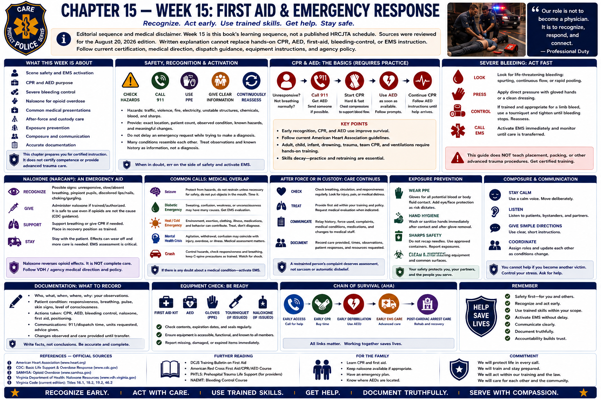

# Chapter 15 — Week 15: First Aid & Emergency Response



> **Editorial sequence and medical disclaimer.** Week 15 is this book's learning sequence, not a published HRCJTA schedule. Sources were reviewed for the August 20, 2026 edition. **Written explanation cannot replace hands-on CPR, AED, first-aid, bleeding-control, or EMS instruction.** Follow current certification, medical direction, dispatch guidance, equipment instructions, and agency policy.

## Opening

Police may reach a crash, overdose, assault, or unconscious person before EMS. A person under arrest may become ill. An officer may be injured. The officer's role is not to become a physician; it is to recognize possible emergency, avoid creating additional harm, summon appropriate care, use current trained skills and equipment, communicate changes, and preserve an accurate record.

## What This Week Is About

This chapter introduces scene safety, EMS activation, CPR and AED purpose, severe bleeding, naloxone, common medical presentations, exposure prevention, care after force or custody, composure, and documentation. It prepares the reader for certified instruction; it neither certifies competence nor supplies advanced trauma care.

## What You Need to Understand

### Safety, recognition, and activation come first

Before helping, identify hazards at a general level—traffic, violence, fire, electricity, unstable structures, chemicals, blood, and sharps—and request the resources the situation appears to require. Use appropriate protective equipment. Give dispatch and EMS clear location, patient count, observed condition, known hazards, and meaningful changes. Do not delay an emergency request while trying to make a diagnosis.

An unconscious person, abnormal or absent breathing, severe bleeding, signs of stroke or heart attack, serious injury, seizure that is prolonged or repeated, significant heat or cold illness, or altered consciousness can require urgent EMS assessment. Diabetes, intoxication, overdose, head injury, behavioral crisis, and other conditions can resemble one another. Treat observations and known history as information, not a field diagnosis.

### CPR and AED skills require practice

Cardiopulmonary resuscitation (**CPR**) is intended to support blood flow when cardiac arrest has stopped effective circulation. An automated external defibrillator (**AED**) analyzes rhythm and, when appropriate, directs a shock intended to help restore an effective rhythm. Early recognition, emergency activation, CPR, and timely AED use are links in the American Heart Association's chain of survival.

Public guidance generally says to call emergency services, begin CPR for a person who is unresponsive and not breathing normally, and use an available AED by following its prompts. The exact assessment, compression, ventilation, child/infant, drowning, trauma, team, and special-circumstance procedures belong in current hands-on certification. Skills decay; retraining and practice matter.

### Severe bleeding is time-critical

Life-threatening external bleeding may be continuous or spurting, pool rapidly, soak clothing or dressings, or accompany shock. Activate EMS, use trained bleeding-control measures and available protective equipment, and monitor until care transfers. Mainstream public courses teach direct pressure and, for appropriate life-threatening limb bleeding, trained tourniquet use. Placement, device selection, wound packing, reassessment, and special cases require formal instruction. This guide intentionally gives no advanced trauma procedure.

### Naloxone is an emergency aid, not complete care

Possible opioid overdose can include unresponsiveness, slow or absent breathing, pinpoint pupils, discolored lips or nails, or choking/gurgling sounds; no single sign is conclusive. CDC and SAMHSA advise treating suspected overdose as an emergency: summon EMS, administer naloxone if available and trained/authorized, support breathing or CPR as trained, place the person as trained when appropriate, and stay because effects can recur and additional medical care is needed.

Naloxone reverses opioid effects and generally will not harm someone if opioids are not the cause, according to CDC guidance. It does not replace EMS assessment, monitoring, or care for another cause. Virginia Department of Health's naloxone resources and current agency medical direction govern program details; this chapter provides no drug-use information.

### Common calls can have medical overlap

- **Seizure:** protect from obvious hazards, summon care according to training, observe duration and recovery, and do not improvise restraints or put objects in the mouth.
- **Possible diabetic emergency:** altered behavior, sweating, confusion, weakness, or unconsciousness can have many causes; obtain EMS guidance rather than assuming intoxication.
- **Heat or cold emergency:** environment, exertion, clothing, illness, medications, and behavior can contribute; move toward trained care without turning this chapter into a treatment protocol.
- **Mental-health crisis:** agitation, withdrawal, confusion, or unusual behavior may coexist with injury, overdose, low oxygen, infection, or other illness. Behavioral labels must not block medical assessment.
- **Traffic crash:** address hazards and request fire/EMS resources, then provide only care within training.

### Blood and body fluids require routine precautions

Use gloves and other personal protective equipment appropriate to anticipated exposure; cover personal breaks in skin; avoid direct contact; maintain sharps awareness; and dispose of or isolate contaminated items through approved processes. OSHA's Bloodborne Pathogens Standard requires covered employers to use an exposure-control framework, engineering and work-practice controls, protective equipment, training, vaccination provisions, and post-exposure evaluation.

If a needlestick, splash to eyes or mouth, or other occupational exposure occurs, perform immediate first aid as trained, report promptly, and obtain confidential medical evaluation and follow-up through the agency plan. Do not conceal an exposure out of embarrassment and do not improvise biohazard processing.

### Custody and force do not reduce the need for care

After force or during custody, pay attention to visible injury, pain, breathing difficulty, altered consciousness, head impact, intoxication, significant agitation, repeated vomiting, inability to communicate normally, and any sign of medical distress. Request medical evaluation when indicated by observation, complaint, training, law, or policy. Continue monitoring and communicate relevant facts to EMS and the receiving facility.

Do not assume “just intoxicated,” “just resisting,” or “already cleared” answers a new or worsening symptom. Document observed condition, statements and complaints, force-related facts, aid requested or provided, refusals handled under procedure, changes, and transfer. Chapters 8 and 9's dignity, reasonable force, cessation, intervention, and care principles continue after restraints are applied.

### Composure supports care

Emergency response asks recruits to control their own pace enough to communicate, recall training, coordinate with dispatch and EMS, give bystanders clear nontechnical direction when appropriate, and notice change. Repeated supervised practice builds retrieval under stress. Calm does not mean indifferent; it means usable attention.

## What Training May Feel Like

Hands-on practice can be physically tiring and emotionally vivid. Feedback may expose forgotten steps or hesitation. That is the purpose of training equipment and supervised repetition. Recruits should disclose limitations or exposures through the proper process and never pretend certification they do not hold.

## Key Concepts and Vocabulary

- **EMS:** emergency medical services—the coordinated prehospital system, not merely an ambulance vehicle.
- **CPR:** trained effort to support circulation during cardiac arrest.
- **AED:** device that analyzes heart rhythm and gives user prompts for a shock when indicated.
- **Severe bleeding:** potentially life-threatening blood loss requiring emergency action and trained control.
- **Naloxone:** medicine that can reverse opioid overdose temporarily; it does not replace EMS or follow-up care.
- **Universal/standard precautions:** infection-prevention approach treating potentially infectious material with appropriate controls; use current training terminology.
- **Occupational exposure:** work-related contact that may transmit bloodborne disease and requires prompt reporting and evaluation.
- **Transfer of care:** communication and accountability when EMS or a medical facility assumes patient care.

## From the Classroom to the Street

**Illustrative, not a treatment algorithm.** An officer finds an unresponsive person with abnormal breathing. The officer identifies immediate hazards, calls EMS, reports observations, uses naloxone and CPR/AED skills only as trained and indicated, watches for change, and transfers information to EMS. Later reporting distinguishes what was observed, what a witness said, what aid was given, and how the person responded.

In custody, a person complains of worsening breathing difficulty. The complaint is treated as information requiring assessment, not as an inconvenience. Medical response and documentation protect health and the integrity of later review.

## From the Courthouse to the Academy

```text
Medical need observed or reported
             ↓
EMS request and trained response
             ↓
Transfer of care and contemporaneous records
             ↓
Officer report / photographs / witness accounts
             ↓
Possible evidentiary, administrative, or court review
```

Officer and EMS reports, medical records obtained under applicable legal rules, photographs, recordings, witness statements, dispatch times, and force documentation may later help establish condition, timing, causation, response, and credibility. Medical records have privacy and evidentiary rules; police access is not automatic. Accurate medical-response documentation is part of the factual record, not a substitute for a clinical conclusion.

## What May Be Difficult

**Uncertainty:** different emergencies can look alike. **Memory under pressure:** simple trained priorities must be retrievable. **Distress:** children, serious bleeding, or an unresponsive colleague can be emotionally difficult. **Boundaries:** helping does not authorize untrained procedures. **Afterward:** complete documentation and exposure reporting even when adrenaline fades.

## Questions to Think About

1. What hazards and protective equipment matter before contact?
2. What observations require immediate EMS activation?
3. What care am I currently trained, equipped, and authorized to provide?
4. What changed after aid, and what must EMS know?
5. Does force, custody, intoxication, or agitation risk hiding a medical problem?
6. Was there an occupational exposure requiring prompt reporting and follow-up?
7. Which facts belong in the later record, and which conclusions belong to clinicians?

## Week in Review

Officers often bridge the time until EMS arrives. Sound response means general scene safety, early activation, current certified skills, protective precautions, observation, reassessment, and clear transfer. CPR/AED, bleeding control, and naloxone require hands-on training. Arrest status never makes medical distress irrelevant. Composure and honest documentation connect care to accountability.

## Further Reading & References

### Official Sources

1. Virginia Department of Health, **Emergency Medical Services**: https://www.vdh.virginia.gov/emergency-medical-services/
2. Virginia Department of Health, **Naloxone**: https://www.vdh.virginia.gov/epidemiology/naloxone/
3. Centers for Disease Control and Prevention, **5 Things to Know About Naloxone** and overdose response resources: https://www.cdc.gov/stop-overdose/caring/naloxone.html
4. Occupational Safety and Health Administration, **Bloodborne Pathogens and Needlestick Prevention**: https://www.osha.gov/bloodborne-pathogens
5. Virginia DCJS, **Law Enforcement Training / Compulsory Minimum Training Standards and Performance Outcomes**: https://www.dcjs.virginia.gov/law-enforcement/training

### Further Reading

- American Heart Association, **CPR and ECC Guidelines / Hands-Only CPR**: https://cpr.heart.org/en/resuscitation-science/cpr-and-ecc-guidelines and https://cpr.heart.org/en/cpr-courses-and-kits/hands-only-cpr
- American Red Cross, **First Aid, CPR and AED Training**: https://www.redcross.org/take-a-class/first-aid
- American College of Surgeons, **STOP THE BLEED**: https://www.stopthebleed.org/
- SAMHSA, **Opioid Overdose Prevention and Reversal**: https://www.samhsa.gov/substance-use/treatment/overdose-prevention

### For the Family

- Training may prompt useful interest in CPR classes, AED locations, and a maintained first-aid kit. Choose a recognized hands-on course rather than treating this chapter as household medical instruction.
- Discuss emergency plans calmly, especially for children or known health needs. Do not diagnose symptoms from a list; use emergency services and qualified care when needed.
