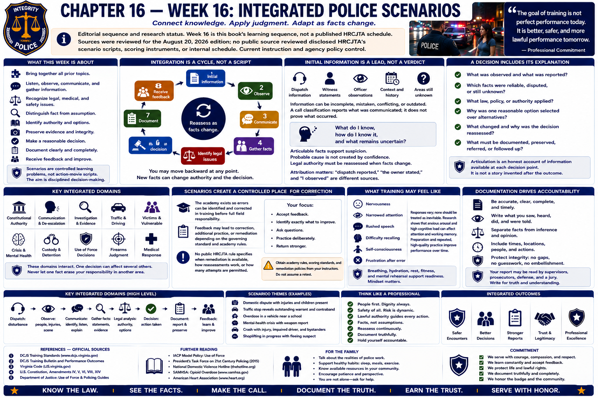

# Chapter 16 — Week 16: Integrated Police Scenarios



> **Editorial sequence and research status.** In this book, Week 16 brings previously separated subjects together. It is not a claim that HRCJTA schedules an “integrated scenario week” at this point. Sources were reviewed for the August 20, 2026 edition; no public source reviewed disclosed HRCJTA's scenario scripts, scoring instruments, or internal schedule. Current instruction and agency policy control.

## Opening

Until now, the book has often placed one subject in the foreground: constitutional authority, communication, patrol, traffic, investigation, victims, custody, force, firearms, driving, crisis, or medical response. A real call does not respect those chapter boundaries. It may begin as a disagreement, reveal an injury, raise a language-access need, produce conflicting accounts, and end with evidence, a summons or arrest decision, and a report.

An integrated scenario is a controlled learning problem that asks a recruit to combine knowledge and judgment rather than recite one isolated rule. The educational aim is not action-movie realism. It is disciplined attention to people, facts, authority, safety, care, evidence, and explanation while information changes.

## What This Week Is About

Scenario-based learning lets knowledge become performance. DCJS publishes compulsory training standards and performance outcomes; a certified academy determines how approved instruction and evaluation are delivered within that framework.[1] This chapter does not convert those statewide outcomes into a purported HRCJTA exercise.

A recruit may need to listen, observe, communicate professionally, gather information, recognize legal and medical issues, distinguish fact from assumption, identify authority, preserve relevant material, make a reasonable decision, and document it afterward. These tasks interact. Clear communication may disclose a medical problem. A witness statement may change the legal analysis. New evidence may disprove the initial dispatch description.

## What You Need to Understand

### Integration is a cycle, not a script

```text
Initial information
       ↓
Observe
       ↓
Communicate
       ↓
Gather facts
       ↓
Identify legal issues
       ↓
Make a reasonable decision
       ↓
Reassess as facts change
       ↓
Document
       ↓
Receive instructor feedback
```

This is a thinking framework, not a tactical checklist. A recruit may move backward: communication produces a new fact, the fact changes authority, and the changed authority requires a different decision. Medical urgency may take priority. An uncertain fact may require another question rather than immediate resolution.

### Initial information is a lead, not a verdict

Dispatch information, first impressions, and witness statements can be incomplete, mistaken, conflicting, outdated, or emotionally expressed. A call classification reports what was communicated; it does not prove what occurred. The productive habit is not **“I already know what happened.”** It is:

> **What do I know, how do I know it, and what remains uncertain?**

That question connects investigation to constitutional authority. Suspicion must be supported by articulable facts; probable cause is not created by confidence; and legal authority must be reassessed when facts change. Attribution matters: “dispatch reported,” “the owner stated,” and “I observed” describe different sources of knowledge.

### A decision includes its explanation

Scenario performance is not only arriving at a preferred endpoint. A recruit may be asked to explain:

- what was observed and what another person reported;
- which facts were reliable, disputed, or still unknown;
- what law, policy, or authority mattered;
- why one reasonable option was selected over alternatives;
- what changed and why the decision was reassessed; and
- what must be documented, preserved, referred, or followed up.

Articulation is not a story invented after the outcome. It is an honest account of the information available at each decision point. A sound result supported by careless reasoning remains a learning concern; an imperfect result followed by candid analysis may reveal exactly what needs practice.

### Scenarios create a controlled place for correction

The academy exists partly so errors can be identified in controlled training before the recruit carries full responsibility in the field. Depending on the governing standard and the academy's rules, feedback may lead to correction, additional practice, or remediation. This book found no public HRCJTA rule establishing when remediation is available, how scenario reassessment works, or how many attempts are permitted. A recruit must obtain those rules from the academy rather than assume a retest.

## What Training May Feel Like

Realistic evaluation may produce nervousness, narrowed attention, rushed speech, difficulty retrieving information, self-consciousness, or frustration after an error. Responses vary; none should be treated as inevitable. Laboratory and applied research supports the more modest proposition that acute stress and high cognitive load can affect attention and working memory, while preparation and repeated, feedback-informed practice can improve retrieval and performance.[2][3]

The answer is not to pretend pressure is absent. It is to return attention to observable information, lawful purpose, trained priorities, communication, and reassessment.

## Key Concepts and Vocabulary

- **Integrated scenario:** controlled learning event requiring several knowledge and performance areas to be used together.
- **Scenario-based training:** instruction or evaluation organized around a realistic problem rather than an isolated fact or skill.
- **Information source:** the person, record, sensor, dispatch message, or observation from which a claimed fact came.
- **Assumption:** proposition treated as true without sufficient confirmation; assumptions should be tested, not hidden.
- **Reassessment:** deliberate reconsideration when facts, risks, authority, or available options change.
- **Articulation:** truthful explanation connecting observations, information, law, reasoning, and action.
- **Debrief:** structured review of performance intended to identify strengths, errors, decisions, and next practice needs.

## From the Classroom to the Street

### Fictional integrated example—not an HRCJTA exercise or tactical model

Dispatch sends a recruit to a disagreement outside a business. The brief message says that “a customer broke a window.” At the scene, the owner says a departing customer damaged a display. The customer says the glass broke when another person pushed her into it. One witness saw an argument but not the contact; another gives an account in limited English and requests language assistance. The customer has a cut and asks for medical help. A camera may have recorded the area.

No call label answers the case. The recruit addresses the medical concern, communicates respectfully, obtains suitable language assistance under policy, separates each person's observations from conclusions, determines what property was damaged and who controls it, considers whether lawful grounds exist for detention or enforcement, identifies and preserves potential evidence, and avoids promising a charge or outcome. If video or a new witness contradicts an earlier account, the recruit reassesses rather than defending the first theory.

The later report attributes each statement, describes the injury and requested care, records observations and evidence handling, identifies uncertainty, and explains any exercise of authority. Law, communication, victim care, investigation, evidence, language access, and documentation have become one problem.

## From the Courthouse to the Academy

What appears at the courthouse as one file may reflect dozens of decisions during one encounter. It may contain reports, photographs, evidence records, warrants, summonses, witness statements, medical records obtained through lawful process, and later testimony. A judge or lawyer sees the surviving record, not the officer's unrecorded intentions.

Your courthouse experience may help you recognize how one missing attribution, unexplained gap, or incorrect date travels through a case. The academy asks you to work earlier in that chain: make lawful decisions, preserve the basis for them, and write so another person can evaluate what actually occurred.

## What May Be Difficult

**Uncertainty:** resisting a quick theory can feel slower, but premature certainty creates error. **Task switching:** legal, medical, interpersonal, and documentary needs compete for attention. **Being observed:** awareness of an evaluator can distract from the problem. **Explaining choices:** a conclusion is easier to state than the facts and alternatives behind it. **Receiving correction:** the debrief can feel more uncomfortable than the scenario, yet it is where practice becomes learning.

## Questions to Think About

1. Which words help keep dispatch information separate from personal observation?
2. What fact would cause you to reconsider an initial legal conclusion?
3. In the fictional business example, which needs can proceed at the same time and which depend on more facts?
4. How would you explain a reasonable decision that later proved factually mistaken?
5. What should a debrief capture besides whether the final answer was “right”?

## Week in Review

Integrated scenarios test relationships among subjects. Listen before concluding. Identify the source of each fact. Address safety and care without abandoning legal analysis. Choose among lawful, reasonable options, then reassess. Finally, explain and document the decision honestly. Integration is not memorizing more steps; it is keeping the parts connected while circumstances change.

## Further Reading & References

### Official Sources

1. Virginia Department of Criminal Justice Services, **Law Enforcement Training** (compulsory minimum training standards and performance-outcome materials), accessed August 20, 2026: https://www.dcjs.virginia.gov/law-enforcement/training
2. National Institute of Justice, **Research and Evaluation on Policing**, scenario and officer decision-making research collection, accessed August 20, 2026: https://nij.ojp.gov/topics/law-enforcement

### Further Reading

3. John Sweller, “Cognitive Load During Problem Solving: Effects on Learning,” *Cognitive Science* 12(2), 1988, pp. 257–285, https://doi.org/10.1207/s15516709cog1202_4 (foundational cognitive-load research; not police policy).
- Police Executive Research Forum, *ICAT: Integrating Communications, Assessment, and Tactics Training Guide*, 2016: https://www.policeforum.org/assets/icattrainingguide.pdf (professional model, not Virginia law or JCCPD policy).
- Eduardo Salas et al., “Debriefing Medical Teams: 12 Evidence-Based Best Practices and Tips,” *The Joint Commission Journal on Quality and Patient Safety* 34(9), 2008, pp. 518–527, https://doi.org/10.1016/S1553-7250(08)34066-5 (cross-professional debriefing literature).

### For the Family

- Scenario work may leave a recruit quiet, keyed up, or frustrated, but reactions vary. A short decompression period, food, sleep, and ordinary conversation may help more than immediate questioning.
- Ask “Do you want me to listen, help you study, or give you space?” rather than requesting protected scenario details or trying to decide whether an instructor was right.
- One difficult performance is information, not a verdict on the recruit's worth. Support honest correction without promising that every deficiency can be retested.
