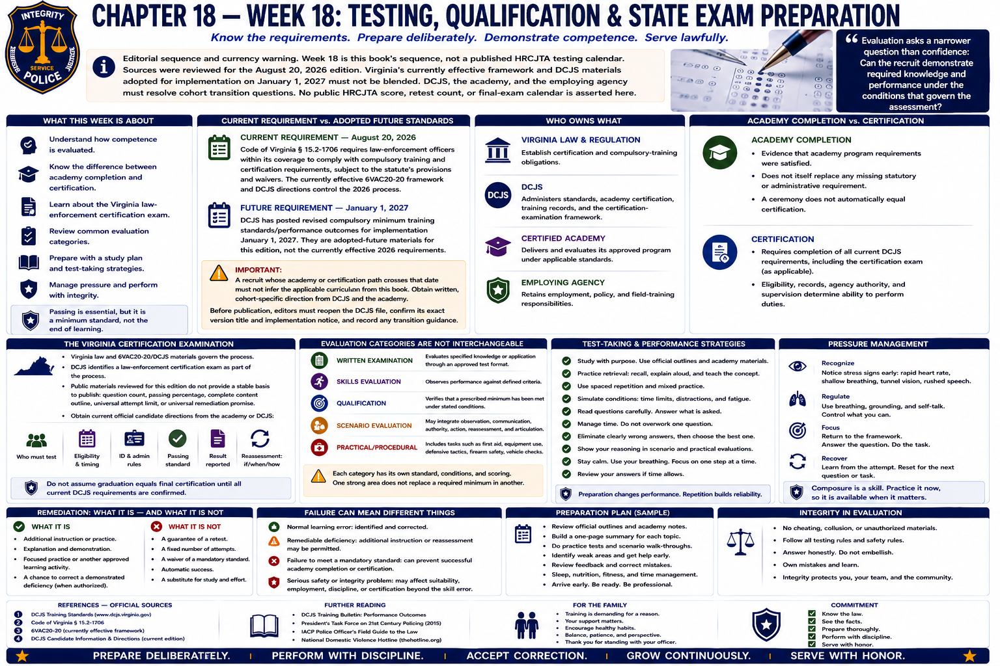

# Chapter 18 — Week 18: Testing, Qualification & State Exam Preparation

> **Editorial sequence and currency warning.** Week 18 is this book's sequence, not a published HRCJTA testing calendar. Sources were reviewed for the August 20, 2026 edition. Virginia's currently effective framework and DCJS materials adopted for implementation on **January 1, 2027** must not be blended. DCJS, the academy, and the employing agency must resolve cohort transition questions. No public HRCJTA score, retest count, or final-exam calendar is asserted here.

## Opening

Evaluation asks a narrower question than confidence: can the recruit demonstrate required knowledge and performance under the conditions that govern the assessment? Written examinations may test recognition and application of law or procedure. Practical evaluations may require reliable performance. Qualifications establish a defined minimum. A state certification examination has a distinct place in Virginia's certification process.

Passing matters. It is also not the endpoint. A minimum standard protects the public only when it becomes a continuing professional habit.

## What This Week Is About

Academy competence can be evaluated through more than one form. DCJS standards and approved performance outcomes are the authoritative starting point; academy and agency requirements may add lawful expectations.[1] Depending on the controlling curriculum and program, evaluation can include written knowledge, demonstrations or practical performance, firearms, driver training, defensive tactics, first aid, integrated decision-making, and documentation. This list describes possible categories, not an invented HRCJTA final-week package.

The recruit needs to know which authority owns each requirement:

- **Virginia law and regulation** establish certification and compulsory-training obligations.
- **DCJS** administers standards, academy certification, training records, and the certification-examination framework.
- **The certified academy** delivers and evaluates its approved program under applicable standards.
- **The employing agency** retains employment, policy, and field-training responsibilities.

## What You Need to Understand

### Current requirement and adopted future standards

> **Current requirement — August 20, 2026.** Code of Virginia § 15.2-1706 requires law-enforcement officers within its coverage to comply with compulsory training and certification requirements, subject to the statute's provisions and waivers. The currently effective 6VAC20-20 framework and DCJS directions control the 2026 process.[2][3]

> **Future requirement — January 1, 2027.** DCJS has posted revised compulsory minimum training standards/performance outcomes for implementation January 1, 2027. They are adopted-future materials for this edition, not the currently effective 2026 requirements.[1]

A recruit whose academy or certification path crosses that date should not infer the applicable curriculum from this book. Obtain written, cohort-specific direction from DCJS and the academy. Before publication, an editor with ordinary web access must reopen the DCJS file, confirm its exact version title and implementation notice, and record any transition guidance; this environment's external HTTPS tunnel returned 403.

### Academy completion and certification are related, not identical

Completing academy instruction is evidence that an academy's program requirements were satisfied. Compulsory training, required examinations, DCJS records, eligibility, employment status, and certification are legally related but distinct. A ceremony does not itself replace a missing statutory or administrative requirement. Likewise, a person's employment status and permission to perform duties depend on law, certification status, agency authority, and supervision—not merely possession of a diploma.

### The Virginia certification examination

Virginia law authorizes and requires certification through the Commonwealth's training system, and 6VAC20-20/DCJS materials govern the process.[2][3] DCJS identifies a law-enforcement certification examination as part of that process. Public materials reviewed for this edition did not provide a stable basis to publish a question count, passing percentage, complete content outline, universal attempt limit, or universal remediation promise. This book therefore does not supply them.

The recruit should obtain the current official candidate directions from the academy or DCJS: who must test; eligibility and timing; identification and administration rules; the currently applicable passing standard; what result is reported; and whether, when, and under what authority reassessment is available. Academy completion should not be casually described as final certification until all current DCJS requirements are confirmed.

### Evaluation categories are not interchangeable

- **Written examination:** evaluates specified knowledge or application through an approved test format.
- **Skills evaluation:** observes performance against defined criteria.
- **Qualification:** verifies that a prescribed minimum has been met under stated conditions.
- **Scenario evaluation:** may integrate observation, communication, authority, action, reassessment, and articulation.
- **Certification examination:** state-administered or state-required examination within the certification framework; it is not simply another name for every academy test.

Exact scoring, remediation, reassessment, and failure consequences can differ by subject and authority. “Everyone gets three chances” is not a rule and must never be promised.

### Passing is not proficiency

Passing an academy qualification establishes a required level of competence. It does not mean learning stops. This distinction applies to firearms, driving, first aid, defensive tactics, written law, communication, and judgment. Minimum competence authorizes the next supervised stage only to the extent law and policy allow; proficiency develops through lawful practice, feedback, field supervision, recurrent training, and continuing study.

### Study by retrieval and explanation

Productive preparation is regular, lawful, and conceptual:

- review notes daily rather than waiting for one long session;
- connect statutes and standards to simple factual examples;
- make vocabulary cards that require definitions and distinctions;
- explain a rule aloud without looking, then check accuracy;
- revisit instructor corrections and keep an error log;
- study appropriately with classmates without sharing protected content;
- practice selecting the relevant rule when facts change;
- prioritize sleep and planned review over avoidable all-night cramming.

Try questions that require explanation:

> What is the difference between reasonable suspicion and probable cause?

> Why does chain of custody matter?

> What is the legal purpose of a search warrant?

> What should change when circumstances change during a use-of-force incident?

If an answer is only a slogan, understanding is probably not yet reliable. Do not seek leaked questions, answer banks, or proprietary academy content. Cheating defeats the public-safety purpose of evaluation and creates an integrity problem beyond the test.

### Manage test pressure practically

Preparation is the strongest general response. Protect sleep, follow a familiar morning routine, arrive with required materials, read directions and questions carefully, budget time, and return attention to the present item rather than rehearsing the last one. When permitted, a slow exhale or brief attention reset can interrupt rushing. These are performance habits, not medical treatment advice.

## What Training May Feel Like

A near-final evaluation can make one item feel like a judgment on the entire academy. It is not useful to minimize the stakes, but panic adds no knowledge. Focus on the standard in front of you. Afterward, record what was uncertain while respecting test-security rules, then use only authorized feedback and materials.

Qualification days may combine physical effort, waiting, equipment responsibility, and observation by instructors. Readiness includes punctuality, correct required equipment, hydration and food consistent with training directions, and enough rest to perform safely.

## Key Concepts and Vocabulary

- **Written examination:** formal assessment of defined knowledge or its application.
- **Skills evaluation:** observation of performance against specified criteria.
- **Qualification:** verified attainment of a defined minimum under prescribed conditions.
- **Competency:** demonstrated ability to perform the required outcome.
- **Passing standard:** officially established threshold; it must come from the authority governing that assessment.
- **Certification:** official recognition under Virginia's legal and administrative framework; not a casual synonym for graduation.
- **Certification examination:** examination required within the DCJS certification process.
- **Test security:** rules protecting assessment content, fairness, and validity.

## From the Classroom to the Street

**Illustrative study exercise—not test content.** Instead of memorizing “probable cause is higher,” a recruit states what each standard permits, identifies the objective facts in a neutral hypothetical, names missing information, and explains why changed facts might end a detention or support a different lawful step. The practice tests retrieval, distinction, application, and articulation without reproducing an academy question.

## From the Courthouse to the Academy

Court work makes the purpose of precision familiar. A small error in a name, date, authority, filing, or chain-of-custody record may change what others can do. Academy testing likewise asks whether terminology, law, procedure, documentation, and professional standards can be applied reliably—not whether the recruit can sound confident.

## What May Be Difficult

**Similar terms:** detention, arrest, custody, and commitment are not interchangeable. **Mixed formats:** knowing a rule does not automatically produce a physical skill. **Unverified rumors:** another class's score or retest story may not apply. **Overstudying:** fatigue can erase the benefit of one more hour. **Outcome fixation:** calculating failure while testing diverts attention from the current task.

## Questions to Think About

1. Which current requirement is state-controlled, academy-controlled, or agency-controlled?
2. Can you explain each core legal term without using the term in its own definition?
3. Which corrections recur in your notes, and what type of practice do they require?
4. What is the difference between qualification and proficiency?
5. Where will you obtain the official passing and reassessment rules for a specific assessment?

## Week in Review

Evaluation includes knowledge, performance, and judgment. Use current official instructions; keep 2026 requirements separate from adopted January 1, 2027 materials. Study by retrieval and explanation, protect sleep, respect test security, and never invent a universal retest rule. Passing proves a defined minimum. Professional growth begins again the next day.

## Further Reading & References

### Official Sources

1. Virginia Department of Criminal Justice Services, **Law Enforcement Training** (current standards, certification information, and posted January 1, 2027 materials), accessed August 20, 2026: https://www.dcjs.virginia.gov/law-enforcement/training
2. *Code of Virginia* § 15.2-1706, **Certification through training required for all law-enforcement officers; waiver of requirements**, current code locator accessed August 20, 2026: https://law.lis.virginia.gov/vacode/title15.2/chapter17/section15.2-1706/
3. Virginia Criminal Justice Services Board, **6VAC20-20, Rules Relating to Compulsory Minimum Training Standards for Law-Enforcement Officers**, current regulation locator accessed August 20, 2026: https://law.lis.virginia.gov/admincode/title6/agency20/chapter20/

### Further Reading

- Henry L. Roediger III and Jeffrey D. Karpicke, “Test-Enhanced Learning,” *Psychological Science* 17(3), 2006, pp. 249–255: https://doi.org/10.1111/j.1467-9280.2006.01693.x
- John Dunlosky et al., “Improving Students' Learning With Effective Learning Techniques,” *Psychological Science in the Public Interest* 14(1), 2013, pp. 4–58: https://doi.org/10.1177/1529100612453266
- National Institute for Occupational Safety and Health, **Training for Law Enforcement on Shift Work and Long Work Hours**, 2015: https://www.cdc.gov/niosh/work-hour-training-for-nurses/longhours/

### For the Family

- Agree on the kind of help wanted: quiet, vocabulary cards, a short explanation practice, a meal, or no quizzing at all. Do not request protected test content.
- Preserve sleep and a predictable departure routine when practical. Last-minute household pressure can consume the same attention needed for directions and equipment.
- Avoid promising that one failure “will be fine” or that a retest is guaranteed. Listen first, then encourage the recruit to obtain the written rule and speak truthfully with the academy and agency.
