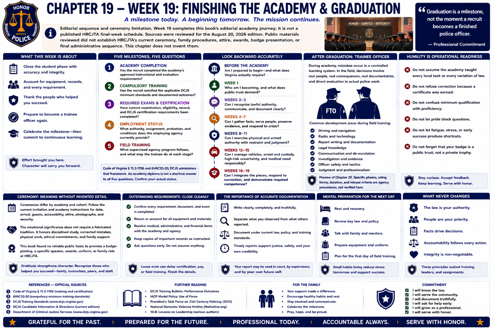

# Chapter 19 — Week 19: Finishing the Academy & Graduation



> **Editorial sequence and ceremony limitation.** Week 19 completes this book's editorial academy journey; it is not a published HRCJTA final-week schedule. Sources were reviewed for the August 20, 2026 edition. Public materials reviewed did not establish HRCJTA's current ceremony, family procedures, attire, awards, badge presentation, or final administrative sequence. This chapter does not invent them.

## Opening

Graduation gathers months of effort into a visible moment. It may bring relief, pride, photographs, and the welcome sense that a difficult stage has closed. Its most honest meaning is quieter:

> **Graduation is a milestone, not the moment a recruit becomes a finished police officer.**

Academy completion says that specified learning and evaluation occurred. Virginia certification has legal and administrative requirements. Employment belongs to the agency relationship. Field training introduces supervised performance in actual police work. These events may occur close together, but they should not be treated as identical.

## What This Week Is About

The final academy phase may include some combination of outstanding requirements, examinations, qualifications, scenario evaluation, records or administrative review, equipment accountability, and ceremony preparation. That is a general description, not an HRCJTA calendar.

The deeper task is transition: close the student phase without pretending learning is complete. Account for equipment and records. Resolve—not assume—the status of every requirement. Thank the people who helped. Then prepare to become a trainee officer again.

## What You Need to Understand

### Five milestones need five accurate questions

1. **Academy completion:** Has the recruit completed the academy's approved instructional and evaluation requirements?
2. **Compulsory training:** Has the recruit satisfied the applicable DCJS minimum standards and documented outcomes?
3. **Required examinations and certification:** Have current examination, eligibility, record, and DCJS certification requirements been completed?
4. **Employment status:** What authority, assignment, probation, and conditions does the employing agency currently provide?
5. **Field training:** What supervised agency program follows, and what may the trainee do at each stage?

Code of Virginia § 15.2-1706 and 6VAC20-20 govern the statewide training/certification framework; DCJS administers that framework.[1][2][3] An academy diploma or ceremony should not be used as a shortcut answer to all five questions. The employing agency and DCJS should confirm the officer's actual status.

### Graduation ceremony is meaningful without invented detail

Ceremonies differ by academy and cohort. Families should follow the current invitation or academy instructions for date, arrival, guests, accessibility, attire, photographs, and security. This book found no reliable public basis to promise a badge-pinning, a particular speaker, awards, uniform, or family role at HRCJTA.

The emotional significance does not require a fabricated tradition. Graduation can honor disciplined study, corrected mistakes, physical work, ethical commitments, and the family routines that made attendance possible.

### Look backward accurately

```text
Before the academy:
Am I prepared to begin—and what does Virginia actually require?

Week 1:
Who am I becoming, and what does public trust demand?

Weeks 2–3:
Can I recognize lawful authority, communicate, and document clearly?

Weeks 4–7:
Can I gather facts, serve people, preserve evidence, and respond to crisis?

Weeks 8–11:
Can I exercise physical and armed authority with restraint and judgment?

Weeks 12–15:
Can I manage vehicles, arrest and custody, high-risk uncertainty, and medical need responsibly?

Weeks 16–19:
Can I integrate the pieces, respond to correction, and demonstrate required competence?
```

This progression is the book's architecture, not an HRCJTA syllabus. Its recurring questions—What do I know? What authority exists? What changed? How will I explain it?—remain useful after the chapter numbers end.

### The next role is trainee officer

During academy, mistakes occur primarily inside a controlled learning system. During field training, decisions increasingly involve real people, real consequences, real documentation, and direct evaluation in actual police work. The new officer may work with a **Field Training Officer (FTO)** or within the agency's equivalent supervised structure.

Areas commonly important in field development can include driving, navigation, radio use, report writing, legal knowledge, communication, investigation, safety, judgment, and professionalism. This is a general preview of Chapter 20, not a statement of James City County's phases, rating form, duration, or release criteria. Those local procedures were not verified for this edition.

### Humility is operational readiness

After graduation, do not:

- assume the academy taught every local task or every variation of law;
- refuse correction because a certificate was earned;
- confuse minimum qualification with proficiency;
- treat civilians or repeat callers cynically;
- view policy as an obstacle to “real policing”;
- neglect sleep, physical health, relationships, or mental health; or
- stop studying current law, policy, and professional practice.

Confidence should grow from preparation and accountable performance. Overconfidence hides uncertainty; professional humility identifies it early enough to seek guidance.

## What Training May Feel Like

The last days can feel both crowded and strangely empty. A recruit may be completing details while already imagining the street. Relief can coexist with concern about a remaining result, an unfamiliar schedule, or the prospect of evaluation by a field trainer. Pride does not cancel uncertainty.

Keep using the habits that carried the academy: verify requirements, write down directions, prepare equipment, sleep, arrive early, accept correction, and tell the truth. Do not let ceremony preparation displace an unresolved qualification or record question.

## Key Concepts and Vocabulary

- **Academy graduate:** person who has completed the academy's defined requirements; the term alone does not answer every certification or employment question.
- **Graduation:** recognition of academy completion, often ceremonial; not a substitute for a legal requirement.
- **Certification:** official status under Virginia's statutory and administrative system.
- **Probationary officer:** agency employment/status term whose meaning and conditions depend on law and agency rules; not a synonym for uncertified recruit.
- **Field training:** supervised agency learning and evaluation in actual police work after or alongside required formal preparation.
- **Field Training Officer (FTO):** officer assigned under an agency's program to train and evaluate a trainee; local titles and structures may differ.
- **Lifelong learning:** continuing study, practice, feedback, and renewal of competence throughout a career.

## From the Classroom to the Street

The academy gave subjects separate names so they could be taught. The street recombines them. A trainee may navigate to a routine call, use the radio, speak with a frightened person, recognize a legal issue, request medical help, preserve a photograph, consult policy, write a report, and explain the work to an FTO and supervisor. The academy foundation matters because each task affects the others.

Chapter 20 will examine that supervised transition. It will not assume that graduation grants independence beyond the officer's current authority and assignment.

## From the Courthouse to the Academy

At the courthouse, a new employee may know legal vocabulary yet still need local workflow, judgment, review, and supervised repetition. Police field training has a comparable distinction without being the same job: classroom knowledge must become accurate work inside a particular institution.

The advantage of courthouse experience remains modest but real. You know that records outlast memory, that procedure affects people, and that a confident assertion can still be wrong. Carry those lessons forward without assuming they replace street supervision.

## What May Be Difficult

**An ending without completion:** the class ends while professional formation continues. **Status ambiguity:** “graduated,” “certified,” “employed,” and “released to independent duty” may describe different facts. **Schedule change:** field assignments can alter sleep and household routines. **Loss of cohort:** daily classmates may disperse to agencies or shifts. **New correction:** an FTO may require agency-specific work different from academy practice without making the academy experience worthless.

## Questions to Think About

1. Who has confirmed each of the five milestones, and where is it documented?
2. Which academy habit most improved your judgment?
3. What correction are you still tempted to resist?
4. How will you ask for help before uncertainty becomes error?
5. What household routines need to change when field training begins?

## Week in Review

The 19-week academy journey is complete. The profession is not. Celebrate the milestone, verify actual certification and employment status, and enter field training ready to learn. A certificate records achievement; public trust will be renewed through the next truthful report, the next restrained decision, the next correction accepted, and the next person treated with dignity.

## Further Reading & References

### Official Sources

1. *Code of Virginia* § 15.2-1706, **Certification through training required for all law-enforcement officers; waiver of requirements**, current code locator accessed August 20, 2026: https://law.lis.virginia.gov/vacode/title15.2/chapter17/section15.2-1706/
2. Virginia Criminal Justice Services Board, **6VAC20-20, Rules Relating to Compulsory Minimum Training Standards for Law-Enforcement Officers**, current regulation locator accessed August 20, 2026: https://law.lis.virginia.gov/admincode/title6/agency20/chapter20/
3. Virginia Department of Criminal Justice Services, **Law Enforcement Training**, certification and standards locator, accessed August 20, 2026: https://www.dcjs.virginia.gov/law-enforcement/training
- Hampton Roads Criminal Justice Training Academy, institutional website, accessed August 20, 2026: https://www.hrcjta.com/ (supports institutional context only; no ceremony or final-week practice inferred).
- James City County, **Police Jobs**, accessed August 20, 2026: https://www.jamescitycountyva.gov/765/Police-Jobs (employment context only; no FTO structure inferred).

### Further Reading

- U.S. Department of Justice, Office of Community Oriented Policing Services, **Officer Safety and Wellness Resources**, accessed August 20, 2026: https://cops.usdoj.gov/officersafetyandwellness
- National Institute of Justice, **Law Enforcement Officer Safety and Wellness**, accessed August 20, 2026: https://nij.ojp.gov/topics/law-enforcement/officer-safety-wellness
- Police Executive Research Forum, *Transforming Police Recruit Training: 40 Guiding Principles*, 2022: https://www.policeforum.org/assets/TransformingRecruitTraining.pdf (professional recommendations, not Virginia or JCCPD requirements).

### For the Family

- Graduation may bring pride, relief, uncertainty, schedule changes, and anticipation at once. Follow the current academy invitation rather than assuming ceremony traditions from another department or television.
- Celebrate completion without suggesting the hardest adjustment must be over. Ask what field training may change about meals, sleep, transportation, childcare, and decompression.
- The new officer may again feel like a beginner. Listen without demanding operational details, support continued study and health, and treat willingness to accept an FTO's correction as growth rather than failure.
- Mark the achievement in a way that fits your family. The most durable celebration may be gratitude for the routines and sacrifices that made nineteen weeks possible.
