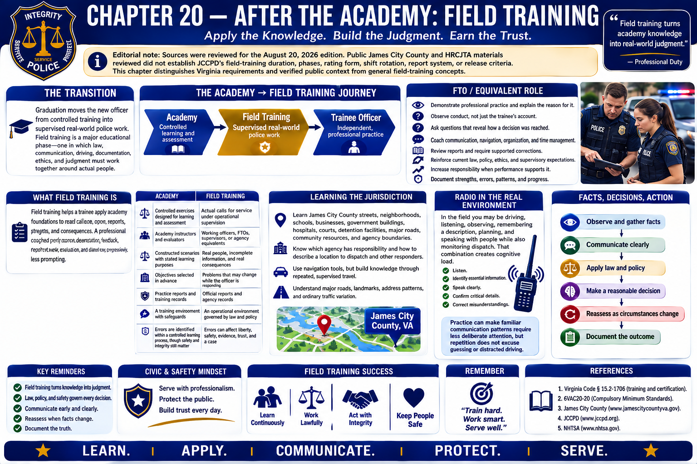

# Chapter 20 — After the Academy: Field Training



> **Research and local-practice limitation.** Sources were reviewed for the August 20, 2026 edition. Public James City County and HRCJTA materials reviewed did not establish JCCPD's field-training duration, phases, rating form, shift rotation, report system, or release criteria. This chapter therefore distinguishes Virginia requirements and verified public context from general field-training concepts. Current agency policy and instruction control.

## Opening

Academy graduation moves the new officer from controlled training into supervised real-world police work. It does not make supervision an administrative formality. Field training is another major educational phase—one in which law, communication, driving, documentation, ethics, and judgment must work together around actual people.

A new officer may work with an experienced officer commonly called a **Field Training Officer (FTO)**, or with the agency's equivalent. The title, program model, length, evaluation system, and authority granted to the trainee are local matters. No public source reviewed supports attributing a particular national FTO model or phase structure to James City County Police.

## What Field Training Is

Field training helps a trainee apply academy foundations to real calls, people, reports, streets, department systems, and consequences. A professional program may combine demonstration, coached performance, observation, feedback, report review, evaluation, and progressively less prompting. National Institute of Justice and COPS Office field-training publications describe structured coaching and evaluation as general professional concepts; they are not JCCPD policy.[1][2]

| Academy | Field training |
| --- | --- |
| Controlled exercises designed for learning and assessment | Actual calls for service under operational supervision |
| Academy instructors and evaluators | Working officers, FTOs, supervisors, or agency equivalents |
| Constructed scenarios with stated learning purposes | Real people, incomplete information, and real consequences |
| Objectives selected in advance | Problems that may change while the officer is responding |
| Practice reports and training records | Official reports and agency records |
| A training environment with safeguards | An operational environment governed by law and policy |
| Errors are identified within a controlled learning process, though safety and integrity still matter | Errors can affect liberty, safety, evidence, trust, and a case |

The comparison does not mean academy errors are consequence-free. Unsafe conduct, dishonesty, or failure to meet a standard can matter there too. The difference is that field decisions directly enter public life.

## The FTO's Role

An FTO or equivalent may:

- demonstrate professional practice and explain the reason for it;
- observe the trainee's conduct rather than rely only on the trainee's account;
- ask questions that reveal how a decision was reached;
- coach communication, navigation, organization, and time management;
- review reports and require supported corrections;
- reinforce current law, policy, ethics, and supervisory expectations;
- increase responsibility when performance supports it; and
- document strengths, errors, patterns, and progress.

The FTO is neither merely a passenger nor a source of shortcuts around policy. Evaluation should be treated as evidence about performance, not as a verdict about personal worth. Exact JCCPD scoring categories, if any, were not publicly verified.

## Learning the Jurisdiction

Statewide training supplies a foundation; field training introduces the actual community. Geographic learning can include streets, neighborhoods, schools, businesses, government buildings, hospitals, courts, detention facilities, major roads, community resources, neighboring jurisdictions, and agency boundaries. James City County publishes general maps and public information about county services, while JCCPD's recruiting page confirms the employment context.[3][4] Neither source establishes patrol deployment or field-training practice.

Geographic familiarity matters because an officer must reach the correct place, understand which agency has responsibility, describe a location to dispatch and other responders, and plan a lawful, safe route. Navigation software can assist, but it can fail, lag, or demand visual attention. Repeated supervised travel builds knowledge of major roads, landmarks, address patterns, boundaries, and ordinary traffic variation without publishing tactical maps or deployment information.

## Radio in the Real Environment

Chapter 3 introduced radio discipline one task at a time. In the field, the trainee may be driving, listening, observing, remembering a description, planning, and speaking with people while also monitoring dispatch. That combination creates cognitive load; practice can make familiar communication patterns require less deliberate attention, but repetition does not excuse guessing or distracted driving.[5]

Useful general habits remain simple: listen, identify essential information, speak clearly, confirm critical details, and correct misunderstandings. Local identifiers, codes, channels, status language, and computer systems must come from current agency instruction. This book does not supply JCCPD radio codes.

## Real Reports and Close Review

Report writing is often a large early-career learning curve. The officer must learn agency software, report categories, required fields, approved terminology, review processes, deadlines, corrections, supplemental reports, and evidence or property documentation. Those systems were not publicly verified for JCCPD.

A report that passed an academy exercise may still need work in:

- chronology and separation of events;
- attribution—who observed, said, or did each thing;
- facts supporting the legal decision;
- names, dates, times, and identifiers;
- clear descriptions of evidence and its handling;
- grammar and readable organization; and
- completeness, including notifications and disposition.

Close review is not busywork. An official report may be used by supervisors, prosecutors, defense counsel, courts, victims, records personnel, insurers, or later investigators. Repeated correction teaches the new officer to make the record usable by someone who was not there. Corrections must remain truthful; polishing prose cannot become filling gaps with assumptions.

## Calls for Service—and Why Routine Calls Matter

Field training can expose an officer to varied work: traffic stops, crashes, alarms, shoplifting, disputes, welfare checks, property crimes, domestic calls, suspicious activity, medical emergencies, missing persons, mental-health calls, warrants, and court-related matters. These examples do not describe their frequency in James City County.

> **Most professional competence is built through ordinary calls, not dramatic incidents.**

A routine call can require patient listening, lawful judgment, navigation, radio use, note taking, evidence decisions, referrals, a clear explanation, and a complete report. Ordinary repetitions teach organization and reveal habits. The measure is not excitement; it is whether the work is lawful, safe, accurate, respectful, and reviewable.

## Gradual Independence

A useful conceptual learning progression is:

```text
Observe
   ↓
Perform with close coaching
   ↓
Perform with limited prompting
   ↓
Handle routine tasks independently while supervised
   ↓
Demonstrate consistent professional judgment
```

This diagram is not a verified JCCPD phase structure. Progress may be uneven: strong radio work does not establish strong reports, and one good call does not prove consistency. Increasing independence should follow demonstrated competence and agency authorization, not impatience.

## Correction and Asking for Help

Feedback may come immediately when safety or legality requires it, after a call, during report review, at the end of a shift, or through formal evaluation. Chapter 17's lesson still applies: listen, identify the observable issue, correct what can be corrected, and ask a focused question. Defensiveness consumes attention that should go to learning; silent confusion is not humility.

> **Good judgment includes recognizing when additional expertise is needed.**

Depending on the issue and authorized process, useful resources may include the FTO, a supervisor, experienced officers, dispatch, current policy, specialized units, and properly routed consultation with a prosecutor or magistrate. A magistrate is an independent judicial officer, not the officer's on-demand legal adviser. Asking for help does not transfer the officer's duty to state facts honestly or follow the chain of command.

## Academy Fundamentals and Agency Policy

The academy teaches statewide foundations. The employing agency teaches its policies and systems, which may address reports, equipment, response, pursuit, evidence, body-worn cameras, notifications, local forms, and administrative or leave systems. Policy may be more restrictive than a constitutional minimum. When academy shorthand and current policy appear to conflict, the trainee should pause and seek authorized clarification rather than privately choosing the preferred rule.

Body-worn-camera and digital-evidence responsibilities illustrate the point. Activation, categorization, preservation, access, privacy, public-record handling, report references, and supervisory review are governed by law and agency policy. Virginia law addresses law-enforcement body-worn-camera systems and records in particular contexts, but no local JCCPD activation or workflow rule is asserted here.[6] A recording supplements; it does not authorize a report to contradict what the officer knows.

## Court Appearances: A Changed Role

The courthouse is no longer only a place where she processed or observed other people's cases. An officer may appear as a complainant, witness, arresting officer, or investigating officer. Preparation includes following subpoena and agency procedures, reviewing reports and permitted records, locating required evidence through proper channels, dressing professionally, arriving as directed, and telling the truth.

On the stand:

- listen to the complete question and answer the question asked;
- use plain, precise language rather than performing confidence;
- distinguish personal observation from another person's statement;
- never guess; say when you do not know or do not remember;
- correct a material mistake promptly; and
- distinguish an independent memory from a memory properly refreshed with a record.

Virginia's Rules of Evidence govern refreshing recollection and recorded recollection; courtroom procedure and the judge's rulings control.[7] Reviewing a report may refresh memory, but the report should not become a script. Honest limits strengthen, rather than weaken, reliable testimony.

### From clerk to officer

Courthouse experience may help with professional behavior, files, schedules, warrants, summonses, judges, attorneys, and administrative precision. It does not replace investigative training. The new responsibility is to understand the upstream work that produces the record:

```text
Street encounter
      ↓
Legal decision
      ↓
Investigation
      ↓
Evidence
      ↓
Report
      ↓
Charge / warrant / summons
      ↓
Court
```

The former clerk now sees why a misspelled name, unclear probable-cause statement, missing date, or incomplete return creates work and may affect a case. She also sees why the courthouse cannot repair facts that were never gathered or honestly documented.

## Shift Work, Family, and Recovery

Field training may be less predictable than academy attendance. Early, evening, or overnight work; weekends and holidays; schedule changes; unfinished reports; court; and unexpected overtime can affect sleep, meals, childcare, transportation, and shared time. These are general possibilities—not JCCPD's verified schedule.

NIOSH identifies night work and long or irregular hours as fatigue risks; fatigue can affect alertness, mood, and performance.[8] Practical basics include protecting a dark, quiet sleep period, planning meals, sustaining appropriate physical activity, allowing recovery, and discussing schedule changes before they become household surprises. Individual health questions belong with a qualified professional, not this book.

Families can use a shared calendar, decide who protects the officer's sleep window, plan backup childcare, and preserve small periods of undistracted time. The officer can say, without sharing protected details, whether a difficult day left her needing quiet, conversation, food, sleep, or professional support. Peer support, an employee assistance program, counseling, medical care, or agency wellness resources can be responsible tools; their availability and confidentiality rules must be verified locally.[9]

## Questions to Think About

1. Which tasks can I perform reliably, and which still require prompting?
2. Can I explain the facts supporting my decision without adding assumptions?
3. What report correction appears repeatedly, and what system will prevent it?
4. When uncertainty appears, whom does policy authorize me to consult?
5. What schedule and recovery plan does my household need this month?

## Chapter in Review

Field training converts academy knowledge into supervised public work. The trainee learns the jurisdiction, agency systems, reports, court responsibility, and the ordinary calls through which judgment develops. Independence is earned through consistent performance. Correction is part of education, and asking for appropriate help is part of judgment. Chapter 21 considers what happens as immediate coaching decreases but professional formation continues.

## Further Reading & References

### Official Sources

1. National Institute of Justice, **Field Training for Police Officers: The State of the Art**, 1987, historical overview of FTO models, https://www.ojp.gov/pdffiles1/Digitization/105574NCJRS.pdf (general history, not current JCCPD policy).
2. U.S. Department of Justice, COPS Office, **Recruitment, Hiring, and Retention Resources**, including field-training resources, https://cops.usdoj.gov/ (accessed August 20, 2026; national guidance, not a Virginia requirement).
3. James City County, **Police Jobs**, https://www.jamescitycountyva.gov/765/Police-Jobs (accessed August 20, 2026; employment context only; no local FTO program inferred).
4. James City County, **Maps & GIS**, https://www.jamescitycountyva.gov/116/Maps-GIS (accessed August 20, 2026; public geographic context only).
5. Virginia Department of Criminal Justice Services, **Law Enforcement Training**, https://www.dcjs.virginia.gov/law-enforcement/training (accessed August 20, 2026).
6. *Code of Virginia* § 15.2-1723.1, **Body-worn camera systems**, and Virginia Freedom of Information Act, current code locators, https://law.lis.virginia.gov/vacode/title15.2/chapter17/section15.2-1723.1/ (accessed August 20, 2026; agency policy controls operation).
7. Supreme Court of Virginia, **Rules of the Supreme Court of Virginia**, Rules of Evidence 2:612 and 2:803(5), https://www.vacourts.gov/courts/scv/rulesofcourt.pdf (accessed August 20, 2026).

### Further Reading

- John Sweller, “Cognitive Load During Problem Solving: Effects on Learning,” *Cognitive Science* 12(2), 1988, 257–285, https://doi.org/10.1207/s15516709cog1202_4.
- U.S. Department of Justice, COPS Office, **Officer Safety and Wellness Resources**, https://cops.usdoj.gov/officersafetyandwellness (accessed August 20, 2026).
8. National Institute for Occupational Safety and Health, **Training for Nurses on Shift Work and Long Work Hours**, 2015, https://www.cdc.gov/niosh/work-hour-training-for-nurses/ (general work-hours science, not police scheduling advice).

### For the Family

- National Institute for Occupational Safety and Health, **Work Schedules: Shift Work and Long Hours**, https://www.cdc.gov/niosh/topics/workschedules/ (accessed August 20, 2026).
9. U.S. Department of Justice, COPS Office, **Law Enforcement Mental Health and Wellness Act: Report to Congress**, 2019, https://cops.usdoj.gov/RIC/Publications/cops-p370-pub.pdf.
- Ask the agency which family, peer-support, EAP, or wellness resources actually exist and what their confidentiality limits are; a national resource does not establish a local benefit.
