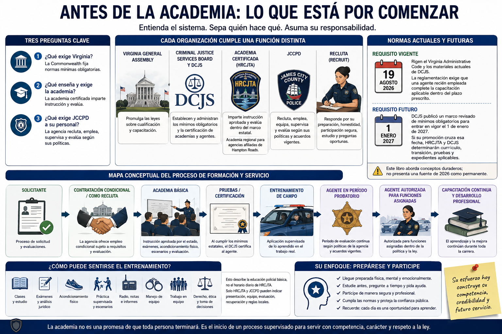

# Capítulo 0 — Antes de la academia: Lo que está por comenzar



> **BORRADOR INVESTIGADO — REVISIÓN FACTUAL SOLICITADA.** Las fuentes se comprobaron con materiales oficiales disponibles al 19 de agosto de 2026. Las semanas del libro son un recorrido editorial, no el calendario no publicado de HRCJTA. Confirme los requisitos de su promoción con DCJS, HRCJTA y James City County Police Department (JCCPD).

## Apertura

Una **academia de policía — police academy** no es una orientación prolongada ni una promesa de que toda persona terminará. Inicia un proceso supervisado en el que el empleador público, la academia certificada y el Commonwealth tienen responsabilidades distintas. La recluta aporta esfuerzo y criterio; el personal instructor enseña y evalúa; la agencia empleadora aporta políticas, supervisión de campo y rendición de cuentas; Virginia fija normas mínimas obligatorias.

Para una futura agente de JCCPD hay que separar tres preguntas: **¿Qué exige Virginia? ¿Qué enseña y exige la academia? ¿Qué exige JCCPD a su personal?** Las respuestas se superponen, pero no son intercambiables. Los mínimos estatales publicados no revelan el calendario diario de HRCJTA, y una página de reclutamiento del condado no modifica la ley de Virginia.

## De qué trata esta semana

Este capítulo explica el sistema antes que una destreza concreta. Según el *Code of Virginia*, el Criminal Justice Services Board establece las normas de capacitación y el **Virginia Department of Criminal Justice Services (DCJS)** administra el marco regulatorio y de certificación. La normativa contempla academia certificada, pruebas, entrenamiento de campo y capacitación continua, no una sola graduación que ponga fin al desarrollo profesional.[1][2]

Hampton Roads Criminal Justice Training Academy (HRCJTA) se presenta como academia regional para agencias afiliadas de Hampton Roads y enumera a James City County entre ellas. Eso acredita una relación regional; **no** acredita un calendario semanal no publicado ni garantiza la asignación de una recluta.[3] El material de JCCPD explica el proceso de contratación. El empleo crea la relación con la agencia; asistir a la academia prepara al personal para ejercer facultades policiales de manera competente y lícita.[4]

## Lo que necesita comprender

### Cada organización cumple una función distinta

- **Virginia General Assembly:** promulga las leyes sobre cualificación y capacitación.
- **Criminal Justice Services Board y DCJS:** establecen y administran los mínimos obligatorios y la certificación de academias y agentes.
- **Academia certificada:** imparte instrucción aprobada y evalúa dentro del marco estatal; HRCJTA es la academia regional pertinente al libro.
- **JCCPD:** recluta, emplea, equipa, supervisa y evalúa según sus políticas y acuerdos vigentes.
- **Recluta — recruit:** responde por su preparación, honestidad, participación segura, estudio y preguntas oportunas.

### Normas actuales y futuras

**Requisito vigente (fecha de investigación: 19 de agosto de 2026).** Rigen el Virginia Administrative Code y los materiales actuales de DCJS. La reglamentación exige que una agente recién empleada sujeta a capacitación mínima complete la capacitación aplicable dentro del plazo prescrito; las prórrogas y exenciones las controla la norma, no este libro.[1]

**Requisito futuro.** DCJS publicó un marco revisado de mínimos obligatorios para entrar en vigor el **1 de enero de 2027**. Si una promoción cruza esa fecha, HRCJTA y DCJS deben determinar currículo, transición, pruebas y expedientes aplicables. Este libro aborda conceptos duraderos; no presenta una fuente de 2026 como permanente.[5]

Puede verificarse que DCJS exige formación jurídica. Sin un horario oficial, no puede afirmarse que HRCJTA enseñe un tema el martes de la Semana 2.

### Mapa conceptual

```text
Solicitante → contratación condicional / como recluta
→ academia básica → pruebas / certificación
→ entrenamiento de campo → agente en período probatorio
→ agente autorizada para funciones asignadas
→ capacitación continua y desarrollo profesional
```

Es un mapa, no una garantía de etiquetas ni de secuencia lineal. Investigación de antecedentes, evaluaciones médica o psicológica, trámites y orientación pueden coincidir. Trabajar con independencia significa estar autorizada para funciones asignadas dentro de la política, no dejar de aprender o de estar supervisada. La capacitación básica se vincula con la **certificación — certification**; el **entrenamiento de campo — field training** lleva lo aprendido al trabajo; la capacitación en servicio continúa después.[1][2] Una agencia puede exigir más que el mínimo estatal.

## Cómo puede sentirse el entrenamiento

Los mínimos de DCJS abarcan derecho, comunicación, patrullaje e investigación, tácticas defensivas, armas de fuego, conducción de emergencia, bienestar físico y ejercicios de desempeño.[5] Puede haber clases, estudio, exámenes, acondicionamiento, práctica supervisada, escenarios, análisis jurídico, radio, notas e informes, manejo de equipo, corrección y trabajo en equipo. Esto describe la educación policial básica, **no** el horario diario de HRCJTA. Solo HRCJTA y JCCPD pueden indicar presentación, equipo, evaluación, recuperación y reglas locales.

El cansancio altera el aprendizaje. Una regla clara en el escritorio cuesta más recordarla después de ejercicio, con varias voces y hechos nuevos. Por eso se combinan conocimientos y aplicación repetida. Dormir, comer, hidratarse, prever el traslado y comunicar problemas temprano son asuntos de desempeño.

## Conceptos y vocabulario clave

- **Capacitación básica policial — basic law-enforcement training:** instrucción inicial y resultados obligatorios de la categoría correspondiente.
- **Academia certificada de justicia penal — certified criminal justice training academy:** academia que cumple los requisitos regulatorios de Virginia.
- **Certificación — certification:** condición reconocida por el estado tras cumplir requisitos laborales, formativos y administrativos; no es solo un diploma.
- **Oficial de entrenamiento de campo — Field Training Officer (FTO):** agente que supervisa la aplicación práctica en la agencia.
- **Empleo probatorio — probationary employment:** condición laboral de la agencia, distinta de la certificación DCJS.
- **Mínimo obligatorio — compulsory minimum:** piso estatal; academia y agencia pueden añadir requisitos lícitos.
- **Capacitación en servicio — in-service training:** educación periódica posterior a la capacitación básica.
- **Recuperación formativa — remediation:** instrucción adicional autorizada para corregir una deficiencia; disponibilidad y consecuencias dependen del programa.

## Del aula a la calle

La academia procura decisiones lícitas y explicables, no respuestas memorizadas. Definir sospecha razonable, reconocer hechos, decidir, comunicar y redactar son capacidades diferentes. Graduarse abre otra fase supervisada: la FTO ayuda a aplicar derecho, políticas, geografía, radio, documentación y expectativas comunitarias. Supervisores, fiscales, tribunales, cambios de política y experiencia continúan la educación.

## Del tribunal a la academia

El trabajo en secretaría judicial aporta conocimiento de órdenes, *summonses*, plazos, números de caso, funciones judiciales, confidencialidad y expedientes completos. La academia lleva el recorrido hacia el origen: qué hechos permiten detener, arrestar, registrar, formular cargos o solicitar autorización judicial; cómo obtener y conservar información; y cómo explicar la decisión. La familiaridad reduce el choque terminológico, pero no sustituye observación callejera, control lícito, entrevistas ni criterio operativo.

## Lo que puede ser difícil

### También cambia el hogar

Planifiquen mañanas y traslado con margen; cuidado infantil y suplentes; comidas; estudio nocturno; sueño; ejercicio, ropa y equipo; tareas domésticas; tiempo familiar; y una forma sencilla de renegociar responsabilidades tras un día difícil. Comparta información confirmada, no rumores. La familia puede apoyar sin convertirse en instructora. Una pregunta útil: «¿Qué facilitaría la mañana de mañana?»

También pesa recibir corrección delante de otras personas, descubrir límites en lo que se sabía o rendir mal en una destreza nueva. La corrección aporta información. Atender honestamente una debilidad desde temprano es más seguro que ocultarla hasta la evaluación.

## Preguntas para reflexionar

1. ¿Qué partes del mapa controlan Virginia, HRCJTA, JCCPD y la recluta?
2. ¿Qué tarea doméstica necesita un plan alternativo?
3. ¿Cómo protegerá sueño y estudio sin aislarse de la familia?
4. Si una regla parece arbitraria, ¿qué finalidad profesional podría tener y a quién corresponde preguntar?
5. ¿Qué hará si una guía antigua contradice a una instructora o fuente oficial actual?

## Resumen de la semana

DCJS administra requisitos estatales; las academias certificadas imparten capacitación aprobada; las agencias contratan, supervisan y añaden políticas. La función regional publicada de HRCJTA y la afiliación de JCCPD no revelan su calendario. La transición del 1 de enero de 2027 hace imprescindible fechar las fuentes. Tras la graduación siguen entrenamiento de campo, período probatorio y aprendizaje responsable continuo.

Para herramientas reutilizables, consulte la **Ruta de Certificación Policial en Virginia** y la **Guía de Preparación Física** en los apéndices.

## Lecturas adicionales y referencias

### Fuentes oficiales

1. Virginia Administrative Code, **6VAC20-20, Rules Relating to Compulsory Minimum Training Standards for Law-Enforcement Officers**, especialmente 6VAC20-20-21 y 6VAC20-20-61, consultado el 19 de agosto de 2026: https://law.lis.virginia.gov/admincode/title6/agency20/chapter20/
2. *Code of Virginia* § 15.2-1706, **Certification through training required for all law-enforcement officers; waiver of requirements**, consultado el 19 de agosto de 2026: https://law.lis.virginia.gov/vacode/title15.2/chapter17/section15.2-1706/
3. Hampton Roads Criminal Justice Training Academy, **About Us / Member Agencies**, consultado el 19 de agosto de 2026: https://www.hrcjta.com/
4. James City County, **Police Jobs**, consultado el 19 de agosto de 2026: https://www.jamescitycountyva.gov/765/Police-Jobs
5. Virginia Department of Criminal Justice Services, **Law Enforcement Training / Compulsory Minimum Training Standards and Performance Outcomes**, incluidos materiales para el 1 de enero de 2027, consultado el 19 de agosto de 2026: https://www.dcjs.virginia.gov/law-enforcement/training

### Lecturas adicionales

- Brian A. Reaves, *State and Local Law Enforcement Training Academies, 2018—Statistical Tables*, U.S. Department of Justice, Bureau of Justice Statistics, 2021: https://bjs.ojp.gov/library/publications/state-and-local-law-enforcement-training-academies-2018-statistical-tables
- International Association of Chiefs of Police, **Officer Safety and Wellness Resources**, consultado el 19 de agosto de 2026: https://www.theiacp.org/resources/officer-safety-and-wellness

### Para la familia

- National Institute of Justice, **Officer Work Hours, Stress, Fatigue, and Health**, consultado el 19 de agosto de 2026: https://nij.ojp.gov/topics/articles/officer-work-hours-stress-fatigue-and-health
- U.S. Department of Veterans Affairs, National Center for PTSD, **Sleep Problems and PTSD** (contexto general sobre sueño; no afirma que el estrés de academia sea PTSD), consultado el 19 de agosto de 2026: https://www.ptsd.va.gov/understand/related/sleep_problems.asp
