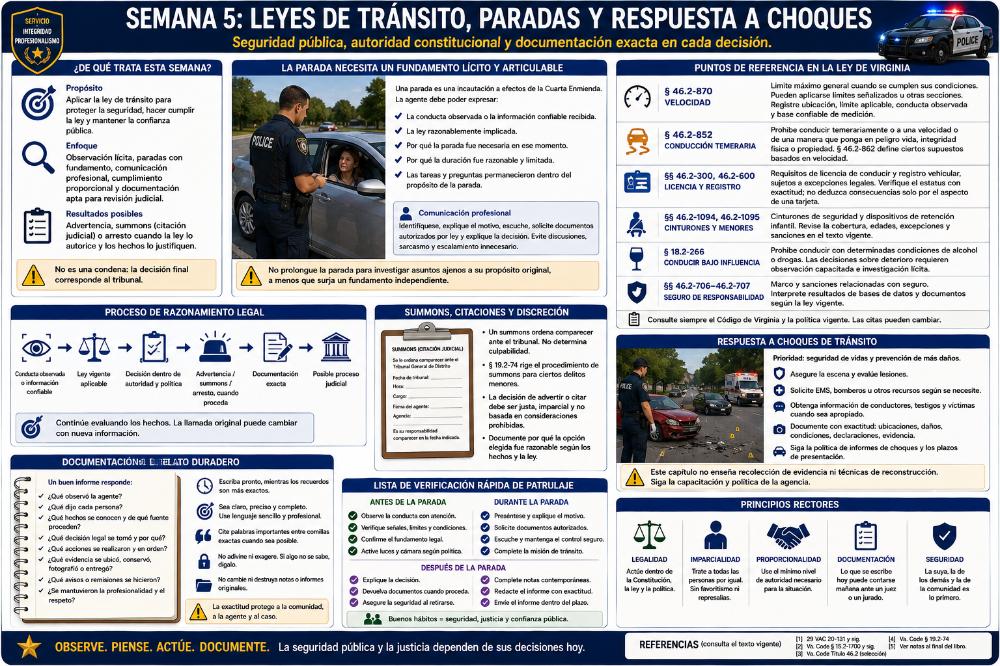

# Capítulo 5 — Semana 5: Leyes de tránsito, paradas y respuesta a choques



> **Secuencia editorial.** La «Semana 5» pertenece al plan de aprendizaje de este libro; no afirma nada sobre el calendario de HRCJTA ni el procedimiento de tránsito de JCCPD. La ley de Virginia citada aquí se revisó como vigente el 20 de agosto de 2026; las agentes deben aplicar la ley, política e instrucción actuales.

## Apertura

Una luz de freno, una medición de velocidad, un cambio de carril o una declaración sobre un choque solo adquiere utilidad jurídica cuando la agente puede describir lo observado, relacionarlo con la ley vigente, comunicarse profesionalmente y conservar un registro exacto. El trabajo de tránsito protege la seguridad pública y tiene consecuencias constitucionales; no es una búsqueda de tecnicismos.

## De qué trata esta semana

El título de vehículos motorizados de Virginia es extenso. Este capítulo ofrece un mapa: observación lícita, fundamento y alcance de una parada, identificación y documentos del vehículo, decisiones proporcionales de cumplimiento, deberes ante choques y documentación apta para revisión judicial. No sustituye el Título 46.2, las decisiones judiciales ni la instrucción de la agencia.

La vigilancia de tránsito procura vías más seguras y rendición de cuentas conforme a derecho. Los resultados pueden incluir una **advertencia — warning**, un **summons — citación judicial** o, cuando la ley lo autorice y los hechos lo justifiquen, arresto. Una **citación — citation** no es una condena. El tribunal resuelve los hechos y el derecho controvertidos.

## Lo que necesita comprender

### La parada necesita un fundamento lícito y articulable

Una **parada de tráfico — traffic stop** es una incautación a efectos de la Cuarta Enmienda. Su justificación y duración dependen de los hechos. La agente debe poder expresar la conducta observada o la información confiable recibida y la ley razonablemente implicada; una «corazonada» vaga no basta. Las tareas o preguntas ajenas a la misión de tránsito no pueden prolongar ilícitamente la parada. La ley y la instrucción jurídica vigentes de la agencia rigen cada caso.

La comunicación profesional comienza, cuando las circunstancias lo permiten, identificándose y explicando claramente el motivo. Escuche información pertinente, identifique a quien conduce, solicite los documentos autorizados por ley, explique la decisión y evite sarcasmo, discusiones o escalamiento innecesario. Esto no es orientación táctica: ubicación del vehículo, aproximación, salida de ocupantes, armas, resistencia y paradas de alto riesgo pertenecen a la formación supervisada.

### Algunos puntos de referencia en la ley de Virginia

- **Velocidad:** § 46.2-870 establece límites máximos generales cuando se cumplen sus condiciones; pueden controlar límites señalizados u otras secciones. Registre la ubicación exacta, el límite aplicable, la conducta observada y una base confiable de medición.
- **Conducción temeraria — reckless driving:** § 46.2-852 prohíbe conducir temerariamente o a una velocidad o de una manera que ponga en peligro vida, integridad física o propiedad. La § 46.2-862 define por separado ciertos supuestos basados en velocidad. El significado jurídico de Virginia lo fija la ley; «temeraria» no equivale a toda infracción por exceso de velocidad ni debe deducirse solo del uso cotidiano en español.
- **Licencia y registro:** §§ 46.2-300 y 46.2-600 establecen requisitos fundamentales de licencia de conducir y registro vehicular, sujetos a excepciones legales. Verifique el estatus con exactitud; no deduzca la consecuencia legal solo por el aspecto de una tarjeta.
- **Cinturones y menores:** §§ 46.2-1094 y 46.2-1095 tratan cinturones de seguridad y dispositivos de retención infantil. Importan su cobertura, límites de aplicación, edades, excepciones y sanciones; consulte el texto vigente y no un eslogan.
- **Conducción bajo influencia:** § 18.2-266 define conductas prohibidas al conducir bajo los efectos de determinadas condiciones de alcohol o drogas. Las decisiones sobre deterioro requieren observación capacitada, investigación lícita y análisis legal exacto; este libro no ofrece un protocolo de pruebas.
- **Requisitos relacionados con seguro:** el marco y las sanciones vigentes de Virginia deben comprobarse mediante DMV y las actuales §§ 46.2-706–46.2-707. Antes de actuar, interprete cualquier resultado de base de datos o problema documental bajo la ley vigente.

Una cadena de razonamiento útil es:

```text
Conducta observada o información confiable
      ↓
Ley vigente aplicable
      ↓
Decisión dentro de autoridad y política
      ↓
Advertencia / summons / arresto, cuando proceda legalmente
      ↓
Documentación
      ↓
Posible proceso judicial
```

### *Summons*, citaciones y discreción

Las leyes de Virginia emplean *summons* en contextos procesales importantes. En el habla común, el documento acusatorio puede llamarse *ticket* o *citation*, pero los términos no siempre son intercambiables. En general, un *summons* ordena a la persona responder al cargo ante un tribunal; no determina culpabilidad. La § 19.2-74 rige el procedimiento de *summons* para ciertos delitos menores y contiene condiciones y excepciones.

Cuando la advertencia o el cargo sean opciones lícitas, la discreción sigue limitada por los hechos, la ley, la política de agencia, la igualdad de trato y la supervisión. La agente debe explicar la presunta infracción y los pasos siguientes sin prometer un resultado judicial. Importan la identidad correcta de quien conduce, los datos del vehículo, el lugar, la hora, el cargo legal y las observaciones.

### Responder a un choque exige cuidado, preservación y coordinación

En un **choque vehicular — crash**, los peligros inmediatos y las necesidades médicas tienen prioridad conceptual. Las agentes coordinan, según corresponda, con bomberos, EMS, personal de transporte y remolque; identifican conductores, pasajeros, propietarios y testigos; registran vía, clima, vehículos y lesiones; preservan declaraciones y registros disponibles; y determinan si la evidencia respalda una acción de cumplimiento. Diagramas, fotografías, mediciones, información electrónica e informes formales pueden ser apropiados según capacitación y política.

Las §§ 46.2-894 y 46.2-895 abordan los deberes del conductor tras choques con lesiones, muerte o propiedad atendida; la § 46.2-896 aborda ciertos choques con propiedad no atendida. La § 46.2-373 regula **informes de choque — crash reports** policiales cuando se cumplen condiciones legales, e indica requisitos de envío y plazo. Las categorías exactas y el flujo de la agencia deben aprenderse del texto y la política actuales; este capítulo no inventa un formulario o umbral de JCCPD.

Este libro prefiere *choque* cuando la causalidad aún no está establecida; *accidente* es común en conversación y *colisión* puede ser apropiado según contexto o terminología oficial. No infiera culpa porque ocurrió un choque. Separe observaciones físicas, declaraciones de participantes y testigos, registros y conclusiones. Responsabilidad civil, cargo de tránsito y obligación de informar son preguntas distintas.

## Cómo puede sentirse el entrenamiento

La materia combina numerosas leyes parecidas con comunicación y papeleo preciso. En la formación genérica, las jornadas prácticas pueden ser largas o al aire libre, pero aquí no se afirma el horario de HRCJTA. El cansancio favorece dígitos transpuestos y hechos supuestos; verificar deliberadamente es un hábito profesional.

## Conceptos y vocabulario clave

- **Parada de tráfico — traffic stop:** incautación temporal que exige justificación constitucional.
- **Citación — citation:** término común para el aviso escrito de una presunta infracción; use el nombre exacto del documento de Virginia.
- **Summons — citación judicial:** proceso que ordena comparecer o responder ante un tribunal; no es una condena.
- **Sospecha razonable — reasonable suspicion:** fundamento objetivo y articulable, bajo la totalidad de circunstancias, para una detención breve.
- **Conducción temeraria — reckless driving:** delito de tránsito de Virginia definido por ley; no es mero sinónimo de descuido.
- **Informe de choque — crash report:** registro oficial exigido en circunstancias definidas por ley y procedimiento.
- **Registro vehicular — registration:** inscripción jurídica del vehículo, distinta del título, propiedad, inspección y seguro.
- **Corroboración — corroboration:** información independiente que respalda o pone a prueba un relato.

## Del aula a la calle

**Ejemplo ficticio; no es procedimiento de JCCPD.** Una agente ve un sedán cruzar una señal roja fija. Registra lugar, dirección, estado de la señal, línea de visión, tránsito y vehículo identificado, no solo «se pasó el rojo». Tras una parada lícita, el conductor dice que el resplandor ocultó la señal. La declaración se documenta y evalúa; por sí sola no descarta ni prueba el cargo. La agente verifica identidad y registros pertinentes, elige un resultado autorizado por ley y política, lo explica y completa documentación exacta.

En un choque de dos autos, «el Vehículo 1 lo causó» es una conclusión. Los componentes útiles incluyen posiciones finales, daños visibles, controles viales, relatos atribuidos por nombre, testigos independientes, lesiones comunicadas u observadas, registros consultados y limitaciones. Una acción de cumplimiento requiere evidencia de infracción, no presión por elegir un ganador para el seguro.

## Del tribunal a la academia

Un *traffic summons*, un cargo de *reckless driving*, un proceso relacionado con DUI, un cargo derivado de un choque o un asunto de licencia puede llegar al Virginia General District Court. El papeleo conocido por quien trabaja en el tribunal comenzó antes: con una observación, clasificación legal, identificación, comunicación y documentación al borde de la vía. Pueden revisarse notas y grabaciones; la agente puede declarar y ser contrainterrogada. Los límites claros —qué se midió, vio, dijo o consultó en un registro— son más sólidos que una certeza añadida después.

## Lo que puede ser difícil

**Densidad legal:** secciones cercanas pueden crear delitos y excepciones diferentes; lea toda la disposición vigente. **Alcance constitucional:** el inicio lícito no vuelve lícita toda prolongación. **Precisión:** confirme persona, placa, vehículo, ubicación, dirección, hora, sección legal e información judicial. **Emoción tras el choque:** puede haber personas heridas o asustadas; cuidado y recopilación neutral pueden coexistir. **Preparación judicial:** revise los registros permitidos y declare desde la memoria honesta; nunca rellene un vacío.

## Preguntas para reflexionar

1. ¿Qué hechos objetivos fundamentan la parada?
2. ¿Qué información se relaciona con la misión de tránsito y qué la prolongaría?
3. ¿Por qué exceso de velocidad y conducción temeraria no son automáticamente iguales?
4. ¿Qué hechos proceden de observación, una persona o una base de datos?
5. ¿Qué exige un *summons* y qué no decide?
6. ¿Cómo difieren obligación de informar, cumplimiento de la ley y culpa civil tras un choque?
7. ¿Qué detalle necesitaría un juez meses después?

## Resumen de la semana

La vigilancia de tránsito enlaza observación, ley vigente, una parada constitucionalmente limitada, explicación profesional, discreción autorizada y documentación exacta. La respuesta a choques añade necesidades médicas, coordinación interinstitucional, preservación y deberes legales. Aprenda el marco y luego los procedimientos mediante formación supervisada; nunca sustituya el Título 46.2 vigente ni la política de agencia por esta guía.

## Lecturas adicionales y referencias

### Fuentes oficiales

1. *Code of Virginia*, Title 46.2, **Motor Vehicles**: https://law.lis.virginia.gov/vacode/title46.2/
2. *Code of Virginia* §§ 46.2-852 and 46.2-862, **Reckless driving**: https://law.lis.virginia.gov/vacode/title46.2/chapter8/section46.2-852/ and https://law.lis.virginia.gov/vacode/title46.2/chapter8/section46.2-862/
3. *Code of Virginia* §§ 46.2-894–46.2-896 and 46.2-373, **Crash duties and law-enforcement reports**: https://law.lis.virginia.gov/vacode/title46.2/chapter8/section46.2-894/ and https://law.lis.virginia.gov/vacode/title46.2/chapter3/section46.2-373/
4. *Code of Virginia* § 18.2-266, **Driving motor vehicle, engine, etc., while intoxicated**: https://law.lis.virginia.gov/vacode/title18.2/chapter7/section18.2-266/
5. Virginia Department of Motor Vehicles, **Virginia Driver's Manual**: https://www.dmv.virginia.gov/licenses-ids/exams/manual
6. Virginia State Police, **Safety Division**: https://vsp.virginia.gov/safety-and-enforcement/safety-division/

### Lecturas adicionales

- National Highway Traffic Safety Administration, **Traffic Safety Facts and research**: https://www.nhtsa.gov/data
- U.S. Supreme Court, *Rodriguez v. United States*, 575 U.S. 348 (2015): https://supreme.justia.com/cases/federal/us/575/348/ (copia de acceso secundario; para trabajo jurídico, consulte el repertorio oficial).

### Para la familia

- La formación práctica y el estudio de leyes densas pueden cansar. Apoyen hidratación, sueño y un bloque de estudio previsible; no pidan a la alumna demostrar procedimientos al borde de la vía.
