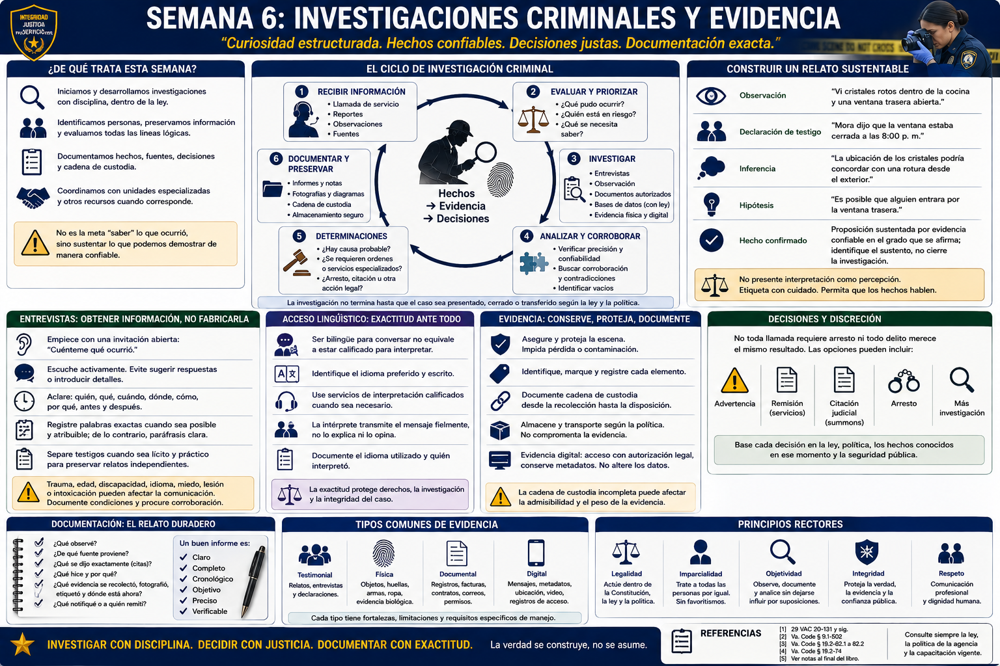

# Capítulo 6 — Semana 6: Investigaciones criminales y evidencia



> **Secuencia editorial.** La Semana 6 es una organización de este libro. No describe el calendario de HRCJTA, las asignaciones investigativas de JCCPD, su política de evidencia ni su práctica local de interpretación.

## Apertura

«Sé lo que ocurrió» no es la meta de una investigadora. La pregunta profesional es: **¿Qué puedo documentar y sustentar de manera confiable?** Un relato verosímil puede cambiar cuando aparece una marca de tiempo, un testigo independiente, una fotografía o un hecho contrario. La **investigación criminal — criminal investigation** es curiosidad estructurada dentro de la ley.

## De qué trata esta semana

El personal de patrullaje suele iniciar la **investigación preliminar — preliminary investigation**: reconocer qué pudo ocurrir, atender necesidades urgentes, identificar personas, preservar información, documentar relatos iniciales y desarrollar pistas. Quienes realizan la **investigación de seguimiento — follow-up investigation** pueden volver a entrevistar, obtener registros autorizados, coordinar exámenes, comprobar cronologías y preparar un caso. Las unidades especializadas aportan capacitación y recursos para determinados delitos o tipos de evidencia. Los límites y traspasos varían según la agencia.

El propósito no es ajustar los hechos a la primera teoría, sino recopilar y evaluar información pertinente —incluidos los hechos que debilitan una explicación sospechada— respetando los límites constitucionales y legales.

## Lo que necesita comprender

### Construir un relato sustentable

Una investigación puede usar relatos de víctimas y testigos, información sobre sospechosos, cronologías, objetos físicos, documentos, fotografías, registros autorizados y **evidencia digital — digital evidence**. Cada elemento suscita preguntas: ¿quién lo produjo?, ¿cómo se obtuvo?, ¿es auténtico?, ¿qué muestra realmente?, ¿cuáles son sus límites?, ¿otra fuente lo corrobora o contradice?

La causa probable es un estándar constitucional práctico y dependiente de los hechos, no prueba más allá de duda razonable. Debe apoyarse en hechos y circunstancias que, en ese momento, sustenten la conclusión jurídica pertinente. La investigación debe exponer hechos, fuentes, consideraciones de confiabilidad y vacíos materiales; fiscalía y tribunales adoptan después sus decisiones jurídicas en sus respectivos papeles.

La evidencia digital puede incluir mensajes, registros de cuentas, datos de dispositivos, video, ubicación y metadatos. El acceso puede requerir consentimiento, proceso legal, conocimientos especializados y solicitudes de preservación. Este capítulo no enseña acceso a dispositivos, vigilancia ni métodos para evadir seguridad.

### Observar no es interpretar

- **Observación — observation:** «Vi cristales rotos dentro de la cocina y una ventana trasera abierta».
- **Declaración de testigo — witness statement:** «Mora dijo que la ventana estaba cerrada a las 8:00 p. m.».
- **Inferencia — inference:** «La ubicación de los cristales podría concordar con una rotura desde el exterior».
- **Hipótesis — hypothesis:** «Es posible que alguien entrara por la ventana trasera».
- **Hecho confirmado — confirmed fact:** proposición sustentada por evidencia confiable en el grado que se afirma; «confirmado» debe identificar el sustento, no cerrar la investigación.

Una fotografía puede confirmar dónde estaban los cristales al tomarla, pero no necesariamente quién los rompió. Un registro de acceso con hora puede corroborar la entrada mediante una credencial, pero no necesariamente identificar a quien la llevaba. Etiquetar con cuidado impide presentar interpretación como percepción.

### Las entrevistas obtienen información; no la fabrican

Cuando proceda, comience con una invitación abierta: «Cuénteme qué ocurrió». Practique **escucha activa — active listening** sin proporcionar detalles. Continúe con preguntas aclaratorias sobre secuencia, lugar, base sensorial, identidad, incertidumbre y lo ocurrido antes y después. Registre palabras exactas cuando tengan importancia jurídica y sea posible hacerlo fielmente; de lo contrario, atribuya una paráfrasis clara. Separe testigos cuando sea lícito y práctico para preservar recuerdos independientes, no para insinuar culpabilidad.

Trauma, edad, discapacidad, lesión, idioma, miedo e intoxicación pueden afectar la comunicación. La presentación emocional por sí sola no es una prueba confiable de verdad. Trate la seguridad expresada con cautela, evite suposiciones, documente condiciones y procure corroboración. El interrogatorio bajo custodia y las cuestiones de *Miranda* exigen análisis jurídico separado; este capítulo enseña recopilación profesional de hechos, no manipulación.

### El acceso lingüístico protege la exactitud

Ser bilingüe para conversar no equivale automáticamente a estar calificada para **interpretar — interpret** con exactitud en una investigación, atención médica o tribunal. La interpretación exige transmisión fiel del sentido, confidencialidad, límites de función y competencia temática. La agente no debe suponer comprensión por un acento, un intercambio breve ni la presencia de un familiar.

Identifique el idioma hablado y escrito que prefiere la persona; utilice asistencia lingüística calificada cuando la ley o política lo exija; hable con la persona y no sobre ella; evite modismos; permita interpretar en segmentos manejables; y documente qué ayuda se utilizó. Menores, acompañantes, víctimas o testigos interesados pueden no ser intérpretes adecuados. Los tribunales y las agencias controlan sus propios requisitos de cualificación o certificación. Una agente bilingüe puede comunicarse directamente cuando sea competente y esté autorizada, pero no sustituye automáticamente a una intérprete oficial ni a una notificación jurídica traducida.

### La evidencia debe conservar identidad y trazabilidad

La **pertinencia — relevance** pregunta si la información tiende a hacer más o menos probable un hecho de importancia. La **confiabilidad — reliability** se refiere a credibilidad y limitaciones. La **admisibilidad — admissibility** es una decisión jurídica regida por reglas probatorias, derecho constitucional, leyes y decisiones judiciales; no depende solo de que la agente crea importante un objeto.

Preservar busca evitar pérdida, alteración, contaminación o acceso inexplicado. El personal capacitado documenta lugar y condición, fotografía cuando procede, recolecta y etiqueta según política, registra transferencias, usa almacenamiento adecuado y conserva registros originales. Sustancias peligrosas, armas de fuego, material biológico, explosivos y materiales desconocidos requieren instrucción y equipo especializados; esta guía no da indicaciones de manejo.

```text
Evidencia localizada
      ↓
Documentada
      ↓
Recolectada por personal capacitado
      ↓
Etiquetada
      ↓
Transferida con registro
      ↓
Almacenada según política
      ↓
Retirada para análisis autorizado o tribunal
```

La **cadena de custodia — chain of custody** es el historial documentado de posesión y manejo: qué se recolectó, quién lo manipuló, cuándo cambió de manos, dónde se almacenó y cómo se mantuvo su integridad. Imagine que una tienda entrega un pequeño dispositivo con video. La etiqueta lo vincula al caso; el registro de transferencia indica quién lo recibió y cuándo; el almacenamiento seguro y el retiro posterior explican dónde estuvo. Un vacío inexplicado no cambia mágicamente el contenido, pero puede plantear una cuestión grave de autenticidad o integridad. La agente debe documentar honestamente y nunca reconstruir una anotación faltante como si hubiera ocurrido.

## Cómo puede sentirse el entrenamiento

Las investigaciones combinan umbrales jurídicos, procedimientos detallados, nombres, horas, objetos, entrevistas e informes. La dificultad cognitiva consiste en mantener varias explicaciones posibles sin volverse imprecisa. Listas de control y sistemas autorizados apoyan la memoria; no sustituyen el pensamiento. La documentación compleja puede convertirse en carga de estudio en casa, pero el descanso protegido mejora la exactitud.

## Conceptos y vocabulario clave

- **Investigación preliminar — preliminary investigation:** identificación, preservación, entrevistas, pistas y documentación iniciales.
- **Investigación de seguimiento — follow-up investigation:** trabajo posterior que evalúa pistas y desarrolla un caso sustentable.
- **Evidencia — evidence:** información o material ofrecido para probar o refutar un hecho; en contexto judicial también puede traducirse como *prueba*.
- **Evidencia física — physical evidence:** objeto o material físico potencialmente pertinente.
- **Evidencia documental — documentary evidence:** documento o registro ofrecido por su contenido probatorio.
- **Evidencia digital — digital evidence:** información electrónica potencialmente probatoria, sujeta a autoridad, autenticidad y preservación.
- **Cadena de custodia — chain of custody:** historial documentado de posesión y manejo.
- **Contaminación — contamination:** alteración, transferencia o introducción no deseada que puede afectar la integridad.
- **Corroboración — corroboration:** sustento o comprobación independiente de información.
- **Pista — lead:** información que sugiere una indagación productiva; no es prueba.
- **Hipótesis — hypothesis:** explicación comprobable, no hecho establecido.
- **Intérprete — interpreter:** persona que transmite significado hablado o signado entre idiomas; la cualificación depende del contexto.

## Del aula a la calle

**Ejemplo ficticio; no es procedimiento de una agencia.** Un denunciante dice que un exempleado robó una computadora portátil al mediodía. La agente atribuye esa alegación. El video muestra a las 12:08 a una persona con ropa parecida, pero no su rostro. Un inventario incluye el dispositivo; un registro indica que a las 12:05 se usó la credencial del exempleado; una supervisora dice que a veces se compartían credenciales. Cada elemento se documenta con fuente y limitación. En conjunto crean pistas, pero afirmar «el video prueba que el exempleado la robó» exageraría lo observado.

La investigación puede organizarse así: definir el posible delito y sus elementos; crear una cronología revisable; enumerar personas y bases de conocimiento; inventariar evidencia y custodia; identificar concordancias y contradicciones; buscar corroboración lícita; registrar pasos infructuosos y límites; reevaluar causa probable; y presentar documentación completa para revisión.

## Del tribunal a la academia

Evidencia, declaraciones, informes policiales y materiales de causa probable influyen en cargos, *discovery*, mociones, testimonio y admisibilidad. La defensa puede examinar recolección, atribución, omisiones, preservación, sugestividad y cadena de custodia. Fiscalía debe revelar material conforme al derecho aplicable. Un juez ve un registro construido por muchas manos. Una buena investigación hace visible cada vínculo; no garantiza cargo ni condena.

La experiencia judicial puede hacer familiares los *warrants* y objetos probatorios — *exhibits*. La academia añade el inicio: adquisición lícita, documentación neutral, preservación y humildad para decir qué no demuestra un registro.

## Lo que puede ser difícil

**Sesgo de confirmación:** busque activamente hechos incompatibles con la teoría de trabajo. **Memoria:** use notas contemporáneas y distinga el recuerdo refrescado de lo que dice un registro. **Contradicciones:** aclare sin intimidar; una inconsistencia puede proceder de perspectiva, memoria, idioma o engaño y debe evaluarse, no diagnosticarse automáticamente. **Volumen:** use cronologías y registros de evidencia conservando el contexto original. **Traspasos:** registre quién recibió qué, cuándo, por qué y en qué condición.

## Preguntas para reflexionar

1. ¿Cada oración es observación, declaración atribuida, inferencia, hipótesis o hecho confirmado?
2. ¿Qué fuente independiente podría corroborar o cuestionar el relato?
3. ¿Qué autoridad se necesita para el siguiente paso investigativo?
4. ¿Qué muestra —y qué no muestra— cada fotografía o registro?
5. ¿Podría necesitarse asistencia lingüística aunque la conversación parezca posible?
6. ¿Puede reconstruirse cada transferencia de evidencia?
7. ¿Qué hecho revelaría aunque debilitara la teoría inicial?

## Resumen de la semana

La investigación avanza desde incertidumbre hacia un relato documentado y comprobable. Escuche sin dirigir, atribuya fuentes, distinga observación de significado, preserve información favorable y desfavorable, use procesos lícitos, respete necesidades lingüísticas y mantenga la integridad de la evidencia. La pregunta rectora no es si la investigadora se siente segura, sino qué puede sustentar en tribunal la evidencia confiable.

## Lecturas adicionales y referencias

### Fuentes oficiales

1. Virginia Department of Criminal Justice Services, **Law Enforcement Training / Compulsory Minimum Training Standards and Performance Outcomes**: https://www.dcjs.virginia.gov/law-enforcement/training
2. *Code of Virginia*, Title 19.2, Chapter 5, **Search Warrants**: https://law.lis.virginia.gov/vacode/title19.2/chapter5/
3. Supreme Court of Virginia, **Rules of Evidence**: https://www.vacourts.gov/courts/scv/rulesofcourt.pdf
4. National Institute of Justice, **Crime Scene Investigation: A Guide for Law Enforcement**, 2013: https://nij.ojp.gov/library/publications/crime-scene-investigation-guide-law-enforcement
5. U.S. Department of Justice, Civil Rights Division, **Language Access**: https://www.justice.gov/crt/language-access

### Lecturas adicionales

- National Institute of Justice, **Eyewitness Evidence: A Guide for Law Enforcement**, 1999: https://nij.ojp.gov/library/publications/eyewitness-evidence-guide-law-enforcement
- National Institute of Standards and Technology, **Digital Evidence**: https://www.nist.gov/programs-projects/digital-evidence
- Charles R. Swanson et al., *Criminal Investigation*, 12.ª ed., McGraw Hill, 2019.

### Para la familia

- Estudiar investigación puede significar tardes tranquilas dedicadas a procedimientos y escritura. Ayuden a proteger un horario regular de estudio y sueño.
- No pidan detalles de casos. Practiquen exactitud con actividades neutrales —como reconstruir una receta o la cronología de un viaje— y acepten «no sé».
