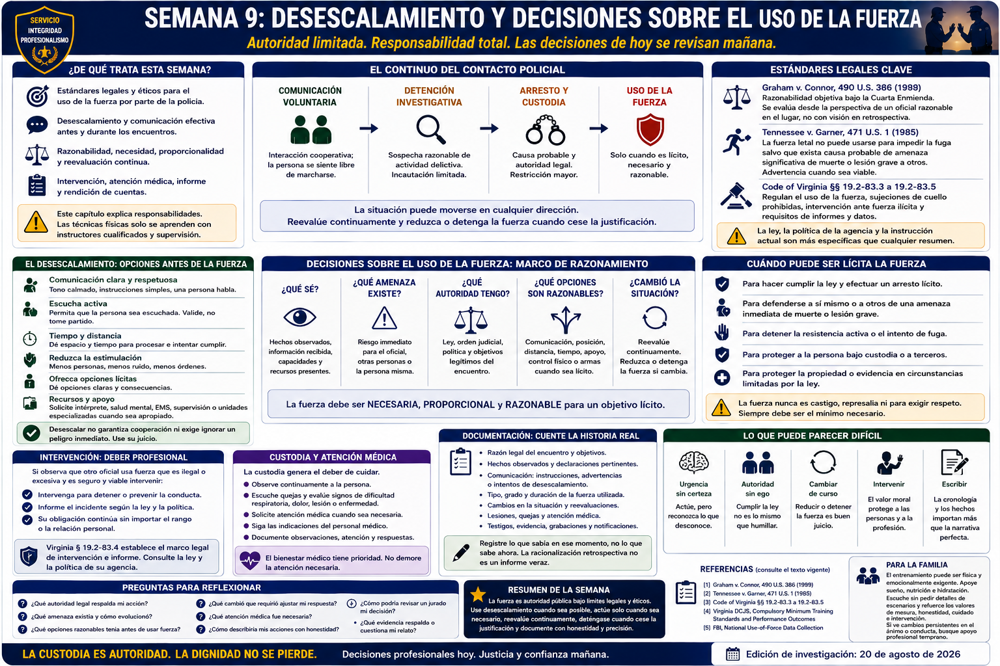

# Capítulo 9 — Semana 9: Desescalamiento y decisiones sobre el uso de la fuerza



> **Secuencia editorial y estado de la investigación.** La Semana 9 pertenece a la secuencia del libro; no es un calendario publicado de HRCJTA ni la política de fuerza de JCCPD. Las autoridades se revisaron para la edición del 20 de agosto de 2026. El derecho cambia y depende intensamente de los hechos; rigen la ley vigente, la instrucción de DCJS, la política de la agencia y el asesoramiento jurídico. Aquí no se enseña ninguna técnica física.

## Apertura

**Uso de la fuerza — use of force** describe ampliamente el ejercicio de coerción física de un oficial contra una persona. Comprende conductas y consecuencias muy distintas; el nombre de un equipo o categoría no determina si un acto fue lícito. Importan autoridad, propósito, necesidad, grado, duración, circunstancias y cambios.

El juicio profesional comienza antes de la fuerza, continúa mientras se emplea y no acaba después. La comunicación puede lograr cooperación. Distancia, tiempo, cobertura o recursos adicionales pueden crear opciones cuando estén razonablemente disponibles; un peligro inmediato puede volver insegura la demora. En ambos casos hay que percibir con cuidado, actuar lícitamente, reevaluar, detenerse cuando cese la justificación, obtener atención, informar con verdad y aceptar revisión.

## De qué trata esta semana

Este capítulo estudia razonabilidad constitucional, disposiciones estatales de Virginia, desescalamiento, decisiones bajo incertidumbre, intervención, respuesta médica, informes y rendición de cuentas. **Proporcionalidad — proportionality** se usa como concepto de juicio: grado y duración deben corresponder al objetivo lícito y las circunstancias, nunca ser represalia. Los estándares constitucionales y estatales controlantes, no un lema aislado, determinan la legalidad.

Las leyes de fuerza de Virginia están en el Título 19.2, Capítulo 7, incluidos §§ 19.2-83.3 a 19.2-83.5. El recluta debe leer el texto vigente. Regulan las sujeciones de cuello prohibidas con una excepción legal estrecha, la intervención ante fuerza ilícita de otro oficial y requisitos estatales de fuerza y datos. Esta paráfrasis no sustituye la ley ni una política de agencia más restrictiva.

## Lo que necesita comprender

### *Graham v. Connor*: un estándar, no un lema

En *Graham v. Connor*, 490 U.S. 386 (1989), Dethorne Graham, que tenía diabetes, entró y salió apresuradamente de una tienda buscando jugo de naranja. Un oficial observó la conducta, realizó una detención investigativa y Graham resultó lesionado. El tribunal inferior aplicó una prueba de debido proceso sustantivo a su reclamación por fuerza excesiva.

La Corte Suprema resolvió que una reclamación por fuerza excesiva durante un arresto, detención investigativa u otra incautación se analiza bajo la **razonabilidad objetiva — objective reasonableness** de la Cuarta Enmienda. No se pregunta por la buena o mala intención privada ni si, conocidos todos los hechos después, otra opción parece preferible. Se pregunta si la fuerza fue objetivamente razonable ante los hechos y circunstancias que enfrentaba un oficial razonable en el lugar.

La Corte señaló, entre otras consideraciones, la gravedad del presunto delito, si había amenaza inmediata para oficiales u otras personas y si existía resistencia activa al arresto o intento de fuga. No es una tabla mecánica de puntuación. Importa la totalidad, y un hecho puede ganar o perder peso al cambiar el encuentro. La advertencia contra la visión retrospectiva “20/20” no elimina el escrutinio ni vuelve concluyente la afirmación del oficial.

### *Tennessee v. Garner*: límites especiales para la fuerza letal

En *Tennessee v. Garner*, 471 U.S. 1 (1985), un oficial disparó mortalmente contra un adolescente aparentemente desarmado que huía saltando una cerca tras un presunto robo nocturno. La Corte sostuvo que la **fuerza letal — deadly force** constituye una incautación bajo la Cuarta Enmienda y rechazó permitirla contra todo sospechoso de delito grave en fuga. No puede emplearse para impedir la fuga salvo que se cumplan las condiciones constitucionales, centradas en causa probable para creer que la persona representa una amenaza significativa de muerte o lesión física grave para el oficial u otras personas; debe advertirse cuando sea viable.

La ley vigente de Virginia añade requisitos estatales. El recluta debe aprender el texto y la política exactos sobre necesidad, personas en fuga, advertencias viables, desescalamiento, cese, asistencia médica, prácticas prohibidas, intervención e informes. Ningún caso ofrece una fórmula táctica ni autoriza fuerza solo porque alguien corra.

### El desescalamiento es juicio disciplinado

El **desescalamiento — de-escalation** reúne herramientas de comunicación, valoración, coordinación y manejo del tiempo para buscar una resolución lícita más segura cuando las circunstancias lo permitan razonablemente. Puede incluir tono sereno, escucha, expectativas claras, menos provocaciones evitables, pausas, distancia apropiada, reducción de estímulos innecesarios, intérprete o recurso médico/de crisis, y tiempo para procesar.

No es un guion mágico, garantía de cooperación ni obligación de ignorar una amenaza inmediata. Las opciones dependen de la persona, objetivo legal, entorno, recursos y amenaza. La pregunta no es “¿dije la frase especial?”, sino “¿qué opciones razonables había, qué observé y cómo me adapté?”.

### Las decisiones deben permanecer abiertas al cambio

```text
¿Qué sé? → ¿Qué desconozco? → ¿Qué amenaza o preocupación existe?
→ ¿Qué autoridad legal tengo? → ¿Qué opciones están razonablemente disponibles?
→ ¿Cambió la situación? → ¿Qué debo documentar?
```

La urgencia no elimina la incertidumbre. Separe hecho observado, informe recibido, inferencia y dato desconocido. Reevalúe continuamente:

```text
Observar → Valorar → Actuar lícitamente → Reevaluar
                         → Reducir o detener la fuerza si cambia la justificación
```

La fuerza no es un permiso irreversible. Una amenaza puede aumentar, disminuir o terminar; puede comenzar la cooperación o aparecer una emergencia médica. La fuerza continuada exige justificación continuada y debe reducirse o cesar cuando esta cambie o termine.

### La intervención y revisión protegen a las personas y la profesión

Virginia § 19.2-83.4 crea un marco legal de intervención e informe cuando un oficial presencia fuerza ilícita de otro oficial, sujeto a la viabilidad y demás términos de la ley. Lea el texto operativo. La ley es distinta de los resultados formativos de DCJS y de la política de agencia, que puede añadir deberes, vías, plazos o protecciones.

El **deber de intervenir — duty to intervene** puede exigir valor moral. Rango, amistad, vergüenza o temor a la reacción no vuelven razonable una fuerza irrazonable. Cuando sea seguro y viable conforme a los requisitos controlantes, actúe para detener la conducta ilícita y presente el informe exigido. La revisión supervisora forma parte del servicio público lícito.

### La atención y el informe forman parte del hecho

Después de la fuerza, atienda el peligro persistente; convoque o preste asistencia médica según entrenamiento y política; vigile a la persona; identifique lesiones y quejas; conserve evidencia; notifique a quien corresponda; y coopere con la revisión. Nunca demore atención necesaria para terminar una entrevista o mejorar una narración.

Un informe veraz documenta:

- razón legal del encuentro;
- conducta observable y declaraciones pertinentes;
- información conocida en cada decisión importante;
- comunicación, advertencias o intentos de desescalamiento relevantes;
- tipo, grado y duración de la fuerza en términos fácticos;
- cambios y reevaluación;
- lesiones, quejas, vigilancia y asistencia médica;
- testigos, grabaciones, evidencia física y notificaciones; y
- lo que el oficial desconocía o no podía observar.

No parta de una conclusión para adaptar después los hechos. **La racionalización retrospectiva no es redacción de informes.** Registre lo que realmente informó la decisión en ese momento, incluso hechos incómodos. Una justificación falsa y pulida es peor que el relato honesto de una decisión difícil.

## Cómo puede sentirse el entrenamiento

El análisis puede incomodar porque personas razonables perciben hechos distintos o llegan a valoraciones iniciales diferentes. La retroalimentación debe desarrollar articulación y reevaluación, no premiar certeza por sí misma. El recluta debe aceptar corrección, separar ego y juicio, y reconocer que la mesura puede ser un resultado exitoso.

Los ejercicios físicos pertenecen a supervisión cualificada. Se omiten intencionalmente métodos, zonas corporales, contramedidas, mecanismos de sujeción y tácticas con armas.

## Conceptos y vocabulario clave

- **Uso de la fuerza:** coerción física de un oficial; ley y política distinguen clases, fines y consecuencias.
- **Razonabilidad objetiva:** valoración bajo la totalidad que enfrenta un oficial razonable en el lugar, no intención subjetiva ni retrospectiva solamente.
- **Fuerza letal:** fuerza con el significado definido por ley y política controlantes y límites especiales.
- **Necesidad — necessity:** si la fuerza hace falta para un fin lícito dadas las circunstancias.
- **Desescalamiento:** comunicación y medidas razonables de juicio destinadas a reducir intensidad; no pasividad ante peligro inmediato.
- **Proporcionalidad:** correspondencia conceptual entre grado/duración, objetivo lícito y circunstancias; rige la ley controlante.
- **Deber de intervenir:** responsabilidad legal y de política respecto de fuerza ilícita de otro oficial; controlan los elementos exactos.
- **Reevaluación — reassessment:** nueva valoración cuando cambian información, conducta, amenaza, autoridad o salud.
- **Racionalización retrospectiva:** inventar o reformular razones después; incompatible con informes veraces.

## Del aula a la calle

**Ejemplo ficticio; no es procedimiento de JCCPD.** Una persona denunciada por una infracción menor grita y camina de un lado a otro, pero no amenaza. Sin peligro inmediato, un solo oficial comunica, explica la expectativa legal, reduce órdenes simultáneas y solicita un recurso apropiado. La persona empieza a cooperar. No prueba que el método siempre funcione; muestra por qué importan gravedad, amenaza, comunicación, tiempo y cambio.

En otro ejemplo conceptual, comienza fuerza lícita ante una agresión. Luego la persona se detiene, sigue instrucciones y presenta un aparente problema médico. Cambian justificación y prioridades: cesa la fuerza innecesaria, se solicita atención, se vigila, notifica, conserva evidencia y documenta toda la transición.

## Del tribunal a la academia

```text
Segundos para decidir → Horas para documentar
→ Días o meses de investigación → Posiblemente años de revisión legal
```

Supervisores, investigadores, fiscales, defensa, jueces, jurados y tribunales civiles pueden comparar informes, video corporal cuando corresponda, despacho, testigos, evidencia física y médica, política, estatutos y derecho constitucional. El video puede ser poderoso sin reproducir toda perspectiva; no debe exagerarse ni la memoria ni la grabación.

La revisión lenta de un hecho rápido no es por sí misma injusta. *Graham* exige atender a las circunstancias del lugar, y la rendición de cuentas exige contrastar el relato con todo el registro fiable. La lección es juicio disciplinado y franqueza, no temor a la revisión.

## Lo que puede ser difícil

**Urgencia sin certeza:** nombre lo desconocido. **Autoridad sin ego:** cumplir no equivale a respetar personalmente. **Cambiar de curso:** reducir o cesar es buen juicio. **Intervenir:** prepárese para actuar pese al rango o amistad. **Escribir:** la cronología debe mostrar qué se sabía y cuándo. **Preocupación pública:** explique la norma sin desestimar la consecuencia humana.

## Preguntas para reflexionar

1. ¿Qué decidió *Graham* y qué no decidió?
2. ¿Qué hechos se relacionan con gravedad, amenaza inmediata, resistencia o fuga?
3. ¿Qué opciones estaban razonablemente disponibles antes y durante la fuerza?
4. ¿Cuándo cambiaron las circunstancias?
5. ¿Qué exige intervención, atención, notificación o conservación?
6. ¿Distingue el informe razones contemporáneas de retrospectiva?
7. ¿Qué evidencia podría confirmar o cuestionar el relato?

## Resumen de la semana

La fuerza es autoridad gubernamental sometida a revisión constitucional, legal, de política, ética y pública. Valore la totalidad; use desescalamiento cuando sea razonablemente posible sin ignorar peligro inmediato; ajuste decisiones a necesidades lícitas; reevalúe; deténgase al cesar la justificación; intervenga según se exija; obtenga atención médica; y documente hechos sin fabricar una defensa posterior.

## Lecturas adicionales y referencias

### Fuentes oficiales

1. *Graham v. Connor*, 490 U.S. 386 (1989), U.S. Reports: https://tile.loc.gov/storage-services/service/ll/usrep/usrep490/usrep490386/usrep490386.pdf
2. *Tennessee v. Garner*, 471 U.S. 1 (1985), U.S. Reports: https://tile.loc.gov/storage-services/service/ll/usrep/usrep471/usrep471001/usrep471001.pdf
3. *Code of Virginia* §§ 19.2-83.3–19.2-83.5, **law-enforcement force, intervention, and reporting provisions**: https://law.lis.virginia.gov/vacode/title19.2/chapter7/
4. Virginia Department of Criminal Justice Services, **Law Enforcement Training / Compulsory Minimum Training Standards and Performance Outcomes**: https://www.dcjs.virginia.gov/law-enforcement/training
5. FBI, **National Use-of-Force Data Collection**: https://www.fbi.gov/how-we-can-help-you/more-fbi-services-and-information/ucr/use-of-force

### Lecturas adicionales

- Police Executive Research Forum, **ICAT: Integrating Communications, Assessment, and Tactics Training Guide** (2016; orientación profesional, no política de Virginia ni JCCPD): https://www.policeforum.org/assets/icattrainingguide.pdf
- National Institute of Justice, **Overview of Police Use of Force**: https://nij.ojp.gov/topics/articles/overview-police-use-force

### Para la familia

- Estudiar la fuerza puede dejar al recluta reflexivo, callado o cansado; no significa que inevitablemente habrá malestar grave. Ofrezca rutina y escucha sin pedir detalles confidenciales.
- Converse sobre valores —mesura, honestidad, cuidado e intervención— y no trate la fuerza como entretenimiento. Cambios persistentes del sueño, ánimo o relaciones merecen apoyo profesional confidencial temprano.
