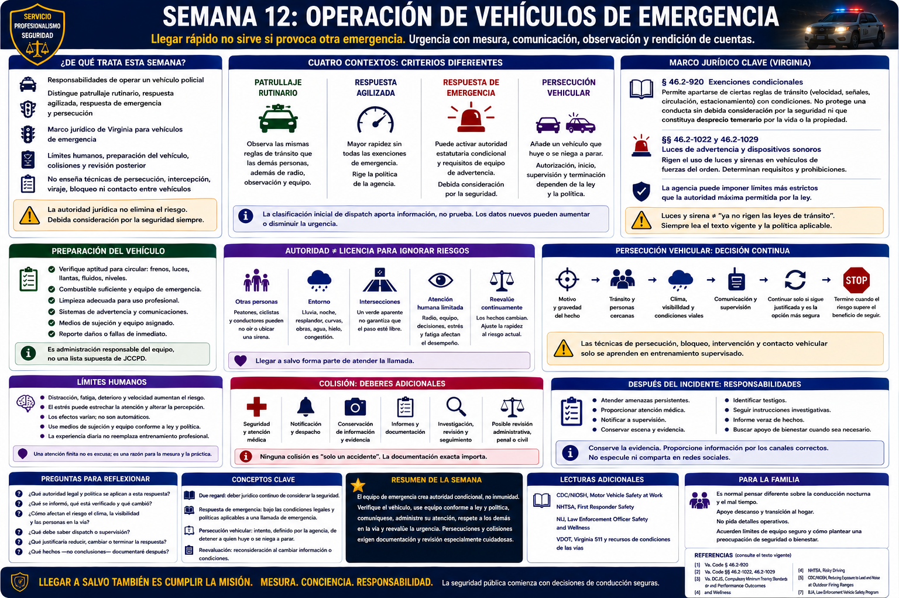

# Capítulo 12 — Semana 12: Operación de vehículos de emergencia



> **Secuencia editorial y estado de la investigación.** La Semana 12 pertenece al recorrido didáctico de este libro; no es un calendario publicado de HRCJTA ni una categoría de respuesta de JCCPD. Las fuentes se revisaron para la edición del 20 de agosto de 2026. Rigen la ley vigente, la instrucción de la academia y la política de la agencia, no este panorama general.

## Apertura

Un vehículo policial sirve como medio de transporte, lugar de trabajo móvil y bien público muy visible; también puede generar un riesgo considerable. Una llamada puede ser urgente mientras la lluvia reduce la visibilidad, una intersección sigue ocupada y otra conductora no entiende de dónde viene una sirena. La autoridad jurídica no elimina esos hechos.

La lección central es sencilla: **llegar rápido no sirve si la agente provoca otra emergencia en el trayecto**. La conducción profesional une urgencia con mesura, comunicación, observación y rendición de cuentas.

## De qué trata esta semana

Esta semana aborda las responsabilidades de operar un vehículo policial. Distingue el patrullaje rutinario, una respuesta agilizada conforme a política, una **respuesta de emergencia — emergency response** y una persecución, sin inventar códigos locales de prioridad. Explica el marco jurídico de Virginia para vehículos de emergencia, los límites humanos, la preparación del vehículo, las colisiones y la revisión posterior. No enseña técnicas de persecución, intercepción, viraje, bloqueo ni contacto entre vehículos.

## Lo que necesita comprender

### Las exenciones son condicionales, no ilimitadas

La § 46.2-920 del *Code of Virginia* identifica circunstancias en las que quien conduce un **vehículo de emergencia autorizado — authorized emergency vehicle** puede apartarse de determinadas reglas de tránsito. La disposición trata, entre otros asuntos, límites de velocidad, señales y reglas de circulación y estacionamiento. Sus condiciones y excepciones importan: el equipo de advertencia exigido depende de la circunstancia descrita, y la sección no protege una conducta realizada sin **debida consideración por la seguridad — due regard** ni una conducta que constituya desprecio temerario por la vida o la propiedad.

*Due regard* expresa un deber jurídico continuo de tomar en cuenta la seguridad de las personas y los bienes ante los riesgos razonablemente previsibles; no es una recomendación vaga de «tener cuidado». Por eso, «luces y sirena» no significa «ya no rigen las leyes de tránsito». Hay que leer la sección vigente, no depender de un eslogan.

Virginia define por separado los vehículos de emergencia autorizados y regula luces de advertencia y dispositivos sonoros (§§ 46.2-1022, 46.2-1029 y disposiciones relacionadas). Determinar si un vehículo, una llamada o una configuración de avisos concreta reúne los requisitos es una cuestión jurídica y de política. La agencia puede imponer límites más estrictos que la autoridad máxima permitida por la ley.

### Cuatro contextos exigen criterios distintos

- La **conducción de patrullaje rutinario — routine patrol driving** normalmente observa las mismas reglas viales y responsabilidades defensivas que rigen para las demás personas, además de las exigencias de radio, observación y equipo.
- **Respuesta agilizada — expedited response** es aquí una descripción general, no un código de Virginia o JCCPD. Una agencia puede autorizar mayor rapidez sin que se activen todas las exenciones estatutarias de emergencia; controla su política vigente.
- Una **respuesta de emergencia** puede activar autoridad estatutaria condicional y requisitos de equipo de advertencia, pero nunca borra el deber de considerar tránsito, peatones, visibilidad, clima, configuración de la vía y gravedad de la llamada.
- Una **persecución vehicular — vehicle pursuit** añade un vehículo que huye o se niega a detenerse y un riesgo público que cambia continuamente. Autorización, inicio, supervisión, continuación y terminación dependen de la ley y de la política de agencia.

La clasificación inicial de *dispatch* aporta información, no prueba. Los datos nuevos pueden aumentar o disminuir la urgencia. Las agentes comunican cambios importantes y comparan continuamente la necesidad de llegar con rapidez con el riesgo previsible.

### Las intersecciones y la incertidumbre merecen especial respeto

Otras personas pueden no oír una sirena, oírla sin ubicarla o reaccionar de manera imprevisible. Edificios, árboles, oscuridad, resplandor, curvas, zonas de obras, agua acumulada, hielo y congestión modifican lo que puede verse y la capacidad de detenerse. Peatones y ciclistas pueden recibir muy poco aviso. Una luz verde, una señal de emergencia o la aparente reducción de velocidad de otro vehículo no garantizan que el paso esté libre.

Este es un principio de criterio, no una técnica de conducción. El manejo exacto del vehículo corresponde a un circuito controlado con personal instructor cualificado.

### La atención humana es finita

NHTSA identifica distracción, fatiga, deterioro, velocidad y falta de uso de medios de sujeción entre los grandes riesgos viales. Una agente al volante también puede escuchar la radio, recibir información cambiante, buscar direcciones, controlar equipo de emergencia y prever la conducta de otras personas. El estrés y el trabajo nocturno **pueden** estrechar la atención y degradar decisiones; los efectos varían y no son automáticos.

La experiencia de conducción ordinaria no crea competencia con vehículos de emergencia. La repetición supervisada enseña a manejar la carga profesional sin fingir que dividir la atención carece de costo.

Los cinturones protegen a agentes y pasajeros. La ley general de Virginia contiene disposiciones y excepciones que deben leerse según el tipo de vehículo y la política actual; este capítulo no infiere una excepción operativa. La pauta segura es utilizar los medios instalados conforme a capacitación y requisitos.

### La preparación comienza antes de moverse

Una revisión general previa considera si el vehículo está apto para circular, tiene combustible, no presenta daños visibles, está suficientemente limpio para uso profesional y cuenta con el equipo de seguridad y respuesta asignado. Merecen atención neumáticos, luces, sistemas de advertencia, comunicaciones, medios de sujeción y defectos evidentes. Registre e informe daños previos o fallas mediante el proceso de la agencia. Es la administración responsable del equipo explicada en el Capítulo 1, no una supuesta lista de JCCPD.

### La persecución es una decisión continua

Una persecución puede poner en peligro a la persona perseguida, agentes, pasajeros y personas ajenas al hecho que la originó. En la valoración pueden influir la gravedad e inmediatez del motivo para detener, la información de identidad, el tránsito, la velocidad, el clima, la visibilidad, peatones, condiciones viales, comunicaciones y alternativas que cambian. La supervisión y las reglas para terminar varían según la agencia. Tener autoridad para iniciar no resuelve si continuar sigue estando justificado.

Se excluyen intencionalmente las técnicas de persecución, intervención vehicular, bloqueo, intercepción y prevención de fuga. Si se asignan, deben aprenderse únicamente mediante capacitación vigente y supervisada de la academia y la agencia.

### Una colisión inicia deberes adicionales

Si un vehículo policial participa en una colisión, tienen prioridad la seguridad inmediata y las necesidades médicas. Después pueden seguir notificación, conservación de información pertinente, informes, investigación independiente o especializada, revisión de supervisión, procesos de seguro o riesgo, revisión administrativa y posibles revisiones penal o civil. La secuencia y quién investiga dependen de los hechos, la jurisdicción y la política.

Un registro veraz incluye la llamada, los avisos utilizados, las condiciones observadas, decisiones, cambios y consecuencias; no se limita a «respondía a una emergencia».

## Cómo puede sentirse el entrenamiento

La instrucción controlada puede resultar aleccionadora. Una recluta segura al conducir diariamente ahora trabaja bajo observación, sigue indicaciones precisas de seguridad, se comunica, reconoce la atención dividida y acepta correcciones. El clima o las condiciones del circuito pueden cambiar la formación. La rapidez no mide el profesionalismo; sí lo hacen el criterio repetible y el control seguro.

## Conceptos y vocabulario clave

- **Vehículo de emergencia autorizado — authorized emergency vehicle:** vehículo comprendido en la definición estatutaria de Virginia; no todo vehículo gubernamental reúne automáticamente esa condición.
- **Equipo de emergencia — emergency equipment:** luces y dispositivos sonoros de advertencia regidos por ley y política.
- **Debida consideración por la seguridad — due regard:** responsabilidad jurídica continua que conserva la § 46.2-920; no autoriza ignorar peligros previsibles.
- **Respuesta de emergencia — emergency response:** respuesta bajo las condiciones jurídicas y de política aplicables a una llamada de emergencia.
- **Persecución vehicular — vehicle pursuit:** intento, definido por la agencia, de detener a quien huye o se niega a parar; definición y autorización varían.
- **Reevaluación — reassessment:** reconsideración de necesidad y riesgo al cambiar información o condiciones.
- **Rendición de cuentas por una colisión — collision accountability:** seguridad, notificación, evidencia, documentación, investigación y revisión después de un choque.

## Del aula a la calle

**Ejemplo ficticio; no es procedimiento de JCCPD.** *Dispatch* comunica un hecho urgente. La lluvia redujo la visibilidad y el tránsito es intenso. La agente considera el peligro informado, las condiciones de la ruta, las personas cercanas, los requisitos del equipo de advertencia y las novedades de otras unidades. Ajusta la respuesta al cambiar los hechos. El nombre de la llamada no garantiza velocidad ni exención alguna.

Otro ejemplo menos dramático puede ser más común: antes del patrullaje rutinario, la agente encuentra una falla y la informa en vez de dejar el problema a la siguiente persona. La responsabilidad vehicular es ética cotidiana.

## Del tribunal a la academia

```text
Llamada urgente
   ↓
Decisión de conducción
   ↓
Condiciones observadas
   ↓
Posible colisión / asunto de cumplimiento
   ↓
Documentación
   ↓
Revisión administrativa o judicial
```

Quienes revisen después pueden comparar registros de *dispatch*, video disponible, datos vehiculares, testigos, evidencia vial, clima, leyes, capacitación, política e informes. «Emergencia» explica el contexto, pero no demuestra automáticamente que se cumplieron todas las condiciones legales ni que cada decisión respetó el deber de *due regard*.

## Lo que puede ser difícil

**Urgencia sin precipitación:** una llamada angustiada crea presión antes de conocer los hechos. **Atención dividida:** radio y observación compiten con conducir. **Visibilidad:** noche, lluvia y resplandor aumentan la incertidumbre. **Ego:** reducir la velocidad o terminar puede ser la opción responsable. **Adaptación familiar:** conducir mucho, trabajar junto a vías, de noche o con mal tiempo son realidades, pero la conducción de emergencia no es imprudencia ni drama constante.

## Preguntas para reflexionar

1. ¿Qué autoridad jurídica y política se aplican a esta respuesta?
2. ¿Qué se informó, qué está verificado y qué cambió?
3. ¿Cómo modifican el riesgo el clima, la visibilidad, las personas usuarias de la vía y el tránsito?
4. ¿Qué deben saber *dispatch* o supervisión?
5. ¿Qué justificaría reducir, cambiar o terminar la respuesta?
6. ¿Qué hechos —no conclusiones— necesitaría la documentación posterior?

## Resumen de la semana

El equipo de emergencia crea autoridad condicional, no inmunidad. Una agente profesional comprueba el vehículo, usa medios de sujeción y equipo conforme a ley y política, comunica, administra una atención finita, respeta a las demás personas en la vía y reevalúa la urgencia. Persecuciones y colisiones exigen documentación y revisión especialmente cuidadosas. Llegar a salvo forma parte de atender la llamada.

## Lecturas adicionales y referencias

### Fuentes oficiales

1. *Code of Virginia* § 46.2-920, **Certain vehicles exempt from regulations in certain situations; exceptions and additional requirements**: https://law.lis.virginia.gov/vacode/title46.2/chapter8/section46.2-920/
2. *Code of Virginia* §§ 46.2-1022 y 46.2-1029, **warning lights and sirens on law-enforcement vehicles**: https://law.lis.virginia.gov/vacode/title46.2/chapter10/
3. Virginia DCJS, **Law Enforcement Training / Compulsory Minimum Training Standards and Performance Outcomes**: https://www.dcjs.virginia.gov/law-enforcement/training
4. National Highway Traffic Safety Administration, **Risky Driving** y **First Responder Safety**: https://www.nhtsa.gov/risky-driving y https://www.nhtsa.gov/road-safety/first-responder-safety

### Lecturas adicionales

- CDC/NIOSH, **Motor Vehicle Safety at Work**: https://www.cdc.gov/niosh/motor-vehicle/
- Virginia Department of Transportation, **Virginia 511 and road-condition resources**: https://www.511virginia.org/

### Para la familia

- Es razonable pensar de otra forma sobre la conducción nocturna y el mal tiempo. Pregunten por descanso y transición al hogar, no por detalles operativos.
- Mantengan hábitos viales ordinarios —cinturones, sobriedad, vehículos mantenidos y atención sin distracciones— sin tratar cada turno como una crisis.
