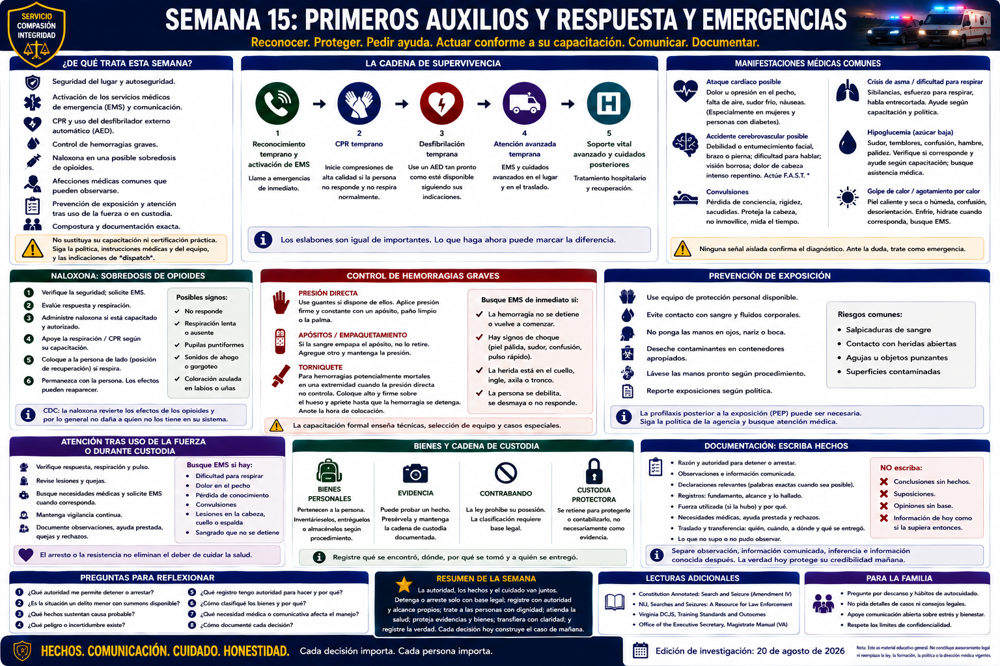

# Capítulo 15 — Semana 15: Primeros auxilios y respuesta a emergencias



> **Secuencia editorial y advertencia médica.** La Semana 15 pertenece al recorrido del libro, no a un calendario publicado de HRCJTA. Las fuentes se revisaron para la edición del 20 de agosto de 2026. **Una explicación escrita no sustituye la certificación práctica en CPR, la instrucción en AED, primeros auxilios, control de hemorragias ni educación de EMS.** Siga certificación, dirección médica, orientación de *dispatch*, instrucciones del equipo y política de agencia vigentes.

## Apertura

La policía puede llegar a un choque, sobredosis, agresión o persona inconsciente antes que los servicios médicos. Alguien bajo arresto puede enfermar. Una agente puede lesionarse. Su función no es convertirse en médica, sino reconocer una posible emergencia, evitar daño adicional, pedir atención apropiada, utilizar destrezas y equipo vigentes para los que está capacitada, comunicar cambios y conservar un registro exacto.

## De qué trata esta semana

Este capítulo introduce seguridad general del lugar, activación de los **servicios médicos de emergencia — Emergency Medical Services (EMS)**, finalidad de CPR y AED, hemorragia grave, naloxona, manifestaciones médicas comunes, prevención de exposición, atención tras fuerza o durante custodia, compostura y documentación. Prepara para instrucción certificada; no certifica competencia ni enseña atención traumatológica avanzada.

## Lo que necesita comprender

### Seguridad, reconocimiento y activación van primero

Antes de ayudar, identifique peligros a nivel general —tránsito, violencia, fuego, electricidad, estructuras inestables, sustancias químicas, sangre y objetos punzantes— y solicite los recursos que la situación parezca exigir. Use el equipo de protección apropiado. Comunique a *dispatch* y EMS ubicación clara, número de pacientes, condición observada, peligros conocidos y cambios importantes. No retrase una solicitud de emergencia mientras intenta formular un diagnóstico.

Inconsciencia, respiración anormal o ausente, hemorragia grave, señales de accidente cerebrovascular o ataque cardíaco, lesión grave, convulsión prolongada o repetida, enfermedad importante por calor o frío o alteración de la conciencia pueden exigir evaluación urgente de EMS. Diabetes, intoxicación, sobredosis, lesión craneal, crisis conductual y otras afecciones pueden parecerse. Trate observaciones e historia conocida como información, no diagnóstico de campo.

### Las destrezas de CPR y AED requieren práctica

La **reanimación cardiopulmonar — cardiopulmonary resuscitation (CPR)** procura mantener el flujo sanguíneo cuando un paro cardíaco detuvo la circulación eficaz. Un **desfibrilador externo automático — automated external defibrillator (AED)** analiza el ritmo y, cuando corresponde, indica una descarga destinada a ayudar a restablecer un ritmo eficaz. Reconocimiento temprano, activación de emergencias, CPR y uso oportuno del AED forman eslabones de la cadena de supervivencia de la American Heart Association.

La orientación pública generalmente indica llamar a emergencias, iniciar CPR para una persona que no responde y no respira normalmente, y usar un AED disponible siguiendo sus indicaciones. Evaluación exacta, compresiones, ventilación, atención de menores o lactantes, ahogamiento, trauma, equipos y circunstancias especiales pertenecen a certificación práctica vigente. Las destrezas se deterioran; importan reentrenamiento y práctica.

Se conservan **CPR** y **AED**, siglas inglesas que la recluta oirá en Virginia. Las formas españolas RCP y DEA pueden aparecer en materiales para el público, pero no sustituyen aquí el vocabulario profesional inglés.

### La hemorragia grave exige atención inmediata

Una **hemorragia grave — severe bleeding** externa potencialmente mortal puede ser continua o pulsátil, acumularse rápidamente, empapar ropa o apósitos o acompañarse de choque. Active EMS, use las medidas de control para las que esté capacitada y el equipo protector disponible, y vigile hasta transferir la atención.

Los cursos generales reconocidos enseñan presión directa y, para determinadas hemorragias potencialmente mortales de extremidades, uso capacitado de **torniquete — tourniquet**. Colocación, selección del dispositivo, empaquetamiento de heridas, reevaluación y casos especiales requieren instrucción formal. Esta guía no ofrece procedimientos traumatológicos avanzados.

### La naloxona es ayuda de emergencia, no atención completa

Una posible sobredosis de opioides puede presentar falta de respuesta, respiración lenta o ausente, pupilas puntiformes, coloración anormal de labios o uñas o sonidos de ahogo o gorgoteo; ninguna señal aislada es concluyente. CDC y SAMHSA aconsejan tratar la sospecha como emergencia: solicitar EMS; administrar **naloxona — naloxone** si está disponible y la agente está capacitada y autorizada; apoyar respiración o CPR según capacitación; colocar a la persona según lo aprendido cuando corresponda; y permanecer porque los efectos pueden reaparecer y se necesita atención adicional.

Según CDC, la naloxona revierte efectos opioides y por lo general no daña a quien no tiene opioides como causa. No sustituye evaluación, vigilancia ni atención de EMS por otra causa. Los recursos de Virginia Department of Health y la dirección médica vigente de la agencia controlan los detalles del programa; este capítulo no brinda información sobre consumo de drogas ni dosis.

### Las llamadas comunes pueden compartir manifestaciones médicas

- **Convulsión:** proteja de peligros evidentes, solicite atención según capacitación, observe duración y recuperación, y no improvise medios de sujeción ni coloque objetos en la boca.
- **Posible emergencia diabética:** conducta alterada, sudor, confusión, debilidad o inconsciencia tienen muchas causas; procure orientación de EMS en vez de presumir intoxicación.
- **Emergencia por calor o frío:** ambiente, esfuerzo, ropa, enfermedad, medicamentos y conducta pueden contribuir; avance hacia atención capacitada sin convertir esta sección en protocolo.
- **Crisis de salud mental:** agitación, retraimiento, confusión o conducta inusual pueden coexistir con lesión, sobredosis, poco oxígeno, infección u otra enfermedad. Una etiqueta conductual no debe impedir valoración médica.
- **Choque de tránsito:** atienda peligros y pida bomberos o EMS; luego preste solo atención dentro de su capacitación.

### La sangre y los fluidos corporales requieren precauciones rutinarias

Utilice guantes y demás equipo de protección personal adecuado a la exposición prevista; cubra lesiones de su propia piel; evite contacto directo; mantenga atención a objetos punzantes; y deseche o aísle material contaminado mediante procesos aprobados.

Las **precauciones universales — universal precautions** son el término histórico para tratar sangre y ciertos fluidos como potencialmente infecciosos. La capacitación moderna puede emplear el marco más amplio de **precauciones estándar — standard precautions** según el contexto. Siga la terminología y los controles actuales; ninguno de los términos significa que toda persona tiene una infección. La norma de OSHA sobre patógenos transmitidos por sangre exige a empleadores cubiertos un plan de control de exposición, controles de ingeniería y prácticas de trabajo, equipo protector, capacitación, disposiciones sobre vacunación y evaluación posterior.

Si ocurre un pinchazo, una salpicadura en ojos o boca u otra **exposición ocupacional — occupational exposure**, realice primeros auxilios inmediatos según capacitación, informe pronto y obtenga evaluación y seguimiento médicos confidenciales conforme al plan de la agencia. No oculte una exposición por vergüenza ni improvise el procesamiento de riesgo biológico.

### La custodia y la fuerza no reducen la necesidad de atención

Después de fuerza o durante custodia, preste atención a lesión visible, dolor, dificultad respiratoria, alteración de conciencia, golpe en la cabeza, intoxicación, agitación significativa, vómitos repetidos, incapacidad para comunicarse normalmente y todo signo de angustia médica. Pida evaluación cuando lo indiquen observación, queja, capacitación, ley o política. Continúe vigilando y comunique hechos pertinentes a EMS y al centro receptor.

No presuma que «solo está intoxicado», «solo se resiste» o «ya recibió autorización médica» resuelve un síntoma nuevo o peor. Documente condición observada, declaraciones y quejas, hechos relacionados con fuerza, ayuda solicitada o prestada, negativas manejadas conforme a procedimiento, cambios y transferencia. Dignidad, fuerza razonable, cese, intervención y atención de los Capítulos 8 y 9 continúan después de aplicar medios de sujeción.

### La compostura favorece la atención

La respuesta exige controlar el propio ritmo lo suficiente para comunicar, recuperar la capacitación, coordinar con *dispatch* y EMS, dar a testigos instrucciones claras y no técnicas cuando corresponda, y percibir cambios. La práctica repetida y supervisada mejora el acceso a lo aprendido bajo estrés. Calma no significa indiferencia, sino atención utilizable.

## Cómo puede sentirse el entrenamiento

La práctica puede cansar físicamente y resultar emocionalmente vívida. La retroalimentación puede revelar pasos olvidados o vacilación: para eso existen el equipo de capacitación y la repetición supervisada. La recluta debe comunicar limitaciones o exposiciones por el proceso correcto y nunca fingir una certificación que no posee.

## Conceptos y vocabulario clave

- **Servicios médicos de emergencia — Emergency Medical Services (EMS):** sistema prehospitalario coordinado, no simplemente una ambulancia.
- **Reanimación cardiopulmonar — cardiopulmonary resuscitation (CPR):** esfuerzo aprendido para sostener circulación durante paro cardíaco.
- **Desfibrilador externo automático — automated external defibrillator (AED):** dispositivo que analiza ritmo y da indicaciones para una descarga cuando corresponde.
- **Hemorragia grave — severe bleeding:** pérdida potencialmente mortal que exige acción de emergencia y control capacitado.
- **Naloxona — naloxone:** medicamento que puede revertir temporalmente una sobredosis de opioides; no sustituye EMS ni seguimiento.
- **Precauciones universales/estándar — universal/standard precautions:** marco preventivo que aplica controles apropiados a material potencialmente infeccioso; use terminología vigente.
- **Exposición ocupacional — occupational exposure:** contacto laboral que puede transmitir enfermedad por sangre y exige informe y evaluación prontos.
- **Transferencia de atención — transfer of care:** comunicación y rendición de cuentas cuando EMS o un centro médico asume la atención.

## Del aula a la calle

**Ejemplo ficticio; no es algoritmo de tratamiento.** Una agente encuentra a una persona inconsciente con respiración anormal. Identifica peligros inmediatos, llama a EMS, comunica observaciones, usa naloxona y destrezas CPR/AED solo según capacitación e indicación, vigila cambios y transfiere información. El informe posterior distingue observación, relato de testigo, ayuda prestada y respuesta.

Bajo custodia, una persona comunica dificultad respiratoria que empeora. La queja se trata como información que exige valoración, no como molestia. Respuesta médica y documentación protegen salud e integridad de la revisión posterior.

## Del tribunal a la academia

```text
Necesidad médica observada o comunicada
             ↓
Solicitud de EMS y respuesta capacitada
             ↓
Transferencia de atención y registros contemporáneos
             ↓
Informe policial / fotografías / testigos
             ↓
Posible revisión probatoria, administrativa o judicial
```

Informes policiales y de EMS, expedientes médicos obtenidos bajo reglas aplicables, fotografías, grabaciones, testigos, horas de *dispatch* y documentación de fuerza pueden ayudar después a establecer condición, momento, causalidad, respuesta y credibilidad. Los expedientes médicos tienen reglas de privacidad y prueba; el acceso policial no es automático. Documentar la respuesta forma parte del registro fáctico, no sustituye una conclusión clínica.

## Lo que puede ser difícil

**Incertidumbre:** distintas emergencias pueden parecerse. **Memoria bajo presión:** deben recuperarse prioridades sencillas aprendidas. **Angustia:** menores, hemorragia grave o un colega inconsciente pueden ser difíciles. **Límites:** ayudar no autoriza procedimientos sin capacitación. **Después:** complete documentación e informe de exposición cuando baje la adrenalina.

## Preguntas para reflexionar

1. ¿Qué peligros y equipo protector importan antes del contacto?
2. ¿Qué observaciones exigen activar EMS de inmediato?
3. ¿Qué atención estoy actualmente capacitada, equipada y autorizada para brindar?
4. ¿Qué cambió después de ayudar y qué necesita saber EMS?
5. ¿Podrían fuerza, custodia, intoxicación o agitación ocultar un problema médico?
6. ¿Hubo exposición ocupacional que exige informe y seguimiento prontos?
7. ¿Qué hechos pertenecen al registro y qué conclusiones corresponden a profesionales clínicos?

## Resumen de la semana

La policía suele cubrir el tiempo hasta que llega EMS. Una respuesta sólida combina seguridad general, activación temprana, destrezas certificadas vigentes, precauciones protectoras, observación, reevaluación y transferencia clara. CPR/AED, control de hemorragias y naloxona exigen práctica. El arresto nunca vuelve irrelevante la angustia médica. Compostura y documentación honesta conectan atención con rendición de cuentas.

## Lecturas adicionales y referencias

### Fuentes oficiales

1. Virginia Department of Health, **Emergency Medical Services**: https://www.vdh.virginia.gov/emergency-medical-services/
2. Virginia Department of Health, **Naloxone**: https://www.vdh.virginia.gov/epidemiology/naloxone/
3. Centers for Disease Control and Prevention, **5 Things to Know About Naloxone**: https://www.cdc.gov/stop-overdose/caring/naloxone.html
4. Occupational Safety and Health Administration, **Bloodborne Pathogens and Needlestick Prevention**: https://www.osha.gov/bloodborne-pathogens
5. Virginia DCJS, **Law Enforcement Training / Compulsory Minimum Training Standards and Performance Outcomes**: https://www.dcjs.virginia.gov/law-enforcement/training

### Lecturas adicionales

- American Heart Association, **CPR and ECC Guidelines / Hands-Only CPR**: https://cpr.heart.org/en/resuscitation-science/cpr-and-ecc-guidelines y https://cpr.heart.org/en/cpr-courses-and-kits/hands-only-cpr
- American Red Cross, **First Aid, CPR and AED Training**: https://www.redcross.org/take-a-class/first-aid
- American College of Surgeons, **STOP THE BLEED**: https://www.stopthebleed.org/
- SAMHSA, **Opioid Overdose Prevention and Reversal**: https://www.samhsa.gov/substance-use/treatment/overdose-prevention

### Para la familia

- La formación puede despertar interés por cursos de CPR, ubicación de AED y un botiquín mantenido. Elijan un curso práctico reconocido; este capítulo no es instrucción médica doméstica.
- Hablen con calma de planes de emergencia, sobre todo para menores o necesidades conocidas. No diagnostiquen por una lista; usen emergencias y atención cualificada cuando corresponda.
