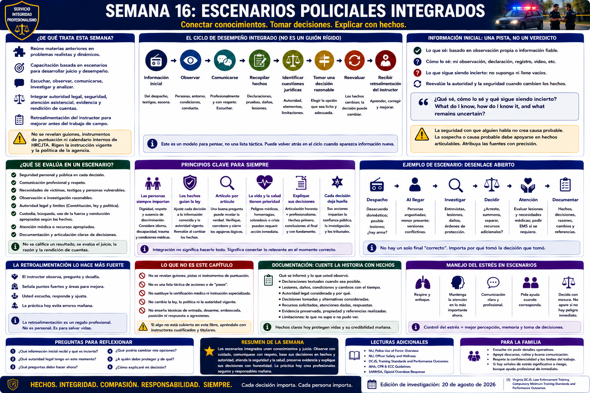

# Capítulo 16 — Semana 16: Escenarios Policiales Integrados



> **Secuencia editorial y estado de la investigación.** En este libro, la Semana 16 reúne materias que antes se estudiaron por separado. No se afirma que HRCJTA programe una «semana de escenarios integrados» en este momento. Las fuentes se revisaron para la edición del 20 de agosto de 2026; ninguna fuente pública consultada reveló los guiones, instrumentos de puntuación ni calendario interno de escenarios de HRCJTA. Rigen la instrucción vigente y la política de la agencia.

## Apertura

Hasta ahora, el libro ha puesto con frecuencia una materia en primer plano: autoridad constitucional, comunicación, patrullaje, tránsito, investigación, víctimas, custodia, fuerza, armas de fuego, conducción, crisis o respuesta médica. El trabajo policial real no llega ordenado según las divisiones de un libro de texto. Una llamada puede comenzar como un desacuerdo, revelar una lesión, plantear una necesidad de acceso lingüístico, producir versiones contradictorias y terminar con evidencia, una decisión sobre *summons* o arresto y un informe.

Un **escenario integrado — integrated scenario** es un problema de aprendizaje controlado que exige combinar conocimientos y juicio en vez de recitar una sola regla aislada. El propósito educativo no es imitar una película de acción, sino mantener una atención disciplinada hacia las personas, los hechos, la autoridad, la seguridad, la atención asistencial, la evidencia y la explicación mientras cambia la información.

## De Qué Trata Esta Semana

La **capacitación basada en escenarios — scenario-based training** permite convertir el conocimiento en desempeño. DCJS publica normas mínimas obligatorias y resultados de desempeño; una academia certificada determina cómo imparte y evalúa la instrucción aprobada dentro de ese marco.[1] Este capítulo no transforma esos resultados estatales en un supuesto ejercicio de HRCJTA.

La recluta quizá deba escuchar, observar, comunicarse profesionalmente, recopilar información, reconocer cuestiones jurídicas y médicas, distinguir un hecho de una suposición, identificar su autoridad, preservar material pertinente, tomar una decisión razonable y documentarla después. Estas tareas se relacionan entre sí. Una comunicación clara puede revelar un problema médico. La declaración de un testigo puede cambiar el análisis jurídico. Evidencia nueva puede desmentir la descripción inicial de *dispatch*.

## Lo que Necesita Comprender

### La integración es un ciclo, no un guion

```text
Información inicial
        ↓
Observar
        ↓
Comunicarse
        ↓
Recopilar hechos
        ↓
Identificar cuestiones jurídicas
        ↓
Tomar una decisión razonable
        ↓
Reevaluar cuando cambian los hechos
        ↓
Documentar
        ↓
Recibir retroalimentación del instructor
```

Este es un modelo para pensar, no una lista táctica rígida. La recluta puede volver atrás: la comunicación produce un hecho nuevo, ese hecho cambia la autoridad y el cambio de autoridad exige otra decisión. Una urgencia médica puede tener prioridad. Un hecho incierto puede exigir otra pregunta en vez de una resolución inmediata.

### La información inicial es una pista, no un veredicto

La información de *dispatch*, las primeras impresiones y las declaraciones de testigos pueden ser incompletas, erróneas, contradictorias, desactualizadas o expresadas con emoción. La clasificación de una llamada comunica lo que se informó; no prueba lo sucedido. El hábito productivo no es **«Ya sé qué ocurrió»**, sino:

> **¿Qué sé, cómo lo sé y qué sigue siendo incierto? — What do I know, how do I know it, and what remains uncertain?**

Esa pregunta vincula la investigación con la autoridad constitucional. La sospecha debe apoyarse en hechos articulables; la seguridad con que alguien habla no crea causa probable; y la autoridad jurídica debe reevaluarse cuando cambian los hechos. La atribución importa: «*dispatch* informó», «la propietaria declaró» y «yo observé» identifican fuentes de conocimiento distintas.

### Una decisión incluye su explicación

El desempeño en un escenario no consiste solo en llegar al desenlace preferido. Se puede pedir a la recluta que explique:

- qué observó y qué informó otra persona;
- cuáles hechos eran fiables, controvertidos o todavía desconocidos;
- qué ley, política o autoridad resultaba pertinente;
- por qué eligió una opción razonable en vez de las alternativas;
- qué cambió y por qué reevaluó la decisión; y
- qué debe documentarse, preservarse, remitirse o recibir seguimiento.

La **articulación — articulation** no es un relato inventado después del resultado. Es una explicación honesta de la información disponible en cada punto de decisión. Un resultado acertado apoyado en razonamiento descuidado sigue siendo motivo de aprendizaje; un resultado imperfecto seguido de un análisis franco puede revelar precisamente qué necesita práctica.

### Los escenarios ofrecen un espacio controlado para corregir

La academia existe en parte para identificar errores durante una capacitación controlada, antes de que la recluta asuma toda la responsabilidad en el trabajo de campo. Según la norma aplicable y las reglas de la academia, la **retroalimentación — feedback** puede llevar a una **corrección — correction**, práctica adicional o **instrucción correctiva o remediación — remediation**. Este libro no encontró una regla pública de HRCJTA que establezca cuándo hay remediación, cómo funciona la reevaluación de escenarios o cuántos intentos se permiten. La recluta debe obtener esas reglas de la academia, no suponer que habrá otra prueba.

## Cómo Puede Sentirse el Entrenamiento

Una evaluación realista puede producir nerviosismo, estrechamiento de la atención, habla apresurada, dificultad para recuperar información, excesiva conciencia de estar siendo observada o frustración después de un error. Las respuestas varían; ninguna debe presentarse como inevitable. La investigación experimental y aplicada respalda una afirmación más prudente: el estrés agudo y una carga cognitiva elevada pueden afectar la atención y la memoria de trabajo, mientras que la preparación y la práctica repetida orientada por retroalimentación pueden mejorar la recuperación y el desempeño.[2][3]

La respuesta no consiste en fingir que no hay presión. Consiste en volver la atención a la información observable, el propósito lícito, las prioridades enseñadas, la comunicación y la reevaluación.

## Conceptos y Vocabulario Clave

- **Escenario integrado — integrated scenario:** actividad de aprendizaje controlada que exige emplear juntas varias áreas de conocimiento y desempeño.
- **Capacitación basada en escenarios — scenario-based training:** instrucción o evaluación organizada en torno a un problema realista, no a un hecho o una destreza aislados.
- **Fuente de información — information source:** persona, registro, sensor, mensaje de *dispatch* u observación de donde procede un hecho afirmado.
- **Hecho — fact:** dato que debe vincularse con su fuente y distinguirse de una conclusión.
- **Observación — observation:** lo percibido directamente; no equivale a una declaración ajena ni a una inferencia.
- **Suposición — assumption:** proposición tratada como verdadera sin confirmación suficiente; debe comprobarse, no ocultarse.
- **Inferencia — inference:** conclusión razonada a partir de información; no debe presentarse como observación directa.
- **Información no verificada — unverified information:** dato cuya exactitud aún no se ha confirmado.
- **Reevaluación — reassessment:** reconsideración deliberada cuando cambian los hechos, riesgos, autoridad u opciones disponibles.
- **Articulación — articulation:** explicación veraz que conecta observaciones, información, derecho, razonamiento y acción.
- **Revisión posterior — debrief:** análisis estructurado del desempeño para identificar fortalezas, errores, decisiones y necesidades de práctica.

## Del Aula a la Calle

### Ejemplo integrado ficticio: no es un ejercicio de HRCJTA ni un modelo táctico

*Dispatch* envía a una recluta a un desacuerdo fuera de un negocio. El mensaje breve indica que «una clienta rompió una ventana». En el lugar, el propietario afirma que una clienta que se marchaba dañó una vitrina. La clienta dice que el vidrio se rompió cuando otra persona la empujó contra él. Un testigo vio una discusión, pero no el contacto; otro ofrece su versión en inglés limitado y solicita asistencia lingüística. La clienta tiene una cortadura y pide ayuda médica. Es posible que una cámara haya grabado el área.

La etiqueta de la llamada no resuelve el caso. La recluta atiende la necesidad médica, se comunica con respeto, obtiene asistencia lingüística adecuada conforme a la política, separa las observaciones de cada persona de sus conclusiones, determina qué bien sufrió daños y quién lo controla, considera si hay fundamento legal para una detención o medida de cumplimiento, identifica y preserva posible evidencia y evita prometer una acusación o resultado. Si un video o un testigo nuevo contradice una versión anterior, reevalúa en lugar de defender la primera teoría.

El informe posterior atribuye cada declaración, describe la lesión y la atención solicitada, registra las observaciones y el manejo de la evidencia, identifica la incertidumbre y explica cualquier ejercicio de autoridad. Derecho, comunicación, atención a la víctima, investigación, evidencia, acceso lingüístico y documentación se han convertido en un solo problema.

## Del Tribunal a la Academia

Lo que llega al tribunal como un solo expediente puede reflejar decenas de decisiones tomadas durante un encuentro. Puede contener informes, fotografías, registros de evidencia, órdenes judiciales, *summons*, declaraciones de testigos, expedientes médicos obtenidos mediante un proceso legal y testimonios posteriores. Un juez o abogado ve el registro que perdura, no las intenciones que la agente nunca documentó.

La experiencia en el tribunal puede ayudarle a reconocer cómo una atribución ausente, una laguna sin explicar o una fecha equivocada recorre todo un caso. La academia le pide trabajar antes en esa cadena: tomar decisiones lícitas, preservar su fundamento y escribir de modo que otra persona pueda evaluar lo que realmente ocurrió.

## Lo que Puede Ser Difícil

**Incertidumbre:** resistir una teoría rápida puede parecer más lento, pero la certeza prematura crea errores. **Cambiar de tarea:** las necesidades jurídicas, médicas, interpersonales y documentales compiten por la atención. **Ser observada:** pensar en la persona que evalúa puede distraer del problema. **Explicar decisiones:** es más fácil declarar una conclusión que exponer sus hechos y alternativas. **Recibir corrección:** la revisión posterior puede resultar más incómoda que el escenario, pero allí la práctica se convierte en aprendizaje.

## Preguntas para Reflexionar

1. ¿Qué palabras ayudan a mantener separada la información de *dispatch* de una observación personal?
2. ¿Qué hecho le haría reconsiderar una conclusión jurídica inicial?
3. En el ejemplo ficticio del negocio, ¿qué necesidades pueden atenderse a la vez y cuáles dependen de más hechos?
4. ¿Cómo explicaría una decisión razonable que después resultó basada en un error fáctico?
5. Además de si la respuesta final fue «correcta», ¿qué debe recoger una revisión posterior?

## Resumen de la Semana

Los escenarios integrados ponen a prueba las relaciones entre materias. Escuche antes de concluir. Identifique la fuente de cada hecho. Atienda la seguridad y el cuidado sin abandonar el análisis jurídico. Elija entre opciones lícitas y razonables, y luego reevalúe. Por último, explique y documente la decisión con honestidad. Integrar no significa memorizar más pasos, sino mantener conectadas las partes mientras cambian las circunstancias.

## Lecturas Adicionales y Referencias

### Fuentes Oficiales

1. Virginia Department of Criminal Justice Services, **Law Enforcement Training** (normas mínimas obligatorias y materiales sobre resultados de desempeño), consultado el 20 de agosto de 2026: https://www.dcjs.virginia.gov/law-enforcement/training
2. National Institute of Justice, **Research and Evaluation on Policing**, colección de investigación sobre escenarios y toma de decisiones policiales, consultada el 20 de agosto de 2026: https://nij.ojp.gov/topics/law-enforcement

### Lecturas Adicionales

3. John Sweller, “Cognitive Load During Problem Solving: Effects on Learning,” *Cognitive Science* 12(2), 1988, pp. 257–285, https://doi.org/10.1207/s15516709cog1202_4 (investigación fundamental sobre carga cognitiva; no es política policial).
- Police Executive Research Forum, *ICAT: Integrating Communications, Assessment, and Tactics Training Guide*, 2016: https://www.policeforum.org/assets/icattrainingguide.pdf (modelo profesional; no es derecho de Virginia ni política de JCCPD).
- Eduardo Salas et al., “Debriefing Medical Teams: 12 Evidence-Based Best Practices and Tips,” *The Joint Commission Journal on Quality and Patient Safety* 34(9), 2008, pp. 518–527, https://doi.org/10.1016/S1553-7250(08)34066-5 (literatura interdisciplinaria sobre revisiones posteriores).

### Para la Familia

- El trabajo con escenarios puede dejar a la recluta callada, tensa o frustrada, aunque las reacciones varían. Un período breve para desconectarse, comida, sueño y una conversación cotidiana quizá ayuden más que hacer preguntas de inmediato.
- Pregunte «¿Quieres que te escuche, te ayude a estudiar o te dé espacio?» en vez de pedir detalles protegidos del escenario o tratar de decidir si el instructor tenía razón.
- Un desempeño difícil aporta información; no dicta el valor personal de la recluta. Apoye la corrección honesta sin prometer que toda deficiencia permite una nueva evaluación.
