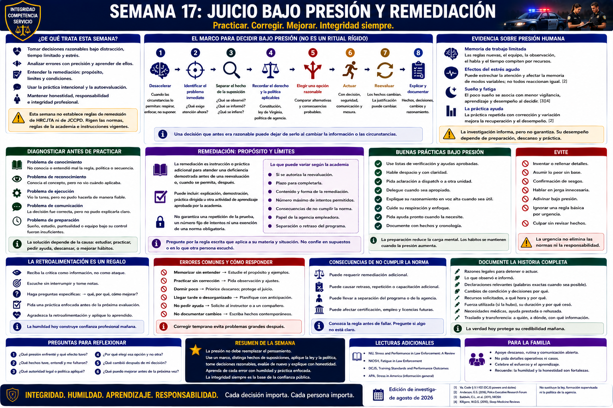

# Capítulo 17 — Semana 17: Juicio Bajo Presión y Remediación



> **Secuencia editorial y límite de la política local.** La Semana 17 pertenece a la secuencia de aprendizaje de este libro; no es un calendario publicado de HRCJTA. Las fuentes se revisaron para la edición del 20 de agosto de 2026. No se localizó una regla pública de HRCJTA sobre remediación, repetición de pruebas, límite de intentos o separación del programa. Rigen las normas estatales, las reglas de la academia, la política de la agencia y las instrucciones dadas a la recluta.

## Apertura

**El buen juicio no exige que desaparezca la presión. Exige seguir aplicando el derecho, la observación, la comunicación y la disciplina profesional mientras la presión existe.** La presión de la academia suele ser menos dramática que en la ficción: un límite de tiempo, tareas simultáneas, cansancio, las notas de una persona evaluadora, la duda sobre una respuesta o saber que un desempeño obligatorio importa.

La presión no justifica la falta de honradez ni elimina las normas. Sí ayuda a explicar por qué el juicio debe practicarse y no solo admirarse.

## De Qué Trata Esta Semana

Esta semana se concentra en dos habilidades relacionadas: tomar una decisión razonable cuando la atención está sobrecargada y responder profesionalmente cuando el desempeño no alcanza lo requerido. Ninguna exige perfección. Ambas exigen autoevaluación precisa, corrección, práctica e integridad.

El sistema de mínimos obligatorios de Virginia establece requisitos que debe cumplir la capacitación aprobada.[1] De ello no se desprende que todo error ordinario sea un incumplimiento ni que toda deficiencia pueda remediarse. Importan la norma y la materia aplicables, las reglas de la academia y los requisitos de la agencia.

## Lo que Necesita Comprender

### La presión consume recursos mentales limitados

La **memoria de trabajo — working memory** es limitada. Las reglas nuevas, el equipo, la observación, el habla y la presión de tiempo pueden competir por ella. El estrés agudo puede estrechar la atención o dificultar la recuperación de información en algunas personas y tareas; la fatiga y el sueño insuficiente se asocian con menor vigilancia, aprendizaje y desempeño al decidir.[2][3][4] Son hallazgos a nivel de poblaciones, no un diagnóstico ni una predicción de que toda recluta reaccionará de la misma manera.

La práctica repetida puede facilitar la recuperación de conocimientos importantes, sobre todo cuando incluye corrección y variación adecuada. Practicar no vuelve inmune al estrés, y las ideas populares sobre una única «respuesta al estrés» universal no deben sustituir la evidencia.

### Use un marco, no un ritual

```text
Desacelerar la mente cuando las circunstancias lo permitan
                    ↓
Identificar el problema inmediato
                    ↓
Separar el hecho de la suposición
                    ↓
Recordar el derecho / la política aplicables
                    ↓
Elegir una opción razonable
                    ↓
Actuar
                    ↓
Reevaluar
                    ↓
Explicar y documentar
```

Es una ayuda para pensar, no una lista operativa. Una verdadera emergencia quizá no permita deliberar durante mucho tiempo. «Desacelerar» puede significar una respiración deliberada, una pregunta aclaratoria o negarse a convertir una posibilidad en hecho por la urgencia. La reevaluación sigue siendo necesaria porque una decisión antes razonable puede dejar de serlo cuando cambian las circunstancias.

### Diagnostique el error antes de practicar

Después de recibir retroalimentación, pregunte qué falló realmente:

- **Problema de conocimiento:** la recluta no conocía o entendió mal una regla jurídica, vocabulario, política o secuencia.
- **Problema de reconocimiento:** conocía el concepto, pero no identificó cuándo se aplicaba.
- **Problema de ejecución:** reconoció la tarea, pero no pudo realizarla de manera fiable bajo esas condiciones.
- **Problema de comunicación:** quizá el razonamiento o la acción fueran adecuados, pero no pudo explicarlos con claridad.
- **Problema de preparación:** el sueño, la disponibilidad del equipo, el estudio o la puntualidad estaban bajo su control y fueron insuficientes.

La solución varía. Releer puede ayudar ante una laguna de conocimiento, pero no sustituye una destreza practicada. Repetir sin corregir el concepto erróneo de fondo puede reforzar la respuesta equivocada.

### La remediación es condicional, no garantizada

La **instrucción correctiva o remediación — remediation** es instrucción o práctica adicional destinada a atender una **deficiencia — deficiency** demostrada antes de una reevaluación o, cuando se permita, después de ella. Puede incluir explicación, demostración de un instructor autorizado, práctica focalizada u otra actividad de aprendizaje aprobada. **No promete una repetición de la prueba, un número fijo de intentos ni una exención de una norma obligatoria.**

Los materiales públicos revisados para esta edición no establecieron el proceso local de remediación de HRCJTA. La recluta debe preguntar qué regla escrita aplica a la materia particular, si se autoriza una reevaluación, qué plazo rige y qué función tiene la agencia empleadora. Las garantías informales de otra promoción no son reglas controlantes.

### El incumplimiento puede significar cosas distintas

- Un **error normal de aprendizaje — normal learning error** se identifica y corrige durante la instrucción.
- Una **deficiencia remediable — remediable deficiency** es aquella para la que las reglas controlantes permiten instrucción adicional o reevaluación.
- El **incumplimiento de una norma obligatoria — failure to meet a mandatory standard** puede impedir completar satisfactoriamente la academia o la certificación aunque el esfuerzo haya sido sincero.
- Un **problema grave de seguridad o integridad** puede afectar la idoneidad, el empleo, la disciplina o la certificación más allá del error de destreza original.

No debe imaginarse la academia principalmente como un concurso de eliminación. Tampoco tiene derecho a declarar competente a una persona cuando no ha cumplido resultados obligatorios.

### La integridad es la respuesta innegociable

Una recluta que comete un error no debe fabricar hechos, alterar deshonestamente la documentación, culpar falsamente a otra persona, ocultar un problema de seguridad ni mentir sobre su desempeño. Un error ordinario puede revelar una debilidad que admite capacitación. Una respuesta deshonesta crea una infracción distinta de la confianza pública y puede tener consecuencias mayores que el error original. La lección del Capítulo 1 cobra su mayor importancia cuando decir la verdad resulta incómodo.

## Cómo Puede Sentirse el Entrenamiento

Pueden acumularse los límites de tiempo, la evaluación, los hechos inciertos, la fatiga física, las tareas simultáneas, la observación del instructor, el manejo del equipo, el recuerdo del derecho, el temor a incumplir y la corrección de un error anterior. La recluta quizá termine mentalmente cansada o repase una decisión una y otra vez.

La retroalimentación profesional puede ser específica, directa, incómoda y repetitiva. Separe **la crítica de un desempeño** de **un juicio sobre el valor personal**. Escuche por completo; reformule la deficiencia; haga una pregunta concreta; prepare un plan de práctica; y demuestre mejora. Ponerse a la defensiva bloquea información. Convertir un desempeño en catástrofe consume la atención necesaria para el siguiente.

## Conceptos y Vocabulario Clave

- **Juicio — judgment:** selección entre opciones mediante hechos, derecho, política, riesgo, ética y propósito profesional.
- **Carga cognitiva — cognitive load:** exigencia impuesta a los recursos limitados de la memoria de trabajo.
- **Estrechamiento de la atención — attention narrowing:** reducción del campo de información atendida bajo algunas condiciones de estrés o exigencia; no es una «visión de túnel» universal.
- **Remediación — remediation:** instrucción o práctica adicional autorizada y dirigida a una deficiencia demostrada.
- **Reevaluación — reassessment:** evaluación posterior cuando las reglas aplicables la permiten.
- **Competencia demostrada — competency:** capacidad acreditada para cumplir el requisito definido de desempeño.
- **Retroalimentación — feedback:** información que compara el desempeño con una norma esperada e identifica el siguiente ajuste.

## Del Aula a la Calle

**Ejemplo ficticio y no táctico.** Durante un escenario evaluado, una recluta reconoce correctamente que hay una persona lesionada, pero no comunica la solicitud médica mientras busca información de testigos. En la revisión posterior, «preste más atención» resulta demasiado vago. La recluta identifica que el reconocimiento fue correcto y que la ejecución o comunicación fue deficiente, repasa la prioridad enseñada, practica comunicar la solicitud mientras mantiene un resumen fáctico preciso y —solo si la regla aplicable lo permite— completa una reevaluación.

La respuesta constructiva no consiste en afirmar que quien evaluaba no vio la acción ni en añadir una transmisión de radio que nunca ocurrió. La precisión hace posible mejorar.

## Del Tribunal a la Academia

Los tribunales funcionan con plazos y escrutinio. Un error de presentación quizá pueda corregirse; un requisito jurisdiccional quizá no; falsificar una anotación del expediente es categóricamente distinto de cometer un error tipográfico. El aprendizaje en la academia mantiene una distinción ética semejante aunque sus reglas sean diferentes: la corrección depende de la norma controlante, pero la honestidad se exige en todas las categorías.

## Lo que Puede Ser Difícil

**Especificidad incómoda:** «la comunicación fue débil» sirve menos que identificar el hecho exacto omitido. **Comparación:** la aparente facilidad de otra recluta revela poco sobre su preparación privada o sus otras debilidades. **Espera:** la incertidumbre sobre una reevaluación puede resultar más difícil que practicar. **Fatiga:** estudiar más hasta altas horas puede perjudicar el sueño necesario para aprender. **Orgullo:** aceptar una corrección sin perder el respeto propio es una destreza profesional.

## Preguntas para Reflexionar

1. ¿El último error fue de conocimiento, reconocimiento, ejecución, comunicación o preparación?
2. ¿Qué evidencia demostraría una mejora?
3. ¿Qué parte del marco de decisión es más fácil omitir bajo presión de tiempo?
4. ¿Cómo puede preguntar por la remediación sin suponer que tiene derecho a repetir una prueba?
5. ¿Por qué ocultar puede ser más grave que el error de desempeño original?

## Resumen de la Semana

La presión vuelve más importantes los hábitos disciplinados, no menos. Proteja el sueño y la preparación, separe hechos de suposiciones, elija una opción razonable y reevalúe. Cuando el desempeño resulte insuficiente, escuche, diagnostique, pregunte, practique y mejore. Las normas obligatorias siguen siendo obligatorias; la remediación solo existe donde se autoriza. La integridad nunca depende de la puntuación.

## Lecturas Adicionales y Referencias

### Fuentes Oficiales

1. Virginia Criminal Justice Services Board, **6VAC20-20, Rules Relating to Compulsory Minimum Training Standards for Law-Enforcement Officers**, localizador de la regulación vigente consultado el 20 de agosto de 2026: https://law.lis.virginia.gov/admincode/title6/agency20/chapter20/
- Virginia Department of Criminal Justice Services, **Law Enforcement Training**, localizador de las normas vigentes y futuras ya adoptadas, consultado el 20 de agosto de 2026: https://www.dcjs.virginia.gov/law-enforcement/training
- National Institute for Occupational Safety and Health, **Training for Law Enforcement on Shift Work and Long Work Hours**, 2015: https://www.cdc.gov/niosh/work-hour-training-for-nurses/longhours/

### Lecturas Adicionales

2. Sian L. Beilock y Thomas H. Carr, “When High-Powered People Fail: Working Memory and ‘Choking Under Pressure’ in Math,” *Psychological Science* 16(2), 2005, pp. 101–105, https://doi.org/10.1111/j.0956-7976.2005.00789.x (evidencia de laboratorio; no es específica de la policía).
3. John A. Caldwell et al., “Fatigue and Its Management in the Workplace,” *Neuroscience & Biobehavioral Reviews* 96, 2019, pp. 272–289, https://doi.org/10.1016/j.neubiorev.2018.10.024
4. Yvonne Harrison y James A. Horne, “The Impact of Sleep Deprivation on Decision Making,” *Journal of Experimental Psychology: Applied* 6(3), 2000, pp. 236–249, https://doi.org/10.1037/1076-898X.6.3.236
- Henry L. Roediger III y Jeffrey D. Karpicke, “Test-Enhanced Learning,” *Psychological Science* 17(3), 2006, pp. 249–255, https://doi.org/10.1111/j.1467-9280.2006.01693.x

### Para la Familia

- La recluta puede volver a casa mentalmente cansada, frustrada, preocupada por una prueba, poco dispuesta a hablar de inmediato o concentrada en estudiar. Nada de ello es universal. Pregunte qué clase de apoyo desea.
- Cuando sea posible, permita un tiempo para desconectarse, ayude a proteger el sueño, escuche sin tratar de resolver de inmediato y mantenga predecibles las rutinas del hogar.
- Celebre el progreso constante sin convertir cada cena en un examen ni cada evaluación en un referéndum familiar. Si la recluta informa que no cumplió un requisito, apoye el contacto veraz con sus instructores y la agencia empleadora en vez de ofrecer tranquilidad sin fundamento.
