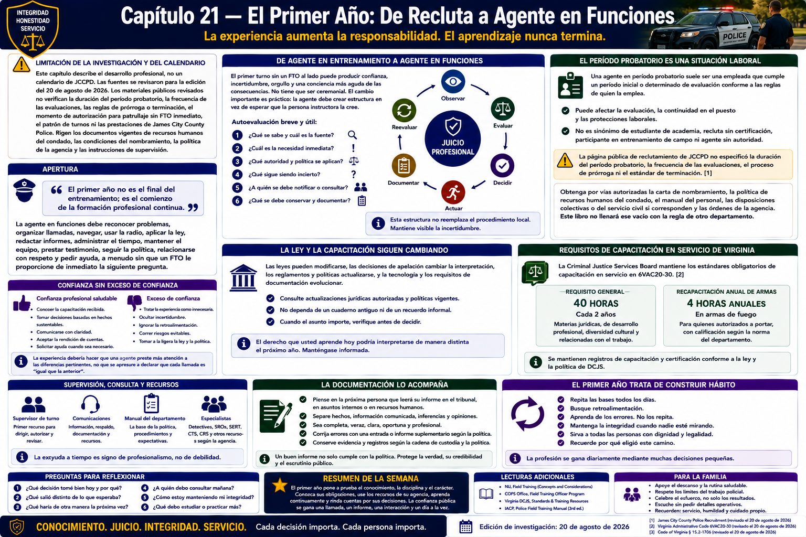

# Capítulo 21 — El Primer Año: De Recluta a Agente en Funciones



> **Limitación de la investigación y del calendario.** Este capítulo describe el desarrollo profesional, no un calendario de JCCPD. Las fuentes se revisaron para la edición del 20 de agosto de 2026. Los materiales públicos revisados no verifican la duración del período probatorio, la frecuencia de las evaluaciones, las reglas de prórroga o terminación, el momento de autorización para patrullaje sin FTO inmediato, el patrón de turnos ni las prestaciones de James City County Police. Rigen los documentos vigentes de recursos humanos del condado, las condiciones del nombramiento, la política de la agencia y las instrucciones de supervisión.

## Apertura

> **El primer año no es el final del entrenamiento; es el comienzo de la formación profesional continua.**

Cuando disminuye la supervisión cercana del entrenamiento de campo, las tareas conocidas se sienten distintas. La agente en funciones debe reconocer problemas, organizar llamadas, navegar, usar la radio, aplicar la ley vigente, redactar informes, administrar el tiempo, mantener el equipo, prestar testimonio, seguir la política, relacionarse con respeto y pedir ayuda, a menudo sin que un FTO le proporcione de inmediato la siguiente pregunta.

Una mayor independencia no significa aislamiento. Significa asumir responsabilidad y utilizar adecuadamente a supervisores, colegas, políticas, capacitación y especialistas.

## De Agente en Entrenamiento a Agente en Funciones

Un primer turno sin un FTO al lado puede producir confianza, incertidumbre, orgullo y una conciencia más aguda de las consecuencias. No tiene que ser ceremonial, y este libro no afirma que JCCPD señale un “primer turno en solitario” determinado. El cambio importante es práctico: la agente debe crear estructura en vez de esperar que la persona instructora la cree.

Una autoevaluación breve y útil pregunta:

1. ¿Qué se sabe y cuál es la fuente?
2. ¿Cuál es la necesidad inmediata?
3. ¿Qué autoridad y política se aplican?
4. ¿Qué sigue siendo incierto?
5. ¿A quién se debe notificar o consultar?
6. ¿Qué se debe conservar y documentar?

Esta estructura no reemplaza el procedimiento local. Mantiene visible la incertidumbre.

## El Período Probatorio Es una Situación Laboral

Una **agente en período probatorio — probationary officer** suele ser una empleada que cumple un período inicial o determinado de evaluación conforme a las reglas de quien la emplea. El período probatorio puede afectar la evaluación, la continuidad en el puesto y las protecciones laborales, pero su significado exacto no es universal. No es sinónimo de estudiante de academia, recluta sin certificación, participante en entrenamiento de campo ni agente carente de toda autoridad.

La página pública de reclutamiento de JCCPD revisada no especificó la duración del período probatorio, la frecuencia de las evaluaciones, el proceso de prórroga ni el estándar de terminación.[1] La agente debe obtener por vías autorizadas la carta de nombramiento que rige su empleo, la política de recursos humanos del condado, el manual del personal, las disposiciones colectivas o del servicio civil si corresponden y las órdenes de la agencia. Este libro no llenará ese vacío con la regla de otro departamento.

## Confianza sin Exceso de Confianza

La **confianza profesional saludable** consiste en conocer la capacitación recibida, tomar oportunamente una decisión basada en hechos sustentables, comunicarse con claridad, aceptar la rendición de cuentas y solicitar ayuda cuando un problema excede los conocimientos o la autoridad propios.

El **exceso de confianza** consiste en tratar la experiencia como innecesaria, ocultar incertidumbre, ignorar la retroalimentación, correr riesgos evitables o tomar a la ligera la ley y la política. Los Capítulos 1, 16 y 17 presentaron la alternativa: la autoridad pública exige humildad, criterio integrado y corrección.

La experiencia debería hacer que una agente preste más atención a las diferencias pertinentes, no que se apresure a declarar que cada llamada es “igual que la anterior”.

## La Ley y la Capacitación Siguen Cambiando

Las leyes pueden modificarse. Las decisiones de apelación pueden cambiar la interpretación de normas constitucionales o legales. También pueden cambiar los reglamentos, los estándares de DCJS, las políticas de la agencia, la tecnología y los requisitos de documentación. No se puede suponer que una regla aprendida en la academia permanecerá igual durante toda una carrera. Consulte actualizaciones jurídicas autorizadas y políticas vigentes; cuando el asunto importe, no dependa de un cuaderno antiguo ni de un recuerdo informal.

### Requisitos de capacitación en servicio de Virginia

La Criminal Justice Services Board de Virginia mantiene los estándares obligatorios de **capacitación en servicio — in-service training** en **6VAC20-30**.[2] Según la revisión realizada para esta edición, el reglamento exige a los agentes de las categorías comprendidas completar **40 horas de capacitación en servicio dentro de cada período de dos años**, distribuidas entre materias jurídicas, de desarrollo profesional, diversidad cultural y relacionadas con el trabajo; además, aborda por separado la recapacitación anual en armas de fuego para los agentes autorizados a portarlas. Deben consultarse el texto operativo vigente y las directrices de DCJS para conocer con exactitud la elegibilidad, los períodos de registro, las exenciones, las modalidades aprobadas, la distribución de materias y los requisitos sobre armas de fuego; no se debe sustituir silenciosamente una modificación adoptada por un resumen anterior.

Este mínimo obligatorio se distingue de:

- la **capacitación específica de la agencia**, como actualizaciones de política local, equipo, destrezas anuales, boletines jurídicos o instrucciones de supervisión; y
- el **desarrollo especializado opcional**, que puede preparar a la agente para una función posterior, pero no reemplaza la capacitación obligatoria.

Conserve registros personales, pero asegúrese de que sea correcto el registro de la agencia o DCJS, no solo una hoja de cálculo privada.

## Construir una Base de Patrullaje

Las trayectorias posteriores pueden incluir investigaciones, tránsito, trabajo como agente de recursos escolares, policía comunitaria, prevención del delito, capacitación, instrucción, unidades especializadas o supervisión. Son ejemplos del ámbito policial en general, no una afirmación de que JCCPD ofrezca cada destino. La primera tarea no es acumular títulos, sino hacerse confiable en el trabajo fundamental.

Una base sólida de patrullaje comprende reconocer el problema, aplicar la ley con imparcialidad, comunicarse con *dispatch* y el público, conducir de forma segura, organizar la evidencia, redactar informes confiables, preparar casos, mantener el equipo, cumplir plazos y formular buenas preguntas. Esos hábitos se transfieren con más facilidad que la emoción.

## La Credibilidad Comunitaria Es Acumulativa

La credibilidad se desarrolla en encuentros ordinarios: escuchar antes de decidir, explicar lo que se pueda explicar, cumplir un compromiso expresado, reconocer la incertidumbre apropiada, documentar con precisión y aplicar la ley de manera uniforme. Una sola conversación cordial no demuestra la confianza de la comunidad, y una conversación difícil no justifica la falta de respeto.

Las llamadas policiales representan en exceso crisis, conflictos, victimización y presuntos delitos. Esa muestra ocupacional no es una imagen representativa de la población. La mayoría de las personas de un vecindario no llegan a conocimiento de una agente por haber cometido un delito. Si la exposición repetida se endurece hasta producir la suposición de que un grupo, domicilio o vecindario es intrínsecamente indigno de confianza, la percepción y las decisiones pueden distorsionarse.

La práctica imparcial significa tratar a cada persona como individuo, separar los hechos de los estereotipos, contrastar una inferencia con la evidencia, aplicar por igual los estándares jurídicos y aceptar la revisión. Los principios del Department of Justice sobre integridad policial y sus recursos de justicia procesal relacionan la legitimidad con la equidad, la posibilidad de expresarse, la neutralidad, el respeto y los motivos dignos de confianza; son recursos profesionales generales, no política de JCCPD.[3][4]

## Errores, Conducta Indebida y Corrección Honrada

Las agentes nuevas cometerán errores ordinarios de aprendizaje. Esa realidad no debe borrar distinciones importantes:

- un **error ordinario de aprendizaje** puede ser una deficiencia corregible de organización, redacción o desconocimiento de un procedimiento;
- una **infracción de política** se aparta de un requisito de la agencia y debe atenderse como indique la política;
- un **error jurídico** puede afectar derechos, evidencia, libertad o responsabilidad legal, y exige supervisión pronta y corrección cuando sea posible;
- un **problema de integridad** comprende la falta de honradez, el encubrimiento, la fabricación o las represalias, y no se normaliza como parte del aprendizaje; y
- un **problema grave de seguridad** exige acción inmediata y la gestión formal que corresponda al riesgo.

Ante un error ordinario, el patrón profesional es reconocerlo, notificarlo según corresponda, corregir lícitamente lo que se pueda, documentar con honradez, aprender la regla controlante y crear una medida que evite su repetición. Nunca se debe antedatar, borrar, inventar ni alterar discretamente un registro para proteger la reputación. La respuesta a un error suele revelar más que el error mismo.

## Reputación Significa Ser Digna de Confianza

La reputación profesional se forma mediante pequeñas conductas repetidas: puntualidad, preparación, calidad de los informes, disciplina de radio, honradez, comunicación respetuosa, disposición para ayudar, cuidado del equipo, aceptación de tareas y preguntas útiles. La popularidad no es el objetivo. Lo es ser digna de confianza.

Una colega confiable no finge certeza, no deja trabajo inconcluso a otras personas sin explicación ni utiliza la amistad para evitar una revisión. Se puede contar con que relatará con exactitud lo ocurrido, incluso cuando el relato resulte incómodo.

## El Bienestar Es Mantenimiento Profesional

El trabajo policial no produce la misma respuesta en todas las personas. Sin embargo, puede implicar trabajo nocturno, horarios irregulares, vigilancia sostenida, conflictos, exposición a hechos traumáticos, estrés organizacional y alteraciones de las rutinas familiares. La evidencia y los recursos profesionales federales respaldan tratar el sueño, la salud física y mental, y las relaciones como asuntos de seguridad y de la fuerza laboral, no como debilidades privadas.[5][6]

Un plan equilibrado de mantenimiento puede incluir:

- proteger un sueño adecuado y adaptar el entorno para dormir al trabajo por turnos;
- comer con regularidad y mantener una actividad física apropiada para la persona;
- reconocer cambios en el estado de ánimo, la concentración, el sueño, las relaciones o el consumo de sustancias;
- recurrir a relaciones de confianza sin vulnerar la confidencialidad;
- conocer las reglas reales de acceso y confidencialidad del apoyo entre pares, el asesoramiento profesional, la capellanía, el EAP y la atención médica; y
- buscar ayuda cualificada en vez de esperar que el malestar se convierta en una crisis.

Son principios preventivos, no consejos de diagnóstico o tratamiento. No todas las agentes desarrollan una enfermedad relacionada con experiencias traumáticas, y recurrir a apoyo no demuestra que exista una.

### El alcohol no es un sistema de recuperación

El alcohol u otras sustancias pueden parecer un atajo atractivo para dormir, adormecer emociones o pasar del trabajo al descanso. Los recursos federales de bienestar identifican el uso indebido de sustancias como una preocupación dentro de la salud integral de los agentes.[5] Conviene advertir pronto ciertos patrones: necesitar más cantidad, usar una sustancia como único recurso para afrontar el estrés, conducir después del consumo, trabajar con las facultades afectadas, ocultarlo o causar tensión en el hogar. Deben orientar la ayuda la política de la agencia y profesionales de salud cualificados, no el folclore entre colegas. No se trata de diagnosticar ni moralizar, sino de proteger la salud, el criterio, la familia y la seguridad pública.

### Conservar una identidad más amplia que la placa

La familia, las amistades, los pasatiempos, el ejercicio, la fe o la vida comunitaria cuando tengan significado personal, y otros intereses ajenos al trabajo policial aportan perspectiva y conexión. Una identidad equilibrada no reduce el compromiso. Ayuda a evitar que el trabajo absorba cada desacuerdo, amistad y medida del valor propio.

## El Primer Año de la Familia

La pareja o la familia puede experimentar cambios de turno, días festivos perdidos, comparecencias ante el tribunal, fatiga, relatos que la agente no puede compartir por completo, preocupaciones por la seguridad, orgullo y rutinas alteradas. Los problemas no son inevitables, pero planificar es mejor que recibir sorpresas.

Entre los hábitos prácticos se encuentran:

- mantener un calendario compartido para turnos, tribunal, capacitación, cuidado infantil y tiempo familiar protegido;
- comunicar pronto los cambios de horario y mantener, cuando sea posible, planes alternativos de cuidado infantil o transporte;
- acordar una rutina que proteja el sueño sin imponer silencio permanente al hogar;
- expresar qué transición se necesita después del trabajo: unos minutos de tranquilidad, una comida, movimiento o conversación; y
- conservar tiempo compartido cotidiano que no sea un repaso del trabajo policial.

### Confidencialidad sin distanciamiento emocional

Una agente quizá no pueda hablar de detalles sobre investigaciones, víctimas, menores, registros protegidos, asuntos de personal o la vida privada de otra persona. “No puedo hablar de los detalles” no tiene que significar “no quiero comunicarme contigo”. A menudo puede hablar de sus propios sentimientos y necesidades a un nivel adecuado: “Fue una llamada difícil; todas las personas están a salvo; necesito tiempo para tranquilizarme y después quiero que conversemos”.

La familia no debe convertirse en un equipo informal de revisión de casos. Si se necesitan detalles para obtener apoyo profesional, la agente debe utilizar un recurso confidencial autorizado y aclarar sus límites.

## Realidades Laborales Cotidianas

El primer año también comprende la inscripción en **prestaciones — benefits**, horas extra, licencias o tiempo libre, días de capacitación, comparecencias ante el tribunal, responsabilidades sobre uniforme o equipo, decisiones sobre el sistema de jubilación y planificación profesional. No se verificaron las condiciones exactas de JCC y estas pueden cambiar. Lea los documentos oficiales de recursos humanos y de la agencia, pregunte cómo se registran el tiempo de tribunal y las horas extra, conserve los recibos y registros de capacitación exigidos, y base los planes del hogar en la remuneración confirmada, no en suposiciones.

## El Tribunal: Ambos Extremos del Registro

La experiencia anterior como empleada judicial ahora sirve de puente. La agente comprende por qué importan los plazos, las órdenes exactas, los nombres legibles, las devoluciones completas, los expedientes organizados y el testimonio veraz. También entiende las decisiones en la calle que los producen.

Un caso puede debilitarse porque la información inicial fue incompleta, no se atribuyó un hecho, un paso de la evidencia quedó poco claro o se articuló mal la base jurídica. El personal judicial no puede reconstruir una investigación. A la inversa, una agente no debe suponer que un informe cuidadoso garantiza un resultado judicial determinado. Cada participante desempeña una función legal distinta.

```text
Hechos y decisiones en la comunidad
              ↓
Evidencia e informe
              ↓
Cargo / orden / citación
              ↓
Personal judicial y administración del caso
              ↓
Revisión judicial y testimonio
```

La nueva perspectiva abarca ambos extremos del proceso y aumenta el deber de realizar correctamente el trabajo intermedio.

## Cómo Se Ve el Éxito Después de un Año

El éxito no consiste en una cantidad de arrestos o citaciones, una colección de llamadas dramáticas ni la frecuencia del uso de la fuerza. Mejores indicadores incluyen:

- criterio sólido y explicable, y decisiones legales;
- informes exactos, oportunos y legibles;
- comunicación respetuosa y preparación confiable de casos;
- conducción segura y cuidado del equipo;
- cumplimiento constante de las políticas;
- honradez sobre los hechos, la memoria, los errores y la incertidumbre;
- disposición para aprender y solicitar ayuda;
- relaciones dignas de confianza con colegas y la comunidad; y
- una vida sostenible que permita seguir creciendo.

Un año no demuestra dominio permanente. Aporta evidencia de hábitos.

## Un Marco Final de Reflexión

- ¿Puedo explicar por qué tomé una decisión?
- ¿Puedo distinguir hechos de suposiciones?
- ¿Sé cuándo y cómo pedir ayuda?
- ¿Mis informes permiten que otra persona comprenda lo ocurrido?
- ¿Trato la autoridad como una responsabilidad?
- ¿Sigo aprendiendo la ley y la política vigentes?
- ¿Mantengo una vida saludable fuera del trabajo?
- ¿Mi familia comprende las exigencias y los límites de la profesión?
- ¿Me estoy convirtiendo en el tipo de agente que quería llegar a ser?

No son calificaciones de desempeño. Son preguntas recurrentes para una profesión en la que el trabajo competente de ayer no responde la llamada de hoy.

## Conclusión: El Recorrido Principal

```text
Considerar la profesión
        ↓
Academia
        ↓
Certificación
        ↓
Entrenamiento de campo
        ↓
Período probatorio / primer año
        ↓
Crecimiento profesional continuo
```

Las flechas no prometen plazos idénticos ni un único camino. La graduación, la certificación, el empleo, el entrenamiento de campo y el período probatorio son situaciones distintas regidas por sus autoridades correspondientes.

Este libro termina donde comienza la práctica sostenida. El trabajo policial profesional exige dedicación continua a la ley, el criterio, la comunicación, el servicio, la rendición de cuentas y el aprendizaje. La medida no es si la agente ha dejado de necesitar correcciones, sino si mantiene la capacidad de actuar lícitamente, explicar con honradez, servir con respeto, recuperarse responsablemente y crecer.

## Lecturas Adicionales y Referencias

### Fuentes Oficiales

1. James City County, **Police Jobs**, https://www.jamescitycountyva.gov/765/Police-Jobs (consultado el 20 de agosto de 2026; solo contexto de reclutamiento; la página pública revisada no establece detalles del período probatorio).
2. Virginia Criminal Justice Services Board, **6VAC20-30, Rules Relating to Compulsory In-Service Training Standards for Law-Enforcement Officers, Jailors or Custodial Officers, Courtroom Security Officers, Process Service Officers and Dispatchers**, localizador vigente del reglamento, https://law.lis.virginia.gov/admincode/title6/agency20/chapter30/ (consultado el 20 de agosto de 2026; rigen el texto operativo y las directrices vigentes de DCJS).
3. U.S. Department of Justice, **Principles for Promoting Police Integrity**, https://www.justice.gov/ (consultado el 20 de agosto de 2026; contexto profesional federal general).
4. U.S. Department of Justice, Office of Community Oriented Policing Services, **Procedural Justice**, colección de recursos, https://cops.usdoj.gov/ (consultado el 20 de agosto de 2026; orientación profesional general).
- Virginia Department of Criminal Justice Services, **Law Enforcement Training**, https://www.dcjs.virginia.gov/law-enforcement/training (consultado el 20 de agosto de 2026; se deben verificar las instrucciones vigentes de registro y cursos aprobados).
- Supreme Court of Virginia, **Rules of the Supreme Court of Virginia**, incluidas las Rules of Evidence, https://www.vacourts.gov/courts/scv/rulesofcourt.pdf (consultado el 20 de agosto de 2026).

### Lecturas Adicionales

5. U.S. Department of Justice, Office of Community Oriented Policing Services, **Officer Safety and Wellness Resources**, https://cops.usdoj.gov/officersafetyandwellness (consultado el 20 de agosto de 2026).
6. National Institute of Justice, **Law Enforcement Officer Safety and Wellness**, https://nij.ojp.gov/topics/law-enforcement/officer-safety-wellness (consultado el 20 de agosto de 2026).
- National Institute for Occupational Safety and Health, **Work Schedules: Shift Work and Long Hours**, https://www.cdc.gov/niosh/topics/workschedules/ (consultado el 20 de agosto de 2026).
- John A. Caldwell et al., “Fatigue and Its Management in the Workplace,” *Neuroscience & Biobehavioral Reviews* 96 (2019): 272–289, https://doi.org/10.1016/j.neubiorev.2018.10.024.

### Para la Familia

- U.S. Department of Justice, COPS Office, **Law Enforcement Mental Health and Wellness Act: Report to Congress**, 2019, https://cops.usdoj.gov/RIC/Publications/cops-p370-pub.pdf.
- National Institute for Occupational Safety and Health, **Work Schedules: Shift Work and Long Hours**, https://www.cdc.gov/niosh/topics/workschedules/.
- Solicite a la entidad empleadora sus recursos vigentes para familias, EAP, apoyo entre pares, capellanía, seguro y crisis, junto con sus condiciones de confidencialidad. Nunca debe inferirse su disponibilidad a partir de una guía nacional.
